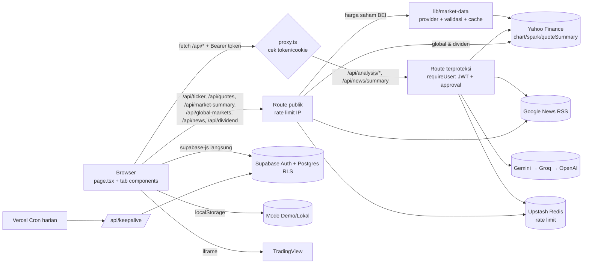

# Dokumentasi Teknis Lengkap: Nunnn Stock Analyzer

> Dokumen rujukan untuk seluruh menu, fitur, arsitektur, logika kalkulasi, API, data, konfigurasi, keamanan, dan hasil audit kode.
> Kondisi kode: commit `86e45a5` (branch `main`, 2026-10-08). Audit awal dibuat pada `3c29703` (2026-10-02); temuan yang sudah diperbaiki sejak itu ditandai ✅ (lihat [§12.1](#121-status-perbaikan)).
> Referensi kode memakai format `path:baris` dan bisa diklik di VSCode atau GitHub.
>
> Status temuan:
> - **Terverifikasi**: dicek langsung di kode.
> - **Perlu verifikasi runtime**: kesimpulan dari membaca kode, belum dibuktikan dengan menjalankan aplikasi.

---

## Daftar Isi

1. [Ringkasan Eksekutif](#1-ringkasan-eksekutif)
2. [Arsitektur](#2-arsitektur)
3. [Tech Stack & Dependensi](#3-tech-stack--dependensi)
4. [Struktur Direktori](#4-struktur-direktori)
5. [Bedah Menu & Fitur](#5-bedah-menu--fitur)
6. [Logika Kalkulasi & Rumus](#6-logika-kalkulasi--rumus)
7. [Referensi API](#7-referensi-api)
8. [Data & Penyimpanan](#8-data--penyimpanan)
9. [Konfigurasi & Environment](#9-konfigurasi--environment)
10. [i18n & Styling](#10-i18n--styling)
11. [Keamanan, CI/CD & Tooling](#11-keamanan-cicd--tooling)
12. [Temuan Audit](#12-temuan-audit)
13. [Utang Teknis & Kualitas Kode](#13-utang-teknis--kualitas-kode)
14. [Roadmap Rekomendasi](#14-roadmap-rekomendasi)
15. [Lampiran](#15-lampiran)

---

## 1. Ringkasan Eksekutif

**Nunnn Stock Analyzer** adalah web app untuk investor saham Indonesia (IDX/BEI). Isinya kalkulator investasi (Average Down, Compounding, Persentase, Dividen, E-IPO), berita pasar dengan rangkuman AI, analisis saham 3-in-1 (fundamental, teknikal, "bandarmology"), portofolio pribadi, dan panel admin untuk menyetujui pengguna.

| Aspek | Nilai |
|---|---|
| Framework | Next.js 16.3.4 (App Router, konvensi `proxy.ts`) + React 19.2.4 |
| Bahasa | TypeScript strict |
| Styling | Tailwind CSS v4, framer-motion, lucide-react, hanya mode gelap |
| Backend | Next.js Route Handlers (12 route), tanpa server actions |
| Data eksternal | Yahoo Finance (endpoint tidak resmi, lewat lapisan provider `lib/market-data` yang bisa diganti vendor berlisensi), Google News RSS, Gemini → Groq → OpenAI |
| Auth & DB | Supabase (Auth + Postgres + RLS); ada mode **Demo/Lokal** berbasis localStorage |
| Rate limit | Upstash Redis (opsional; tidak aktif bila env tidak diisi) |
| Deploy | Vercel (region `sin1`, cron harian) |
| Ukuran | 132 file ter-track git, sekitar 24,5k LOC di `src/`, 11 menu, 12 API route, 7 tabel DB |
| Test | **Tidak ada** |

### 5 temuan paling kritis

1. ✅ ~~**Menu Analisis dan Rangkuman AI selalu 401 di produksi.**~~ Diperbaiki di `abdd7d9`: sesi dikirim sebagai header `Authorization: Bearer`. Lihat [C-01](#c-01).
2. ✅ ~~**Rate limit AI (10/jam) ikut membatasi route fundamental dan teknikal.**~~ Diperbaiki di `abdd7d9`. Lihat [C-02](#c-02).
3. **Data sintetis ditampilkan seolah data nyata.** Contohnya broker summary, foreign flow, harga fallback 5000, serta fundamental dan berita fallback, semuanya tanpa penanda. Ini berisiko untuk keputusan investasi. Dividen sudah memakai data asli sejak `86e45a5`. Lihat [H-01](#h-01).
4. **Persetujuan admin belum dicek di RLS.** Server (`requireUser`) sudah memeriksanya sejak `abdd7d9`, tetapi CRUD tabel data lewat anon key belum. Lihat [H-02](#h-02).
5. **Belum ada test maupun CI kualitas** (lint, type-check, build). Workflow SLSA juga tidak valid. Lihat [H-07](#h-07).

---

## 2. Arsitektur

### 2.1 Pola aplikasi: satu halaman dengan tab state

- Hanya ada **satu route halaman**, yaitu [src/app/page.tsx](src/app/page.tsx) (`'use client'`, 1133 baris).
- Menu tidak dipisah per route. Setiap menu adalah tab yang dipilih lewat state `currentTab` ([page.tsx:52](src/app/page.tsx#L52)) dan disimpan di `sessionStorage['nunnn_stock_active_tab']` ([page.tsx:141-158](src/app/page.tsx#L141-L158)).
- **Semua tab selalu ter-mount.** Tab yang tidak aktif hanya disembunyikan dengan CSS (`block`/`hidden`) di dalam wrapper animasi framer-motion ([page.tsx:613-1041](src/app/page.tsx#L613-L1041)). Efek sampingnya: state tiap tab bertahan saat berpindah tab, tetapi efek dan fetch semua tab ikut jalan saat halaman dibuka.
- `page.tsx` memegang state global: `user`, sesi auth, CRUD rencana Avg Down, toast, tombol scroll-to-top, serta modal logout dan hapus. State ini diteruskan ke komponen lewat props. Tidak ada state library.

### 2.2 Pohon provider ([src/app/layout.tsx](src/app/layout.tsx))

```
<html lang="id" class="dark">
  ClientBootstrap        ← polyfill randomUUID/storage, bersihkan token Supabase basi, overlay error (dev)
    LanguageProvider     ← context i18n (id/en), disimpan di localStorage
      ThemeProvider      ← next-themes, forcedTheme="dark"
        {children}       ← page.tsx (Dashboard)
```

### 2.3 Alur data



Poin penting:
- **CRUD data pengguna** (rencana, portofolio, approval) dilakukan langsung dari browser ke Supabase lewat anon key. Keamanannya bergantung penuh pada RLS.
- **Data pasar dan AI** selalu lewat API route di server, sehingga API key AI tidak sampai ke klien.
- **Harga saham BEI** (IHSG, scan pasar, watchlist, portofolio, `/api/ticker`) dibaca lewat satu antarmuka provider dan dicek kewajarannya. Lihat [§7.1](#71-lapisan-data-pasar).

### 2.4 Dua mode operasi

| | Mode Demo/Lokal | Mode Supabase |
|---|---|---|
| Aktif bila | `NEXT_PUBLIC_SUPABASE_URL`/`ANON_KEY` kosong atau berisi placeholder ([supabase-config.ts](src/lib/supabase-config.ts), dipakai klien, server, dan proxy) | Env terisi dengan benar |
| Auth | User simulasi di localStorage (`nunnn_stock_simulated_users`, password di-hash SHA-256 + salt, [crypto.ts](src/lib/crypto.ts)) | Supabase Auth (email/password + Google OAuth) dengan gerbang approval admin |
| Penyimpanan | localStorage | Tabel Supabase (RLS per `user_id`) |
| Proxy & route terproteksi | Dilewati; `requireUser` memberi identitas `demo:<ip>` (tetap kena rate limit per IP) | Wajib header `Authorization: Bearer <token>` (atau cookie `sb-*-auth-token`); JWT & approval dicek di route |

### 2.5 Konvensi Next.js 16

- `middleware.ts` diganti **`src/proxy.ts`** (fungsi `proxy` + `config.matcher`).
- [AGENTS.md](AGENTS.md) mengingatkan bahwa API Next.js di versi ini berbeda dari yang umum dikenal. Baca `node_modules/next/dist/docs/` sebelum mengubah kode framework.

---

## 3. Tech Stack & Dependensi

Sumber: [package.json](package.json)

| Paket | Versi | Fungsi |
|---|---|---|
| `next` | ^16.3.4 | Framework |
| `react` / `react-dom` | 19.2.4 | UI |
| `@supabase/supabase-js` | ^2.106.2 | Klien Auth/DB (dipakai di browser) |
| `@supabase/ssr` | ^0.12.5 | Klien server ([supabase-server.ts](src/lib/supabase-server.ts)); `createBrowserClient` **tidak dipakai** |
| `@upstash/ratelimit`, `@upstash/redis` | ^2.0.8, ^1.38.3 | Rate limiting |
| `framer-motion` | ^12.40.0 | Animasi |
| `lucide-react` | ^1.17.0 | Ikon |
| `next-themes` | ^0.4.6 | Tema (dipaksa gelap) |
| `clsx`, `tailwind-merge` | ^2.1.1, ^3.6.0 | Helper `cn()` |
| Dev: `tailwindcss` / `@tailwindcss/postcss` | ^4 | Styling |
| Dev: `typescript` ^5, `eslint` ^9, `eslint-config-next` 16.2.6, `@types/*` | | Tooling |

**Scripts:** `dev`, `build`, `start`, `lint` (`eslint`), `deploy` (`node deploy.js`). Tidak ada `test` maupun `typecheck`.

**Yang tidak dipakai:**
- library chart (semua grafik berupa SVG tulisan tangan, ditambah iframe TradingView)
- state library, form library, React Query
- UI kit
- test framework

> Catatan: README masih menyebut Next 16.2.6, SheetJS (`xlsx`), dan canvas-confetti. Keduanya sudah dihapus (commit `56beb3d`, `dae1fd4`).

---

## 4. Struktur Direktori

```
.
├── .github/workflows/        security.yml, slsa-provenance.yml
├── .semgrep/custom-rules.yml  7 aturan SAST kustom
├── .zap/rules.tsv             aturan ZAP baseline
├── .gitleaks.toml             aturan secret scan kustom
├── .pre-commit-config.yaml    gitleaks + semgrep (belum ter-install di .git/hooks)
├── security-reports/          FASE-1..6, FINAL-REPORT.md, contoh fix (.ts/.json/.sql)
├── supabase/migrations/       8 migrasi SQL (tabel, RLS, RPC, trigger)
├── public/                    aset default Next (tidak dipakai)
├── deploy.js                  sinkron .env.local → Vercel + deploy --prod
├── next.config.ts             CSP & security headers, images.remotePatterns
├── vercel.json                cron, maxDuration per route, region, headers
└── src/
    ├── proxy.ts               (37)   gerbang token/cookie untuk /api/analysis/* & /api/news/summary
    ├── app/
    │   ├── layout.tsx         (43)   metadata, viewport, providers
    │   ├── page.tsx           (956)  Dashboard: semua tab + auth + CRUD Avg Down
    │   ├── globals.css        (126)  Tailwind v4 @theme tokens, glass-card, dll.
    │   └── api/
    │       ├── analysis/fundamentals/route.ts (425)
    │       ├── analysis/technical/route.ts    (997)  semua indikator teknikal
    │       ├── analysis/news/route.ts         (464)  sentimen per ticker (AI)
    │       ├── news/route.ts                  (156)  feed berita (kategori, pencarian, watchlist; cache 5 mnt)
    │       ├── news/summary/route.ts          (627)  analisis AI berita + SSRF guard (cache 24 jam)
    │       ├── ticker/route.ts                (135)  harga & pencarian ticker (via provider)
    │       ├── quotes/route.ts                (56)   harga + intraday banyak saham (watchlist, portofolio)
    │       ├── market-summary/route.ts        (137)  IHSG, breadth, movers (scan 886 saham, cache 45 dtk)
    │       ├── global-markets/route.ts        (37)   USD/IDR, LQ45, komoditas, indeks global
    │       ├── dividend/route.ts              (40)   riwayat dividen asli + harga tahunan (cache 6 jam)
    │       ├── dividend/summary/route.ts      (51)   dividen TTM banyak saham (yield chip populer)
    │       └── keepalive/route.ts             (36)   ping Supabase (cron)
    ├── components/            22 komponen + folder home/ & dividend/ (lihat §5)
    │   analysis-tab (2374) · compounding-tab (1720) · ipo-tab (1032)
    │   portfolio-tab (957) · calculator-form (896) · admin-panel-tab (777) · percentage-tab (775)
    │   news-tab (765) · results-display (423) · sidebar (387) · history-table (352)
    │   auth-modal (320) · watchlist-panel (296) · client-bootstrap (294) · portfolio-snapshot (250)
    │   quick-search-ticker (177) · stepper-input (150) · confirm-modal (135)
    │   educational-tip-card (117) · trending-news-strip (106) · company-logo (34) · theme-provider (11)
    │   home/  home-dashboard (232) · market-overview (187) · market-movers (161)
    │          global-markets (91) · sparkline (78) · market-status-bar (69) · types (45)
    │   dividend/  dividend-tab (873) · drip-projection (268) · ex-date-simulator (229)
    │              dividend-history (179) · ui (167)
    └── lib/
        translations.ts (874) · tickers.ts (962, sekitar 940 ticker BEI) · compounding.ts (357)
        dividend.ts (547) · yahoo.ts (314) · calculator.ts (278) · e-ipo.ts (261) · news.ts (220) · format.ts (142)
        watchlist-store.ts (137) · percentage.ts (121) · rate-limit.ts (100) · auth-guard.ts (93) · market-hours.ts (85)
        language-context.tsx (70) · use-polling.ts (66) · idx-themes.ts (54) · crypto.ts (48) · auth-fetch.ts (42)
        supabase.ts (35) · utils.ts (35) · supabase-server.ts (34) · quotes.ts (28) · supabase-config.ts (14)
        dividend-source.ts (36) · types.ts (26) · global-markets.ts (19) · validators.ts (17)
        market-data/  index (64) · yahoo-provider (57) · validate (54) · types (37)
```

---

## 5. Bedah Menu & Fitur

Ringkasan akses tiap menu:

| # | Menu (ID) | Komponen utama | Akses | Simpan data |
|---|---|---|---|---|
| 0 | Beranda | `home/home-dashboard.tsx` + widget | Publik (sapaan & ringkasan portofolio hanya untuk yang login) | — |
| 0b | Watchlist | `watchlist-panel.tsx` (varian penuh) | Publik | Supabase `user_watchlists` / lokal |
| 1 | Berita & Sentimen | `news-tab.tsx` | Publik; Analisis AI wajib login | — |
| 2 | Kalkulator Avg Down | `calculator-form`, `results-display`, `history-table` | Publik | Supabase / lokal |
| 3 | Compounding | `compounding-tab.tsx` | Publik | Supabase / lokal (simpan, muat, hapus) |
| 4 | Persentase | `percentage-tab.tsx` | Publik | Riwayat lokal (5) |
| 5 | Dividen | `dividend/dividend-tab.tsx` + `dividend/*` | Publik | — (tanpa simpan) |
| 6 | E-IPO | `ipo-tab.tsx` | Publik | Muat/hapus saja (tidak ada tombol save) |
| 7 | Analisis Saham Pro | `analysis-tab.tsx` | **Wajib login** | — |
| 8 | Portofolio Saya | `portfolio-tab.tsx` | **Wajib login** | Supabase / lokal |
| 9 | Admin Panel | `admin-panel-tab.tsx` | **Hanya email admin** | Supabase RPC |
| — | Riwayat | — | Nonaktif (badge "Segera") | — |

### 5.0 Sidebar & Navigasi ([sidebar.tsx](src/components/sidebar.tsx))

- **Daftar menu:** [sidebar.tsx:47-60](src/components/sidebar.tsx#L47-L60).
  - Menu `analysis` dan `portfolio` tampil dengan ikon gembok bila belum login.
  - Menu `watchlist` aktif sejak `db0cca3`; hanya `history` yang masih berstatus "Segera".
  - Menu `admin` hanya muncul bila email pengguna sama dengan `NEXT_PUBLIC_ADMIN_EMAIL` (default `admin@nunnnstock.com`, [sidebar.tsx:44](src/components/sidebar.tsx#L44)).
- **Ikon (lucide-react), unik per menu:** Beranda `Home`, Berita `Newspaper`, Avg Down `Calculator`, Compounding `Sprout`, Persentase `Percent`, Dividen `HandCoins`, E-IPO `Rocket`, Analisis `ChartCandlestick`, Portofolio `Briefcase`, Admin `ShieldCheck`, Riwayat `History`, Watchlist `Star`. Badge judul di setiap tab memakai ikon yang sama dengan sidebar.
- **Desktop:**
  - Sidebar fixed yang bisa diciutkan (260px ↔ 80px). Chevron untuk menciutkan baru muncul saat hover.
  - Klik logo membuka Beranda.
  - Pengalih bahasa ID/EN; saat sidebar diciutkan berubah jadi satu tombol toggle.
  - Footer profil berisi email dan tombol logout, atau tombol "Masuk ke Akun".
- **Mobile:** header atas 64px dengan tombol hamburger, lalu drawer geser 280px yang berisi menu, pengalih bahasa, dan area profil.

### 5.1 Beranda ([home/home-dashboard.tsx](src/components/home/home-dashboard.tsx))

`page.tsx` hanya merender `<HomeDashboard isActive={currentTab === 'home'} />`. Semua kartu pasar memakai **satu** request `/api/market-summary` yang di-refresh tiap menit **hanya** saat jam bursa, tab Beranda aktif, dan browser terlihat ([home-dashboard.tsx:91](src/components/home/home-dashboard.tsx#L91), hook [use-polling.ts](src/lib/use-polling.ts)). Di luar itu data diambil sekali saat tab dibuka.

Urutan dari atas:

| Bagian | File | Isi & perilaku |
|---|---|---|
| Sapaan / hero | home-dashboard.tsx | Login: "Selamat pagi/siang/sore/malam, {nama}" (jam WIB) + badge Mode Cloud/Lokal. Pengunjung: hero ringkas + tombol Masuk |
| Status pasar | [market-status-bar.tsx](src/components/home/market-status-bar.tsx) | Sesi BEI (Pra-Pembukaan, Sesi 1, Istirahat, Sesi 2, Pra-Penutupan, Bursa Tutup, Libur Bursa), jam WIB, waktu scan terakhir, nama sumber data dari provider ("data bisa tertunda"), tombol Refresh |
| Pencarian | [quick-search-ticker.tsx](src/components/quick-search-ticker.tsx) | Debounce 350ms ke `/api/ticker?q=`; memilih ticker membuka **Analisis** |
| IHSG | [market-overview.tsx](src/components/home/market-overview.tsx) | Harga, perubahan, tutup kemarin, tertinggi/terendah, grafik intraday 5 menit dengan garis acuan, posisi dalam rentang 52 minggu |
| Breadth | market-overview.tsx | Jumlah saham naik/tetap/turun + bar, label "Mayoritas naik/turun/berimbang", jumlah ARA/ARB, total nilai transaksi, jumlah saham dipantau, dan jumlah saham yang dilewati karena datanya meragukan |
| Global & Makro | [global-markets.tsx](src/components/home/global-markets.tsx) | USD/IDR, LQ45, Emas, Brent, Batu Bara (API2), Nikkei 225, Hang Seng, S&P 500 Futures dengan grafik mini; refresh tiap 2 menit saat Beranda aktif ([lib/global-markets.ts](src/lib/global-markets.ts)) |
| Penggerak Pasar | [market-movers.tsx](src/components/home/market-movers.tsx) | Tab Gainers / Losers / Top Nilai / Top Volume (6 baris). Filter nilai transaksi Semua / ≥ Rp1 M / ≥ Rp10 M (default ≥ Rp1 M, hanya untuk Gainers/Losers). Badge ARA/ARB. Klik kode → Analisis; tombol ☆ → watchlist |
| Watchlist | [watchlist-panel.tsx](src/components/watchlist-panel.tsx) | Varian ringkas (6 baris + "Lihat semua"); lihat di bawah |
| Ringkasan Portofolio | [portfolio-snapshot.tsx](src/components/portfolio-snapshot.tsx) | Login saja. Total ekuitas (+ nilai pasar), **P&L hari ini**, P&L total, kas RDN ("Belum diatur" bila kosong, tanpa angka fiktif). Satuan "jt / M / T" ([format.ts](src/lib/format.ts) `formatIDRCompact`). Harga semua saham diambil sekali lewat `/api/quotes`; perubahan yang meragukan tidak dihitung ke P&L hari ini |
| Berita | [trending-news-strip.tsx](src/components/trending-news-strip.tsx) | 4 berita `/api/news?category=saham` (2 kolom); pesan berbeda untuk gagal dimuat vs kosong |
| Tips | [educational-tip-card.tsx](src/components/educational-tip-card.tsx) | 1 tip acak dari 8 tip dwibahasa (isi dikoreksi di `db0cca3`) |
| Akses Cepat | home-dashboard.tsx | 8 menu dengan ikon yang sama seperti sidebar; ikon gembok untuk Analisis/Portofolio bila belum login |
| Disclaimer | home-dashboard.tsx | Teks `common.disclaimer` |

**Watchlist** ([watchlist-panel.tsx](src/components/watchlist-panel.tsx), store [watchlist-store.ts](src/lib/watchlist-store.ts)):
- Satu store (`useSyncExternalStore`) dipakai bersama oleh widget Beranda, tab **Watchlist** (menu sidebar), dan tombol ☆ di Penggerak Pasar.
- Maksimal 20 saham ([watchlist-store.ts:18](src/lib/watchlist-store.ts#L18)); urutkan berdasarkan urutan tambah, naik tertinggi, turun terdalam, atau A–Z.
- Harga + grafik mini dari `/api/quotes`, di-refresh tiap menit saat jam bursa. Persentase yang tidak lolos pengecekan kewajaran tampil sebagai "?".
- Tombol hapus selalu terlihat di perangkat sentuh (di desktop muncul saat hover).
- Saat kosong, ada saran BBCA/BBRI/BMRI/TLKM/ASII/GTSI.
- Penyimpanan: selalu localStorage `nunnn_stock_watchlist`; bila login ke Supabase, disinkron ke tabel `user_watchlists` ([connectWatchlistToUser](src/lib/watchlist-store.ts#L79)). Versi cloud menang saat login; bila cloud kosong, daftar lokal diunggah.

### 5.2 Berita & Sentimen ([news-tab.tsx](src/components/news-tab.tsx), [lib/news.ts](src/lib/news.ts), [lib/idx-themes.ts](src/lib/idx-themes.ts))

Data hanya diambil saat tab Berita dibuka (`isActive`), dan hasil per kategori di-cache di browser selama 5 menit.

**Navigasi:**
- Pencarian berita atau kode saham (maks 100 karakter), tombol hapus, dan tombol refresh.
- Tab **Untuk Anda** (berita saham di watchlist), **Saham Indonesia**, **Pasar Global**, **Makro & Kebijakan**, **Komoditas**. Kategori lama `foreign`/`domestik`/`politik` di API dialihkan ke kategori baru.
- Tab Untuk Anda tanpa watchlist menampilkan ajakan "Buka Watchlist".

**Feed** (`/api/news`, Google News RSS 7 hari terakhir):
- Judul dibersihkan dari akhiran " - Nama Media", berita duplikat dan konten video dibuang, nama sumber berupa URL diganti domainnya.
- **Kurasi sumber:** bila kategori punya ≥ 10 berita dari daftar ±40 media keuangan/berita arus utama (`TRUSTED_DOMAINS`, [news.ts:30](src/lib/news.ts#L30)), media lain disembunyikan; jumlahnya ditampilkan di bawah feed.
- Berita dikelompokkan per hari (Hari ini / Kemarin / tanggal, WIB) dengan waktu relatif ("3 jam lalu"); tampil 12 berita + "Muat lebih banyak" (maks 40).
- **Chip saham** di setiap berita: kode yang disebut di judul ([extractTickers](src/lib/news.ts#L168)), dengan % perubahan live dari `/api/quotes`, klik → Analisis, ☆ → watchlist.
  - Dikenali dari kode 4 huruf dan dari ±55 nama/brand umum (`NAME_ALIASES`, mis. "BCA" → BBCA, "Bank Mandiri" → BMRI, "Antam" → ANTM, "Vale Indonesia" → INCO). Frasa yang lebih panjang menang ("Indofood CBP" → ICBP, bukan INDF).
  - Kode yang juga kata umum (NATO, NASA, META, BANK, GOLD, ...) hanya dikenali bila didahului "saham"/"emiten" atau ditulis dalam kurung.
- Tab Untuk Anda memakai kueri kode **atau** nama emiten, lalu disaring ketat: hanya berita yang judulnya benar-benar menyebut saham tersebut.

**Analisis AI** (login wajib; `POST /api/news/summary` lewat `authFetch` dengan token Bearer):

| Bagian | Isi |
|---|---|
| Label | Sentimen (Positif/Negatif/Netral) + keyakinan, kategori dampak (Korporasi/Makro/Regulasi/Sektor/Pasar), horizon, **dasar analisis** ("Dari artikel lengkap" atau "Hanya dari judul"), dan provider AI |
| Ringkasan | 1 kalimat inti + 2–3 kalimat konteks, lalu 2–4 poin penting |
| Saham terdampak | **Disebut di berita** (judul + AI) dan **Berpotensi terdampak per sektor**: tema dari peta 25 tema BEI terkurasi ([idx-themes.ts](src/lib/idx-themes.ts)) dengan arah ▲/▼/◆ dan alasan, dikembangkan server menjadi emiten valid |
| Yang perlu dipantau | 1–3 hal ke depan |
| Penutup | Disclaimer "bukan rekomendasi investasi" + tautan artikel asli |

- Tanpa saran beli/jual atau target harga. Keluaran AI divalidasi (enum, panjang teks, kode saham dicocokkan dengan kamus BEI); bila tidak valid, provider berikutnya dicoba (Gemini → Groq → OpenAI, dalam batas waktu 26 detik).
- Analisis "hanya dari judul" dibatasi keyakinan rendah dan maksimal 1 tema; artikel lengkap maksimal 3 tema.
- Tanpa AI (tidak dikonfigurasi/gagal): tampil cuplikan paragraf artikel asli tanpa interpretasi, atau pesan "belum tersedia". Mode "Heuristic Engine" lama yang mengarang temuan sudah dihapus.
- Pesan error spesifik: sesi tidak valid (dengan tombol Masuk), akun menunggu approval, kuota 10/jam habis (dengan sisa waktu), layanan login mati, pemeriksaan akun gagal di server.
- Sentimen hasil analisis juga tampil sebagai badge di kartu berita.

> Catatan: beberapa media (mis. IDNFinancials) memasang proteksi bot Cloudflare yang menolak request dari server. Artikel dari media seperti ini dianalisis hanya dari judul dan diberi label demikian; proteksi tersebut sengaja tidak diakali.

### 5.3 Kalkulator Average Down

File: [calculator-form.tsx](src/components/calculator-form.tsx), [results-display.tsx](src/components/results-display.tsx), [history-table.tsx](src/components/history-table.tsx), [stepper-input.tsx](src/components/stepper-input.tsx), dan logika di [lib/calculator.ts](src/lib/calculator.ts).

**Form.** Hasil dihitung ulang setiap kali input berubah ([calculator-form.tsx:310](src/components/calculator-form.tsx#L310)).

- **Contoh awal:** GTSI (GTS Internasional), 100 lot @ Rp160, beli 100 lot lagi ([calculator-form.tsx:20](src/components/calculator-form.tsx#L20)). Harga sekarang langsung diambil live saat halaman dibuka.
- **Tombol Reset** di header form mengembalikan semua isian ke contoh awal.
- **Tata letak:** satu kolom di layar sempit; mulai `xl` memakai grid 12 kolom (Step 1 & 2 di baris pertama, Step 3 lebar 8/12 dan Step 4 lebar 4/12 di baris kedua).

1. **Saham & Emiten.**
   - Logo, ticker (maks 5 karakter, hanya huruf/angka), dan nama perusahaan.
   - Nama dari kamus lokal tampil instan; nama & harga dari `/api/ticker` diambil 400 ms setelah berhenti mengetik (≥4 karakter).
2. **Posisi Awal.**
   - Lot Awal, Avg Price, dan Harga Sekarang (dengan tombol isi harga pasar).
   - Checkbox "Avg Price awal sudah termasuk fee beli" (hanya muncul bila fee aktif).
3. **Rencana Beli Baru.**
   - Bisa lebih dari satu tahap. Tiap tahap berisi lot, harga beli (dengan tombol isi harga pasar), dan dana dibutuhkan.
   - **Tahap baru terisi otomatis:** lot sama dengan tahap terakhir, harga 5% di bawahnya dan dibulatkan ke fraksi BEI ([calculator-form.tsx:349](src/components/calculator-form.tsx#L349)).
   - **Peringatan fraksi harga** (kuning) bila harga beli bukan kelipatan fraksi BEI.
   - Di HP, setiap tahap tampil sebagai kartu: baris atas berisi nomor tahap, dana, dan tombol hapus; di bawahnya Lot dan Harga Beli berdampingan.
4. **Broker Fee.**
   - Preset: Stockbit 0,15/0,25, Ajaib 0,15/0,25, IPOT 0,19/0,29, Custom, atau Tanpa Fee ([calculator-form.tsx:84](src/components/calculator-form.tsx#L84)).
   - Custom membuka input % beli dan % jual.

**Tombol −/+ ([StepperInput](src/components/stepper-input.tsx)).** Semua kolom angka punya tombol −/+ di kedua sisi; bisa diklik, ditahan (mengulang otomatis), atau memakai panah ↑/↓ keyboard. Angka tetap bisa diketik manual.

| Kolom | Langkah |
|---|---|
| Lot Awal, Lot per tahap | ±1 lot (minimal 1) |
| Harga Sekarang, Harga Beli | ±1 fraksi BEI lewat `stepIdxPrice` (199 → 200 → 202; harga tidak valid di-snap, 2.755 → 2.760/2.750) |
| Avg Price | ±1 fraksi, desimal dipertahankan |
| Fee custom | ±0,01% (0–10%) |

**Baris aksi** ([calculator-form.tsx:848](src/components/calculator-form.tsx#L848)):
- Ringkasan live: Avg Baru (+ % perubahan), Harga BEP (+ % jarak dari harga sekarang), dan Modal Baru.
- Tombol "Simpan" (cloud) atau "Simpan Lokal"; bila nonaktif, alasannya ditampilkan.
- Data disimpan ke tabel `avg_down_plans` atau localStorage `nunnn_stock_saved_plans` ([page.tsx:375](src/app/page.tsx#L375)).

> ⚠️ Saat disimpan, semua tahap masih digabung jadi satu lot dan satu harga rata-rata tertimbang ([page.tsx:389](src/app/page.tsx#L389)). Rincian per tahap hilang, dan flag `avgPriceAwalIncludesFee` hanya ikut tersimpan di mode lokal. Lihat [M-14](#m-14).

**Hasil ([results-display.tsx](src/components/results-display.tsx)):**
- Tampilan kosong "Menunggu Input Data".
- Baris atas 3 kartu: Emiten (logo, ticker, nama), Modal Baru (+lot/lembar), Total Lot Akhir.
- **SEBELUM vs SESUDAH**: avg price, modal, market value, **Harga BEP (impas setelah fee jual)** dengan keterangan "Butuh naik x%", dan floating P&L (Rp/%). Badge "Berbalik Profit!" beranimasi sekali bila posisi berbalik untung.
- **Rangkuman Perbaikan Posisi**:
  - % perubahan avg price. Bila harga beli baru di atas avg, label berubah menjadi "Harga Rata-Rata Naik" (kuning) dengan catatan bahwa ini sebenarnya average up.
  - % pengurangan floating loss ("100% (Sembuh!)" bila impas/untung; "Floating Loss Membesar" bila justru bertambah).
  - Kalimat jarak ke BEP sebelum vs sesudah, misalnya "harga perlu naik 9,61% (sebelumnya 18,82%)".
  - Bila posisi awal sudah untung, yang tampil pesan "Posisi Portofolio Sehat".
- Format angka mengikuti bahasa (id-ID / en-US).

**Rencana tersimpan ([history-table.tsx](src/components/history-table.tsx)):**
- Kartu berjudul "Rencana Tersimpan" dengan jumlah rencana; semua teks dwibahasa.
- Desktop: tabel Saham, Posisi Awal, Rencana Baru, Estimasi Avg Baru (badge Turun/Naik), Tanggal, Aksi. Mobile: kartu.
- Estimasi memakai `calculateAvgDown` yang sama dengan kalkulator, termasuk fee.
- Tombol "Muat" berlabel; setelah diklik halaman otomatis scroll kembali ke form ([page.tsx:498](src/app/page.tsx#L498)). Hapus memakai modal konfirmasi.
- Peringatan localStorage untuk pengguna yang belum login, dengan link "Masuk ke akun" yang membuka modal login lewat prop `onSignInClick`.
- Aksi "Avg Down" dari tab Portofolio mengisi form ini secara otomatis ([page.tsx:509](src/app/page.tsx#L509)).

### 5.4 Kalkulator Compounding ([compounding-tab.tsx](src/components/compounding-tab.tsx), [lib/compounding.ts](src/lib/compounding.ts))

Ada dua mode: **Rencana Trading** (default) dan **Investasi Jangka Panjang**. Header form berisi tombol Reset, Cetak (`window.print`, desktop), dan **Simpan Rencana**.

**Rencana Trading: Harian / Bulanan / Tahunan**
- Pilihan periode muncul di samping pemilih mode. Setiap periode menyimpan nilainya sendiri (target, durasi, setoran), jadi berpindah periode tidak menghapus isian.
- Default ([compounding-tab.tsx:79](src/components/compounding-tab.tsx#L79)):

  | Periode | Target | Durasi | Batas durasi |
  |---|---|---|---|
  | Harian | 1%/hari | 20 hari | 2.520 hari |
  | Bulanan | 5%/bulan | 12 bulan | 600 bulan |
  | Tahunan | 20%/tahun | 10 tahun | 100 tahun |

- Input: modal awal, target profit per periode (%), durasi (dengan tombol pintas, mis. 1 bln/3 bln/6 bln/1 thn), setoran tambahan per periode, dan broker fee (preset atau custom).
- **Konversi target** di bawah kolom target, misalnya "1%/hari ≈ 23,24%/bulan · ≈ 1.127%/tahun (majemuk, sebelum fee)". Muncul peringatan kuning bila setara lebih dari 100% per tahun.
- Asumsi hari bursa: 21 hari per bulan, 252 per tahun.
- Fee broker dipotong 1× beli + 1× jual setiap periode.
- Kartu ringkasan: Modal Akhir, Profit Bersih (+ return %), Total Disetor, **Total Fee Broker**.

**Investasi Jangka Panjang:**
- Input: modal awal, setoran berkala + frekuensinya (harian/mingguan/bulanan/tahunan), return tahunan % + frekuensi bunga (harian/bulanan/kuartalan/tahunan), jangka waktu (0–100 tahun + 0–11 bulan), inflasi % dan pajak bunga %.
- Kartu ringkasan: Total Saldo Akhir (+ return %), Akumulasi Setoran, Akumulasi Bunga (kotor, + total pajak), dan **Saldo Riil** (disesuaikan inflasi).

**Input angka.** Semua kolom angka memakai tombol −/+:
- Nominal Rupiah: langkah mengikuti besarnya angka (10 juta → ±1 juta; di bawah 1 juta → ±100 ribu).
- Persen: target ±0,1 (harian) / ±0,5 (bulanan) / ±1 (tahunan); return & inflasi & pajak ±0,5; fee ±0,01.
- Persen menerima koma maupun titik sebagai desimal ("0,5" = "0.5").

**Grafik** ([compounding-tab.tsx:1314](src/components/compounding-tab.tsx#L1314)):
- Dimulai dari titik modal awal. Isi: area saldo nominal, garis total setoran, dan garis nilai riil (khusus jangka panjang).
- Bisa di-hover dengan mouse maupun disentuh di HP; tooltip mengikuti titik yang disorot.
- Jangka panjang: titik per tahun bila durasi > 36 bulan, selain itu per bulan.
- Angka besar disingkat Juta/Miliar/Triliun … (EN: Million/Billion/Trillion …).

**Tabel** ([compounding-tab.tsx:1463](src/components/compounding-tab.tsx#L1463)):
- Header tetap terlihat saat di-scroll; jumlah baris ditampilkan.
- Kolom: Periode, Saldo Awal, Setoran, Profit/Bunga, Fee Broker atau Pajak (bila > 0), Saldo Akhir, Saldo Riil (bila inflasi > 0), Return Kumulatif.
- Rencana Trading: Harian bisa dilihat **Per Hari / Rekap Bulanan / Rekap Tahunan**; Bulanan bisa **Per Bulan / Rekap Tahunan**; Tahunan per tahun ([compounding-tab.tsx:711](src/components/compounding-tab.tsx#L711)).
- Jangka panjang: toggle Tahunan/Bulanan.

**Rencana tersimpan** ([compounding-tab.tsx:1533](src/components/compounding-tab.tsx#L1533)):
- Simpan lewat dialog dengan judul otomatis (mis. "Trading Harian 1% × 20 Hari"); bisa dimuat dan dihapus (dengan konfirmasi).
- Disimpan di Supabase `compounding_plans` atau localStorage `nunnn_stock_compounding_plans`. Lihat §8.1 untuk pemetaan kolom rencana trading.
- Ada CSS khusus cetak ([compounding-tab.tsx:806](src/components/compounding-tab.tsx#L806)).

### 5.5 Kalkulator Persentase ([percentage-tab.tsx](src/components/percentage-tab.tsx), [lib/percentage.ts](src/lib/percentage.ts))

| Mode | Input | Output |
|---|---|---|
| Perubahan % | Dari, Ke | % perubahan, selisih, multiplier, % yang dibutuhkan untuk kembali ke awal |
| Naik/Turun % | Nilai dasar, % | Nilai setelah naik/turun, selisih, faktor |
| % dari Nilai | %, Total | Nilai bagian, sisa |
| Berapa % | Bagian, Total | Persentase, sisa % |
| Nilai Awal (reverse) | Nilai akhir, % | Nilai awal, selisih |

**Fitur pendukung:**
- Tombol tukar (khusus mode Perubahan) dan toggle Naik/Turun (mode Naik/Turun dan Nilai Awal).
- Preset 5/10/20/25/50%.
- Hasil langsung tampil saat mengetik, dengan `aria-live`.
- Catatan pemulihan saat turun, misalnya "Turun 50% butuh naik 100%".
- Baris rumus, tombol salin ringkasan ke clipboard, dan tombol simpan.
- Riwayat 5 entri terakhir tanpa duplikat (`nunnn_stock_percentage_history`), dengan tombol "Hapus Semua".

**State error:** basis 0, total 0, penurunan ≥100% yang tidak bisa dibalik, dan input tidak valid.

> ⚠️ Input "0.125" terbaca sebagai 125. Lihat [M-01](#m-01).

### 5.6 Kalkulator Dividen ([dividend/dividend-tab.tsx](src/components/dividend/dividend-tab.tsx), [lib/dividend.ts](src/lib/dividend.ts))

Dibangun ulang di `86e45a5`. Semua angka berasal dari data asli; **tidak ada lagi data cadangan buatan**. Emiten yang belum pernah membagikan dividen (mis. GOTO) ditampilkan apa adanya, bukan diberi riwayat palsu.

**1. Pilih saham:**
- Pencarian memakai [QuickSearchTicker](src/components/quick-search-ticker.tsx) (navigasi keyboard, Esc, klik di luar menutup).
- Kartu harga: harga, perubahan Rp/% dari `/api/quotes` (tervalidasi, badge "Data meragukan" bila tidak lolos cek), jam update WIB, label "tertunda". Di-refresh tiap 60 detik saat jam bursa, hanya bila tab aktif dan terlihat.
- 16 chip saham dividen populer, **diurutkan berdasarkan yield 12 bulan di harga sekarang** yang dihitung live (`/api/dividend/summary` + `/api/quotes`), bukan angka tetap.
- Data dimuat hanya saat tab dibuka. Ganti saham membatalkan request lama (`AbortController`), dan data saham sebelumnya tidak pernah tampil di bawah kode saham baru. Gagal → kartu error + "Coba lagi"; 404 → "kode tidak ditemukan".

**2. Profil dividen** ([dividend-history.tsx](src/components/dividend/dividend-history.tsx)):
- Kartu: dividen 12 bulan (TTM) + jumlah pembayaran, yield TTM di harga pasar, konsistensi (tahun berturut-turut), pertumbuhan DPS 5 tahun (CAGR, fallback 3 tahun), stabilitas (berapa kali turun dalam 5 tahun penuh).
- Grafik batang DPS per tahun (12 tahun; 6 tahun di HP), tahun berjalan bergaris putus, baris bawah = yield terhadap rata-rata harga tahun itu.
- Tabel riwayat: tahun, cum date ≈, ex date, cair ≈, DPS; badge "Terjadwal" untuk ex date yang belum lewat. 8 baris pertama, sisanya lewat "Tampilkan semua".

**3. Simulasi** (semua angka punya tombol −/+ [`StepperInput`](src/components/stepper-input.tsx)):
- Mode Nominal atau Lot. Berpindah mode membawa nilai yang setara (lot ↔ modal terpakai).
- Harga beli per lembar: default harga pasar, langkah −/+ mengikuti fraksi BEI, peringatan bila bukan kelipatan fraksi, tombol kembali ke harga pasar.
- Dividen per lembar per tahun dengan pilihan dasar: **TTM**, **tahun penuh terakhir**, **rata-rata 3 tahun** (untuk dividen yang naik-turun seperti batu bara), atau **Manual** (mengetik/menekan −/+ otomatis pindah ke Manual).
- Pajak: 10% (individu, tidak direinvestasi; default), 0% (individu, reinvestasi ≥3 tahun), 20% (investor asing / tarif P3B), atau tarif sendiri 0–100%.
- Fee beli broker (default 0,15%).

**4. Hasil:**
- Dividen bersih per tahun (kotor − pajak), rata-rata per bulan sebagai info sekunder.
- Pembagian berikutnya: nominal bersih, DPS, batas beli (cum) ≈ + hitung mundur hari, tanggal cair ≈, badge Terjadwal/Perkiraan.
- Yield: bersih & kotor terhadap **modal terpakai** (yield on cost), dan yield di harga pasar.
- Kepemilikan (lot/lembar), nilai transaksi + fee, modal terpakai, sisa modal yang tidak cukup untuk 1 lot.
- Kalender 12 bulan (berdasarkan tanggal cair) + daftar pembayaran (tabel di desktop, kartu di HP).

**5. DRIP vs diambil tunai** ([drip-projection.tsx](src/components/dividend/drip-projection.tsx)): jangka 1–30 tahun, asumsi pertumbuhan dividen & harga per tahun (tombol "Pakai CAGR historis"), kartu nilai akhir, keunggulan DRIP, lot tambahan, passive income per bulan di tahun terakhir, grafik dua garis, dan tabel per tahun.

**6. Simulasi cum → ex date (dividend trap)** ([ex-date-simulator.tsx](src/components/dividend/ex-date-simulator.tsx)): beli di cum, terima dividen bersih, jual di ex date. Menampilkan hasil bersih dan **harga jual impas** (dibulatkan ke atas ke fraksi BEI). Nilai mengikuti simulasi utama sampai pengguna mengubahnya.

**7. Catatan pajak & data** di bagian bawah halaman.

Bahasa: semua teks dwibahasa; isi input diformat ulang (titik/koma ribuan) saat bahasa diganti. Tidak ada fitur simpan.

### 5.7 Kalkulator E-IPO ([ipo-tab.tsx](src/components/ipo-tab.tsx), [lib/e-ipo.ts](src/lib/e-ipo.ts))

**Aturan OJK:** accordion berisi tabel golongan I–V, alokasi minimum, 3 tingkat penyesuaian (clawback), dan perbandingan aturan lama 1:2 dengan aturan baru 1:1.

**Input:**
- Ticker (maks 6 karakter; nama dan harga terisi otomatis), nama, dan harga.
- Lot ditawarkan, oversubscription (×), dan jumlah pemesan.
- Pesanan pribadi (lot), dengan baris "Dana dibutuhkan".
- Slider rasio ritel 10–95%.

**Output:**
- 4 kartu: nilai emisi, golongan, alokasi awal, dan alokasi setelah clawback.
- Perbandingan **SEOJK 15/2020 (1:2)** dan **SEOJK 25/2025 (1:1, "Terbaru")**: pool lot, lot ritel/non-ritel, rata-rata jatah, peluang dapat 1 lot.
- Simulasi pribadi:
  - Badge Ritel (≤ Rp100 juta) atau Non-Ritel.
  - Estimasi rata-rata, proporsional, jatah minimal yang dijamin, dan % peluang mendapat lot tambahan.

**Rencana tersimpan:** bisa dimuat dan dihapus (`ipo_plans` atau `nunnn_stock_ipo_plans`). **Tidak ada tombol simpan** di UI.

### 5.8 Analisis Saham Pro ([analysis-tab.tsx](src/components/analysis-tab.tsx), wajib login)

- **Terkunci** bila belum login: ikon perisai dan CTA login ([analysis-tab.tsx:500-523](src/components/analysis-tab.tsx#L500-L523)).
- **Header:**
  - Ticker aktif.
  - Toggle **LIVE**: refresh diam-diam tiap 60 detik ([analysis-tab.tsx:411-417](src/components/analysis-tab.tsx#L411-L417)).
  - Tombol refresh.
  - Pencarian dengan saran: 16 ticker populer ditambah `/api/ticker?q=`.
  - Banner error dan stempel waktu "Diperbarui".
- **Sebelum mencari:** panel hero dengan pilihan cepat Blue Chips (5) dan Growth (6).
- **Pemuatan:** tiga request berurutan (fundamentals → technical → news, [analysis-tab.tsx:364-406](src/components/analysis-tab.tsx#L364-L406)), dengan skeleton penuh saat pertama kali dimuat.

**Kartu Konsensus:**
- Skor gabungan = fundamental 30% + teknikal 35% + bandarmology 20% + narasi berita 15%, lalu −5 bila risiko High atau +2 bila Low ([analysis-tab.tsx:685](src/components/analysis-tab.tsx#L685)).
- Menampilkan rating, daftar pro/kontra, 4 sub-skor, dan meter 5 warna.

**TradingView:** iframe setinggi 540px dengan studi RSI, MACD, dan Pivot.

**Dashboard teknikal:**
- RSI(14) dan MACD.
- Pivot S/R, dengan toggle Standar/Fibonacci.
- SMA/EMA 20 dan 50.
- Multi-timeframe (Weekly/Daily/"Hourly").
- 6 kartu: Bollinger, Stochastic, ADX, ATR + VWAP, OBV, dan Risk (volatilitas, max drawdown, Sharpe).
- Kesimpulan.

**Bandarmology:**
- Status akumulasi/distribusi, net foreign flow, bar MFI, dan tabel top-3 broker beli/jual.
- ⚠️ Broker dan foreign flow adalah data **sintetis**, lihat [H-01](#h-01).

**Sentimen:** badge sentimen, ringkasan AI (dengan label mesin), daftar berita terkait, dan kesimpulan.

**Fundamental:**
- 9 kartu metrik: P/E, PBV, ROE, ROA, DER, Dividend Yield, EPS, NPM, dan Market Cap.
- Grafik batang SVG revenue dan laba bersih (toggle Tahunan/Kuartalan) beserta kesimpulan.

> ⚠️ Warna legenda grafik (emerald/teal, [analysis-tab.tsx:2340-2349](src/components/analysis-tab.tsx#L2340-L2349)) tidak sama dengan warna batang (violet/teal, [:220](src/components/analysis-tab.tsx#L220), [:230](src/components/analysis-tab.tsx#L230)).

### 5.9 Portofolio Saya ([portfolio-tab.tsx](src/components/portfolio-tab.tsx), wajib login)

**Ringkasan:** Total Equity, Modal Diinvestasikan, dan Total Return (Rp/%).

**Holdings:**
- Tombol "Tambah Saham" dan refresh.
- Harga diambil 4 ticker sekaligus secara paralel ([portfolio-tab.tsx:217-262](src/components/portfolio-tab.tsx#L217-L262)). Label "(Menggunakan Avg)" muncul bila harga gagal diambil.
- Desktop: tabel dengan kolom Saham, Lot, Avg, Last, Invested, Market Value, P&L, Aksi. Mobile: tampilan kartu.
- Aksi per baris:
  - **Analisis**: membuka tab Analisis.
  - **Avg Down**: mengisi kalkulator Avg Down secara otomatis.
  - **Ubah**: membuka modal edit.
  - **Hapus**: dengan modal konfirmasi.

**Modal tambah/ubah:** ticker (nama dan harga terisi otomatis; terkunci saat mode edit), nama, lot, dan avg price.

**Penyimpanan:**
- Supabase `portfolio_holdings` dan `portfolio_cash`, atau localStorage `nunnn_stock_portfolio_holdings_{uid}` / `_cash_{uid}`.
- Penggunaan pertama otomatis membuat 2 holding demo ([portfolio-tab.tsx:122-127](src/components/portfolio-tab.tsx#L122-L127)).
- Error ditampilkan dengan `alert()`.

### 5.10 Admin Panel ([admin-panel-tab.tsx](src/components/admin-panel-tab.tsx))

**Sub-tab Persetujuan Pengguna:**
- Statistik total, disetujui, dan pending.
- Pencarian email dan filter Semua/Disetujui/Pending.
- Tabel berisi email (dengan tag "Admin (Anda)"), tanggal daftar, dan status.
- Aksi: Setujui/Tangguhkan (dengan konfirmasi) dan Hapus. Aksi untuk baris milik sendiri dinonaktifkan.
- Semua aksi berjalan lewat RPC `admin_set_user_approval` dan `admin_delete_user`.

**Sub-tab Status Database & Koneksi:**
- Badge status Supabase dan auth.
- Jumlah 5 jenis data lokal.
- Tombol "Reset Data Simulasi": membuat ulang password admin demo dan menampilkannya sekali ([admin-panel-tab.tsx:87-118](src/components/admin-panel-tab.tsx#L87-L118)).

### 5.11 Modal

- **AuthModal** ([auth-modal.tsx](src/components/auth-modal.tsx)):
  - Field email dan password, toggle Masuk/Daftar, dan tombol Google OAuth.
  - Banner "Mode Simulasi (Lokal)" saat Supabase tidak dikonfigurasi.
  - Akun yang baru mendaftar menunggu approval admin; pemberitahuannya lewat `alert`.
  - Semua teks masih *hardcoded* dalam Bahasa Indonesia.
- **ConfirmModal** ([confirm-modal.tsx](src/components/confirm-modal.tsx)): dirender lewat portal, dengan varian danger, warning, dan info.

---

## 6. Logika Kalkulasi & Rumus

### 6.1 Average Down: `calculateAvgDown` ([calculator.ts:97](src/lib/calculator.ts#L97))

```
lembar         = lot × 100
avgAwalRiil    = includeFees && !avgIncludesFee ? avg × (1 + feeBeli) : avg
modalAwal      = lembarAwal × avgAwalRiil
P/L awal       = (includeFees ? MV × (1 − feeJual) : MV) − modalAwal
modalBaru      = Σ tahap (lot×100 × harga × (1 + feeBeli bila includeFees))
avgBaru        = (modalAwal + modalBaru) / (lembarAwal + lembarBaru)
avgReduction%  = (avgAwalRiil − avgBaru) / avgAwalRiil × 100   ← negatif = average up
lossShrunk%    = (PL%awal − PL%akhir) / PL%awal × 100 ; 100 bila berbalik untung, negatif bila loss membesar
hargaBEP       = modal / (lembar × (1 − feeJual bila includeFees))     ← harga jual impas
butuhNaik%     = (hargaBEP − hargaSekarang) / hargaSekarang × 100
```

Contoh default GTSI (100 lot @160, beli 100 lot @135, harga 135, fee Stockbit): avg 160 → 147,60 (−7,75%), BEP 160,40 → 147,97, butuh naik 18,82% → 9,61%.

**Fraksi harga BEI** ([calculator.ts:60-95](src/lib/calculator.ts#L60-L95)):

| Rentang harga | Fraksi |
|---|---|
| < Rp200 | Rp1 |
| Rp200 – < Rp500 | Rp2 |
| Rp500 – < Rp2.000 | Rp5 |
| Rp2.000 – < Rp5.000 | Rp10 |
| ≥ Rp5.000 | Rp25 |

- `getIdxTickSize`, `isValidIdxPrice`, `roundDownToIdxTick`.
- `stepIdxPrice(harga, ±1)`: naik/turun satu fraksi. Turun memakai fraksi rentang di bawahnya (200 → 199, 500 → 498); harga yang tidak valid di-snap ke arah yang dituju.

### 6.2 Compounding jangka panjang: `calculateCompounding` ([compounding.ts:54](src/lib/compounding.ts#L54))

Simulasi dihitung **per bulan**, selama `totalMonths = max(1, tahun×12 + bulan)`.

**Konversi return tahunan ke rate bulanan, sesuai frekuensi compounding:**

| Frekuensi compounding | Rumus `r_monthly` |
|---|---|
| tahunan | (1+r)^(1/12) − 1 |
| kuartalan | (1+r/4)^(1/3) − 1 |
| bulanan | r/12 |
| harian | (1+r/365)^(365/12) − 1 |

**Konversi setoran ke jumlah per bulan:**

| Frekuensi setoran | Setoran per bulan |
|---|---|
| harian | × 30,417 |
| mingguan | × 4,333 |
| bulanan | × 1 |
| tahunan | penuh, hanya di bulan ke-12, 24, … |

**Langkah per bulan:**
1. Bunga = saldo awal bulan × `r_monthly`.
2. Pajak = bunga × tarif pajak.
3. Saldo baru = saldo + setoran + (bunga − pajak). Setoran masuk di akhir bulan, jadi belum berbunga pada bulan itu.
4. Saldo riil = saldo / (1 + i_monthly)^m, dengan i_monthly = (1+inflasi)^(1/12) − 1.

### 6.3 Rencana Trading: `calculateTradingCompounding` ([compounding.ts:246](src/lib/compounding.ts#L246))

Satu fungsi untuk periode harian, bulanan, dan tahunan. Per periode:

```
profit = saldo × r                                       ← r = target % per periode
fee    = saldo × feeBeli + (saldo + profit) × feeJual    ← asumsi seluruh saldo diputar 1× per periode
saldo  = saldo + setoran + (profit − fee)
```

- **Asumsi hari bursa** ([compounding.ts:195-212](src/lib/compounding.ts#L195-L212)): 21 hari per bulan, 252 per tahun. Batas jumlah periode: 2.520 hari, 600 bulan, 100 tahun.
- **Konversi target antar periode** `convertTradingRate` ([compounding.ts:351](src/lib/compounding.ts#L351)): `(1 + r)^(hari_tujuan / hari_asal) − 1`, majemuk dan sebelum fee. Contoh: 1%/hari ≈ 23,24%/bulan ≈ 1.127%/tahun; 5%/bulan ≈ 79,59%/tahun.
- **Rekap** `groupTradingDetails` ([compounding.ts:323](src/lib/compounding.ts#L323)): menggabungkan N periode menjadi satu baris (21 hari → bulan, 252 hari → tahun, 12 bulan → tahun). Kelompok terakhir boleh tidak penuh (mis. 50 hari → 1–21, 22–42, 43–50). Return kumulatif = (saldo akhir − total setoran) / total setoran.

### 6.4 Dividen ([dividend.ts](src/lib/dividend.ts))

Semua fungsi murni (tanpa I/O). Tanggal berupa string ISO kalender.

**Tanggal** ([dividend.ts:94-137](src/lib/dividend.ts#L94-L137)):
- Ex date dari Yahoo (timestamp 09:00 WIB, dikonversi memakai `gmtoffset` bursa).
- Cum date = 1 hari bursa sebelum ex date (settlement T+2). Hanya akhir pekan yang dilewati; hari libur bursa belum diketahui.
- Tanggal cair ≈ ex date + 18 hari, digeser ke hari kerja (sampel BEI 2022–2024: 9–24 hari).
- Tahun pembagian = tahun ex date, kecuali ex date Januari dihitung ke tahun sebelumnya (interim tertunda, mis. BBRI ex 2 Jan 2024 milik siklus 2023).

**`analyzeDividends(events, today, yearlyAvgClose)`** ([dividend.ts:140](src/lib/dividend.ts#L140)):
- TTM = jumlah DPS dengan ex date dalam 365 hari terakhir.
- Tahun penuh terakhir = tahun pembagian sebelum tahun berjalan. Rata-rata 3 tahun hanya bila riwayat mencakup 3 tahun itu (tahun tanpa pembagian dihitung 0).
- Konsistensi: hitung mundur dari tahun penuh terakhir selama DPS > 0. CAGR 5 tahun (fallback 3 tahun) bila kedua ujung > 0. Penurunan dihitung dalam 5 tahun penuh terakhir.
- Yield historis per tahun = DPS / rata-rata harga penutupan bulanan tahun itu.
- Jadwal 12 bulan ke depan: pembagian dengan ex date di masa depan dipakai apa adanya (**Terjadwal**). Pola 12 bulan terakhir (atau tahun penuh terakhir bila kosong) diproyeksikan ke tanggal yang sama tahun berikutnya (**Perkiraan**); perkiraan dalam ±45 hari dari pembagian terjadwal dibuang.

**`simulateDividend`** ([dividend.ts:309](src/lib/dividend.ts#L309)):
- Mode lot: lembar = lot × 100. Mode nominal: lot = floor(modal / (harga × 100 × (1 + fee))).
- Modal terpakai = lembar × harga × (1 + fee); sisa = modal − modal terpakai.
- Bruto = lembar × DPS; pajak = bruto × tarif; yield on cost = bruto atau neto / modal terpakai. (M-10 ✅)

**`buildPaymentSchedule`** ([dividend.ts:361](src/lib/dividend.ts#L361)): DPS perkiraan = DPS siklus acuan × (DPS tahunan pilihan / total siklus acuan), sehingga proporsi interim/final asli tetap (mis. BBCA 55 : 281), bukan dibagi rata.

**`projectDrip`** ([dividend.ts:413](src/lib/dividend.ts#L413)):
- DPS tahun ke-y = DPS × (1 + g_div)^(y−1); harga pada waktu t (tahun) = harga beli × (1 + g_harga)^t.
- Setiap pembayaran: dividen bersih masuk kas DRIP, dibelikan **lot utuh** di harga saat itu termasuk fee beli; sisa kas dibawa ke pembayaran berikutnya.
- Tanpa DRIP: lembar tetap, dividen bersih dikumpulkan sebagai kas. Nilai = lembar × harga akhir tahun + kas.

**`simulateExDate`** ([dividend.ts:518](src/lib/dividend.ts#L518)):
- Harga ex teoritis = cum − DPS, dibulatkan ke fraksi BEI terdekat.
- Hasil = lembar × harga ex × (1 − fee jual) + dividen bersih − lembar × harga cum × (1 + fee beli).
- Harga impas = (biaya beli − dividen bersih) / (lembar × (1 − fee jual)), dibulatkan ke atas ke fraksi BEI.

### 6.5 E-IPO ([e-ipo.ts](src/lib/e-ipo.ts))

**Golongan dan alokasi awal:**

| Golongan | Nilai emisi | Alokasi awal (maks % vs Rp minimal) |
|---|---|---|
| I | ≤ Rp100 M | 20% / Rp10 M |
| II | ≤ Rp250 M | 15% / Rp20 M |
| III | ≤ Rp500 M | 10% / Rp37,5 M |
| IV | ≤ Rp1 T | 7,5% / Rp50 M |
| V | > Rp1 T | 2,5% / Rp75 M |

**Clawback** ([e-ipo.ts:104](src/lib/e-ipo.ts#L104)):

| Oversubscription | Gol. I | II | III | IV | V |
|---|---|---|---|---|---|
| < 2,5× | (tetap) | | | | |
| 2,5–10× | 22,5% | 17,5% | 12,5% | 10% | 5% |
| 10–25× | 25% | 20% | 15% | 12,5% | 7,5% |
| ≥ 25× | 30% | 25% | 20% | 17,5% | 12,5% |

Hasil akhirnya adalah nilai terbesar antara % awal dan % penyesuaian.

**Pembagian pool dan simulasi pribadi:**
- Porsi ritel: aturan lama 1/3 (1:2), aturan baru 1/2 (1:1).
- Rata-rata jatah = pool / jumlah pemesan.
- Peluang dapat 1 lot = min(100, rata-rata × 100).
- Pesanan pribadi:
  - Masuk kategori ritel bila nilainya ≤ Rp100 juta.
  - Estimasi = max(min(pesanan, rata-rata), pesanan / oversubscription).
  - Dijamin = floor(estimasi); sisanya ditampilkan sebagai % peluang lot tambahan.

### 6.6 Persentase ([percentage.ts](src/lib/percentage.ts))

Semua fungsi mengembalikan `{ok:true, ...} | {ok:false, error}`, dengan EPSILON = 1e-12.

| Fungsi | Rumus | Kasus error / catatan |
|---|---|---|
| `percentChange` | (to − from) / \|from\| × 100 | Error bila from = 0. Multiplier = null bila from < 0. returnToStart = (from − to) / \|to\| (null bila to = 0) |
| `applyPercent` | base × (1 ± p/100) | — |
| `percentOf` | total × p/100 | — |
| `whatPercent` | part / total × 100 | `zero-base` bila total = 0 |
| `reversePercent` | final / (1 ± p/100) | `non-positive-factor` bila faktor ≤ EPSILON |

### 6.7 Indikator teknikal ([api/analysis/technical/route.ts](src/app/api/analysis/technical/route.ts))

Data: Yahoo `v8/finance/chart`, harian 6 bulan dan mingguan 1 tahun. Semua indikator dihitung di server dan **tidak di-export**, sehingga belum bisa dites.

| Indikator | Fungsi (baris) | Parameter & catatan |
|---|---|---|
| RSI | `calculateRSI` (20) | Wilder 14. Hasil 50 bila data ≤ periode; **100 bila avgLoss = 0** (seri datar ikut jadi 100, [M-03](#m-03)) |
| MFI | `calculateMFI` (56) | Periode 14. Seed jumlah mentah lalu smoothing Wilder (non-standar). TP sama dihitung sebagai negatif |
| EMA | `calculateEMA` (98) | k = 2/(p+1), seed nilai pertama (bukan SMA) |
| SMA | `calculateSMA` (113) | Rata-rata p terakhir; nilai terakhir bila data kurang |
| MACD | `calculateMACD` (120) | 12/26/9, deteksi crossover, `histRising` |
| Bollinger | `calculateBollingerBands` (171) | SMA20 ± 2σ (populasi), %B, bandwidth |
| Stochastic | `calculateStochastic` (199) | %K 14 (fast), %D = SMA3. Sinyal 80/20 |
| ATR | `calculateATR` (234) | Wilder 14 |
| OBV | `calculateOBV` (260) | Tren 10 bar (`last > first×1,02`); divergensi ±2% |
| "VWAP" | `calculateVWAP` (295) | Typical price berbobot volume untuk 20 bar **harian** (bukan VWAP intraday) |
| ADX/DI | `calculateADX` (314) | Periode 14; >25 Strong, >20 Weak. Smoothing mencampur skala jumlah dan rata-rata |
| Risk | `calculateRiskMetrics` (375) | Volatilitas = σ·√252; max drawdown 6 bulan; Sharpe = mean·252 / vol (rf = 0) |
| Pivot | 714-737 | Classic PP/R1-3/S1-3 dan Fibonacci 0,382/0,618/1,0, dari **bar terakhir** (bisa bar yang masih berjalan) |
| MA | 740-743 | SMA20/50, EMA20/50 |

**Multi-timeframe** ([technical/route.ts:771-807](src/app/api/analysis/technical/route.ts#L771-L807)):
- **Weekly**: harga mingguan dibandingkan SMA20/50 mingguan dan RSI mingguan. Fallback: harga > EMA50.
- **Daily**: harga dibandingkan SMA20 dan tanda histogram MACD.
- **"Hourly"**: dihitung dari RSI dan Stochastic **harian**, jadi labelnya menyesatkan.

**Skor konsensus teknikal** ([technical/route.ts:809-868](src/app/api/analysis/technical/route.ts#L809-L868)):

| Sinyal | Bullish | Bearish |
|---|---|---|
| RSI | <30: +1,5 · 55–70: +0,5 | >70: +1,5 · 30–45: +0,5 |
| MACD | Bullish +1 (crossover +2) | Bearish +1 (crossover +2) |
| Harga vs SMA20 / SMA50 | +0,5 / +1,0 | +0,5 / +1,0 |
| Stochastic | Buy Signal +1,5 · Bullish +0,5 | Sell Signal +1,5 · Bearish +0,5 |
| Bollinger %B | <10: +0,5 | >90: +0,5 |
| ADX Strong | +DI > −DI: +1 | sebaliknya: +1 |
| OBV divergence | Bullish +1 | Bearish +1 |

- Skor = bull / (bull + bear) × 100.
- Rating: ≥75 STRONG BUY, ≥55 BUY, ≤25 STRONG SELL, ≤45 SELL, selain itu NEUTRAL.
- Komentar bobot di kode tidak cocok dengan nilai yang dipakai: komentar "Stochastic weight 1.0" padahal nilainya 1,5, dan "MA weight 1.5" padahal 0,5 + 1,0.

### 6.8 Bandarmology (sintetis) ([technical/route.ts:745-899](src/app/api/analysis/technical/route.ts#L745-L899))

**Input dari bar terakhir:**
- `closePos` = (C − L) / (H − L); bernilai 0,5 bila H = L.
- `volumeRatio` = volume terakhir / rata-rata volume 20 hari.

**Status:**

| Syarat | Status |
|---|---|
| closePos > 0,65 & volRatio > 1,25 | BIG ACCUMULATION |
| closePos > 0,55 & volRatio > 1,0 | ACCUMULATION |
| closePos < 0,35 & volRatio > 1,25 | BIG DISTRIBUTION |
| closePos < 0,45 & volRatio > 1,0 | DISTRIBUTION |

**Foreign net buy:**
- Rumusnya `round(C × Vol × (closePos − 0,5) × 0,65)` ([:763](src/app/api/analysis/technical/route.ts#L763)). Angka ini **rekaan**, bukan data asing sebenarnya.
- Daftar broker dan jumlah lot dibuat dari hash ticker (`getBrokerSelection`/`getDeterministicBrokers`/`getDetailedBrokers`, sekitar baris 423-499).

**Skor bandar:**
- Komponen:
  - MFI >70: bear +1,5; MFI <30: bull +1,5.
  - Status: +1,5, atau +2,5 untuk status BIG.
  - Foreign flow: ±1.
  - Tren OBV: ±0,5.
- Ambang rating sama dengan skor teknikal.

### 6.9 Skor fundamental & skor gabungan ([analysis-tab.tsx:525-827](src/components/analysis-tab.tsx#L525-L827))

**Poin fundamental:**

| Metrik | Poin |
|---|---|
| P/E | <0: −2 · <12: +2 · <22: +1 · lainnya: −1 |
| PBV | <1,2: +2 · <3: +1 · lainnya: −1 |
| ROE | >15: +2 · >8: +1 · ≤0: −2 |
| DER | <80: +1 · >200: −1 |
| NPM | >15: +1 · <0: −1 |

- Normalisasi memakai `minPossible = −5` yang di-*hardcode* ([analysis-tab.tsx:617](src/components/analysis-tab.tsx#L617)). Minimum sebenarnya −7, dan nilainya seharusnya bergantung pada metrik yang tersedia ([M-08](#m-08)).
- Skor narasi: Bullish 80, Bearish 20, Netral 50.
- **Skor gabungan** = 0,30·F + 0,35·T + 0,20·B + 0,15·N, lalu −5 bila risiko High dan +2 bila Low ([analysis-tab.tsx:685](src/components/analysis-tab.tsx#L685)).

### 6.10 Parsing angka ([format.ts](src/lib/format.ts))

`parseFormattedNumber` menerima format ID dan EN sekaligus:
- Hanya koma: "1,250,000" dibaca ribuan; "12,5" dibaca desimal.
- Hanya titik: `/\.\d{3}$/` atau lebih dari satu titik dianggap ribuan. Akibatnya "0.125" → 125 ([M-01](#m-01)).
- Ada koma dan titik: pemisah yang muncul terakhir dianggap desimal.

Helper lain: `formatNumberForInput`, `formatIDR`, `formatPercent`.

---

## 7. Referensi API

Semua route berada di `src/app/api/**/route.ts`. Rate limit IP: 100/menit. Rate limit "AI": 10/jam per `user.id`. Keduanya hanya aktif bila Upstash dikonfigurasi.

| Route | Method & param | Auth | Rate limit | Validasi | Sumber eksternal | Bila gagal |
|---|---|---|---|---|---|---|
| `/api/ticker` | GET `?q=` (cari) / `?symbol=` (harga) | — | IP | `q` ≤ 20 karakter `[A-Za-z0-9.\s-]`; `symbol` lewat `validateTickerSymbol`, akhiran `.JK` dibuang | Yahoo search ×2; harga lewat provider | 500 untuk pencarian; `changePercent: null` bila data meragukan |
| `/api/market-summary` | GET `?minValue=` (Rp, filter Gainers/Losers) | — | IP | `minValue` 0–10¹³ | Provider: IHSG + scan 886 saham (spark 5d/1d, batch 20, 5 paralel). Cache bersama 45 dtk | **502**; data lama tetap disajikan bila ada |
| `/api/quotes` | GET `?symbols=A,B` (maks 30) | — | IP | Tiap simbol lewat `validateTickerSymbol` | Provider (harian 5d/1d + intraday 1d/5m). Cache 30 dtk per kombinasi | 400 bila tidak ada simbol valid; 502 |
| `/api/global-markets` | GET | — | IP | — | Yahoo spark (harian + intraday 15m) untuk 8 instrumen. Cache 60 dtk | 502 |
| `/api/news` | GET `?category=` / `?q=` / `?tickers=A,B` (maks 20) | — | IP | `q` ≤ 100 karakter; ticker lewat validator | Google News RSS (timeout 8 dtk). Cache 5 mnt per kueri | **502** |
| `/api/news/summary` | POST `{title, source, link}` | Cek same-origin + proxy + `requireUser` (JWT + approval) | IP; kuota AI hanya bila memanggil AI (bukan dari cache) | `title` ≤ 300, `source` ≤ 120, `link` ≤ 2000 | Resolve link Google News, baca paragraf artikel (redirect diikuti maks 3, dicek SSRF tiap lompatan), Gemini (3 model) → Groq → OpenAI. Cache 24 jam per artikel | Cuplikan artikel asli (`mode: extract`) atau `mode: unavailable` |
| `/api/analysis/fundamentals` | GET `?symbol=` | proxy + `requireUser` | IP (sejak `abdd7d9`) | validator | Yahoo v7 quote (revalidate 60), v10 quoteSummary | **Data deterministik palsu** |
| `/api/analysis/technical` | GET `?symbol=` | proxy + `requireUser` | IP (sejak `abdd7d9`) | validator | Yahoo chart 1d/6mo + 1wk/1y | **Data deterministik, harga 5000** |
| `/api/analysis/news` | GET `?symbol=` | proxy + `requireUser` | IP + AI | validator | Google & Yahoo RSS, Gemini/Groq/OpenAI | Berita fallback buatan + sentimen keyword |
| `/api/dividend` | GET `?symbol=` | — | IP | validator, `.JK` dibuang | Yahoo chart `range=max&interval=1mo&events=div` (riwayat ex date + rata-rata harga per tahun) lewat [dividend-source.ts](src/lib/dividend-source.ts). Cache 6 jam per ticker | **404** ticker tidak dikenal, **502** sumber gagal (data lama tetap disajikan bila ada). Belum pernah bagi dividen → `events: []` |
| `/api/dividend/summary` | GET `?symbols=A,B` (maks 20) | — | IP | validator | Cache yang sama dengan `/api/dividend` | Ticker yang gagal dilewati |
| `/api/keepalive` | GET | **Tidak ada** (tanpa `CRON_SECRET`) | — | — | Supabase `select id from user_approvals limit 1` | 500 generik |

**Proxy** ([proxy.ts](src/proxy.ts)):
- Matcher: `/api/news/summary` dan `/api/analysis/:path*`.
- Hanya mengecek **keberadaan** kredensial: header `Authorization: Bearer <token>` atau cookie `sb-<ref>-auth-token`. JWT divalidasi di route lewat `requireUser()`.
- Klien memanggil route ini lewat [authFetch](src/lib/auth-fetch.ts), yang menyertakan `access_token` sesi Supabase (sesi disimpan supabase-js di localStorage, bukan cookie).

**Helper server:**
- [auth-guard.ts](src/lib/auth-guard.ts) `requireUser(request)`: validasi JWT dari header Bearer (fallback cookie) lewat `auth.getUser()`, lalu cek baris `user_approvals` dengan JWT pengguna (`select('*')` agar tahan skema yang tertinggal migrasi). Hasil: 401 sesi tidak valid, 403 `not_approved`, 503 Supabase tidak terjangkau, 500 `auth_check_failed` (mis. error database). Mode Demo memberi identitas `demo:<ip>`.
- [rate-limit.ts](src/lib/rate-limit.ts) `applyAiRateLimit(id)`: kuota AI saja, dipakai setelah cek cache agar hasil tersimpan tidak memakan kuota.
- [rate-limit.ts](src/lib/rate-limit.ts) `applyRateLimit(req, id?)`: IP diambil dari `x-forwarded-for` (fallback `127.0.0.1`).
- [validators.ts](src/lib/validators.ts) `validateTickerSymbol`: uppercase lalu dicocokkan dengan `^[A-Z]{1,5}(\.JK)?$`. Validator ini tidak menghapus `.JK`; route `ticker` dan `quotes` membuangnya sendiri.

**Timeout & durasi:**
- Fetch di `news`, `news/summary` (6–12 detik, dengan batas total 26 detik untuk AI) dan semua fetch lewat [lib/yahoo.ts](src/lib/yahoo.ts) (8 detik) memakai timeout (termasuk dividen sejak `86e45a5`). Route analisis belum.
- `maxDuration` di [vercel.json](vercel.json): AI 30 detik, analisis 20 detik, dividen/news/market-summary 15 detik, ticker/quotes/global-markets 10 detik.

### 7.1 Lapisan data pasar

Semua harga saham BEI dibaca lewat [lib/market-data](src/lib/market-data/index.ts), bukan langsung dari Yahoo.

**Provider.** Antarmuka `MarketDataProvider` ([types.ts](src/lib/market-data/types.ts)): `getStockQuotes(tickers, { intraday })` dan `getCompositeIndex()`. Implementasi saat ini: [yahoo-provider.ts](src/lib/market-data/yahoo-provider.ts). Untuk memakai vendor berlisensi BEI:
1. buat `src/lib/market-data/<vendor>-provider.ts`;
2. daftarkan di `PROVIDERS` ([index.ts:14](src/lib/market-data/index.ts#L14));
3. set `MARKET_DATA_PROVIDER=<id>` (plus API key vendor) di Vercel.

Route dan UI tidak perlu diubah. Data global (USD/IDR, komoditas, indeks luar negeri) tetap dari Yahoo.

**Harga acuan (penutupan sesi sebelumnya).** Field `chartPreviousClose`/`previousClose` dari Yahoo terbukti basi atau salah (7 Okt 2026: IHSG memakai penutupan 2 hari lalu sehingga tampil +0,46% padahal −0,75%; VKTR memakai Rp835 sehingga tampil −19,76% padahal −0,74%). Karena itu:
- acuan diambil dari **bar harian terakhir sebelum tanggal sesi terakhir** (`splitSessions`, [yahoo.ts:72](src/lib/yahoo.ts#L72)). Tanggal sesi terakhir ditentukan dari `regularMarketTime` (waktu transaksi terakhir), karena setelah tengah malam Yahoo mengosongkan (`null`) bar sesi yang baru selesai; sebelum perbaikan `84ebbe7` acuan bergeser sehari (8 Okt dini hari: BBCA −2,02% padahal −0,82%, GOTO +3,45% padahal −3,23%, BYAN +2,45% padahal −6,69%);
- grafik intraday memakai bar 5 menit sesi terakhir saja; bar intraday hari sebelumnya tidak dipakai sebagai acuan karena bisa berisi harga basi ([fetchQuotesWithIntraday](src/lib/yahoo.ts#L169));
- acuan saham BEI dibulatkan ke fraksi terdekat (`roundToNearestIdxTick`, [calculator.ts:82](src/lib/calculator.ts#L82)), karena Yahoo kadang menskalakan histori (VKTR 675 → 672,87).

Hasil verifikasi: 17/17 angka (IHSG + 16 saham) identik dengan Stockbit pada 7 Okt 2026, dan 19/19 setelah perbaikan `84ebbe7` pada 8 Okt dini hari.

**Pengecekan kewajaran** (`validateIdxQuote`, [validate.ts:22](src/lib/market-data/validate.ts#L22)):

| Aturan | Kode issue |
|---|---|
| Harga atau acuan ≤ 0 | `invalid-price` |
| Harga bukan kelipatan fraksi BEI | `off-tick` |
| Perubahan melewati batas auto rejection (mustahil) | `exceeds-limit` |
| Harga berubah padahal volume 0 (data basi) | `no-volume` |

Data bermasalah dikeluarkan dari breadth dan movers (jumlahnya dikirim di `dataQuality`), ditandai `suspect: true` di `/api/quotes`, dan dicatat lewat `console.warn`. Aturan ini menangkap data yang **mustahil**, tidak semua data yang **salah**: acuan basi yang perubahannya masih di dalam batas (seperti kasus VKTR) hanya dicegah oleh metode acuan harian di atas.

**Batas ARA/ARB** (`getAutoRejectionBounds`, [calculator.ts:102](src/lib/calculator.ts#L102)): ±35% untuk acuan ≤ Rp200, ±25% untuk ≤ Rp5.000, ±20% di atasnya, dibulatkan ke fraksi, dengan minimal satu fraksi. Diasumsikan simetris; sesuaikan bila BEI mengubah aturan ARB.

**Sesi bursa** ([market-hours.ts:27](src/lib/market-hours.ts#L27), WIB): Senin–Kamis pra-pembukaan 08:45, sesi 1 09:00–12:00, sesi 2 13:30–15:50, pra-penutupan 15:50–16:00; Jumat sesi 1 09:00–11:30, sesi 2 14:00–15:50. Hari libur tidak dijadwalkan; bila sampai 09:30 IHSG belum bertransaksi hari itu, status menjadi "Libur Bursa" (`getEffectiveIdxSession`).

**Cache server** (`createTtlCache`, [yahoo.ts:213](src/lib/yahoo.ts#L213)): in-memory per instance, dengan deduplikasi request yang sedang berjalan, dan menyajikan data lama bila pengambilan baru gagal.

---

## 8. Data & Penyimpanan

### 8.1 Tabel Supabase ([supabase/migrations/](supabase/migrations/))

Semua tabel memakai RLS dengan aturan "pemilik baris sendiri" (`auth.uid() = user_id`).

| Tabel | Kolom penting | Dipakai oleh |
|---|---|---|
| `avg_down_plans` | ticker, company_name, lot_awal, avg_price_awal, current_price, lot_baru, harga_beli_baru, fee_beli, fee_jual. Semua angka dibatasi CHECK > 0 | page.tsx:335/409/465 |
| `portfolio_holdings` | ticker, company_name, lot ≥ 0, avg_price ≥ 0 | portfolio-tab, portfolio-snapshot |
| `portfolio_cash` | user_id (PK), cash_balance ≥ 0 | portfolio-tab, portfolio-snapshot |
| `compounding_plans` | initial_amount, contribution_amount/frequency, annual_return_rate, compounding_frequency, duration_years/months, inflation_rate, tax_rate | compounding-tab (rencana trading memakai ulang kolom-kolom ini, lihat di bawah) |
| `ipo_plans` | price, total_lots, oversubscription ≥ 1, total_subscribers, retail_ratio 0–100, personal_order_lots | ipo-tab |
| `user_approvals` | email, approved, is_admin, approved_by | page.tsx, auth-modal, admin-panel, `requireUser` (server). ⚠️ Per 8 Okt 2026 database produksi **belum punya kolom `is_admin`** (migrasi 000004 belum diterapkan penuh); jalankan ulang migrasi 000004–000007 agar Admin Panel dan `claim_first_admin` berfungsi |
| `user_watchlists` | user_id (PK), items jsonb (array, maks 20), updated_at ([migrasi 000007](supabase/migrations/20261007000007_create_user_watchlists.sql)) | watchlist-store. **Migrasi ini perlu dijalankan di Supabase** agar watchlist tersinkron ke akun |

**Pemetaan kolom untuk rencana trading di `compounding_plans`** ([compounding-tab.tsx:475](src/components/compounding-tab.tsx#L475)). Tidak butuh migrasi karena kolomnya `varchar(20)`/`numeric` tanpa batasan nilai:

| Kolom | Rencana Trading | Investasi Jangka Panjang |
|---|---|---|
| `compounding_frequency` | `trading_daily` / `trading_monthly` / `trading_yearly` | `daily` / `monthly` / `quarterly` / `yearly` |
| `contribution_frequency` | periode (`daily` / `monthly` / `yearly`) | frekuensi setoran |
| `annual_return_rate` | target % per periode | return % per tahun |
| `duration_years` / `duration_months` | 0 / jumlah periode | tahun / bulan |
| `tax_rate` / `inflation_rate` | fee beli / fee jual (%) | pajak / inflasi (%) |

Rencana trading harian lama (`trading_daily`) tetap kompatibel.

**Fungsi (RPC) dan trigger:**
- `is_admin()`
- `admin_set_user_approval(p_email, p_approved)`
- `admin_delete_user(p_email)`
- `claim_first_admin(p_email)`: memakai advisory lock untuk mencegah race ([migrasi 000006](supabase/migrations/20260903000006_fix_claim_first_admin_race.sql)).
- `handle_updated_at` (trigger)
- `force_pending_on_nonadmin_insert` (trigger, [migrasi 000005](supabase/migrations/20260903000005_restrict_user_approvals_insert_rls.sql)): memaksa insert dari non-admin bernilai `approved=false, is_admin=false`.

### 8.2 Kunci browser storage

| Kunci | Jenis | Isi |
|---|---|---|
| `nunnn_stock_active_tab` | sessionStorage | Tab aktif |
| `nunnn_stock_language` | localStorage | `id` / `en` |
| `nunnn_stock_saved_plans` | localStorage | Rencana Avg Down (mode lokal) |
| `nunnn_stock_compounding_plans` | localStorage | Rencana Compounding |
| `nunnn_stock_ipo_plans` | localStorage | Rencana E-IPO |
| `nunnn_stock_percentage_history` | localStorage | 5 riwayat persentase |
| `nunnn_stock_watchlist` | localStorage | Watchlist (maks 20, `{symbol, name}`); cadangan lokal dari `user_watchlists` |
| `nunnn_stock_portfolio_holdings_{uid}` / `_cash_{uid}` | localStorage | Portofolio lokal |
| `nunnn_stock_mock_user` | localStorage | Sesi user demo |
| `nunnn_stock_simulated_users` | localStorage | User demo (hash SHA-256 + salt) |
| `sb-<ref>-auth-token` | localStorage (bawaan supabase-js) | Sesi Supabase. **Bukan cookie**, lihat [C-01](#c-01) |

### 8.3 Alur auth & approval ([page.tsx:161-328](src/app/page.tsx#L161-L328))

1. `supabase.auth.getSession()`. Bila refresh token rusak, kunci `sb-*` dibersihkan.
2. **Bila email = admin:** baca baris `user_approvals`. Bila belum ada, insert pending lalu panggil `rpc('claim_first_admin')`. Bila belum approved atau belum admin, panggil `claim_first_admin` lagi.
3. **Bila bukan admin:** bila tidak ada baris atau `approved=false`, insert pending (bila belum ada), lalu `signOut()` dan tampilkan toast "Akun Anda belum disetujui".
4. Admin menyetujui pengguna dari Admin Panel lewat RPC.

> Pemeriksaan approval ini hanya terjadi di klien. Lihat [H-02](#h-02).

---

## 9. Konfigurasi & Environment

### 9.1 Environment variables

| Variabel | Sisi | Dipakai di | Wajib? |
|---|---|---|---|
| `NEXT_PUBLIC_SUPABASE_URL` / `NEXT_PUBLIC_SUPABASE_ANON_KEY` | Publik | supabase.ts, supabase-server.ts, proxy.ts | Tidak (tanpa ini aplikasi masuk mode demo) |
| `NEXT_PUBLIC_ADMIN_EMAIL` | Publik | page.tsx:189/251, auth-modal:30, admin-panel:98, sidebar:44 | Default `admin@nunnnstock.com` |
| `GEMINI_API_KEY`, `GROQ_API_KEY`, `OPENAI_API_KEY` | Server | analysis/news, news/summary | Tidak (tanpa ini dipakai fallback heuristik) |
| `UPSTASH_REDIS_REST_URL` / `_TOKEN` | Server | rate-limit.ts | Tidak (tanpa ini rate limit **mati**) |
| `MARKET_DATA_PROVIDER` | Server | lib/market-data/index.ts | Tidak (default `yahoo`; ID yang tidak dikenal kembali ke Yahoo dengan peringatan) |
| `GOOGLE_CLIENT_ID` / `_SECRET` | — | **Tidak dipakai kode**, hanya ada di `.env.local` | — |
| `NODE_ENV` | Build | next.config.ts, client-bootstrap, page.tsx | Otomatis |

Belum ada `.env.example`.

### 9.2 File konfigurasi

- **[next.config.ts](next.config.ts):**
  - CSP:
    - `script-src 'self' 'unsafe-inline'` (dev menambah `'unsafe-eval'`)
    - `img-src` mengizinkan `assets.stockbit.com`
    - `frame-src` mengizinkan TradingView
    - `connect-src` berisi Supabase dan 3 host AI
  - Header lain: nosniff, X-Frame-Options DENY, Referrer-Policy, Permissions-Policy, HSTS preload.
  - `images.remotePatterns` mengizinkan logo Stockbit.
  - ⚠️ `style-src`/`font-src` tidak mengizinkan Google Fonts, lihat [H-04](#h-04).
- **[vercel.json](vercel.json):**
  - Cron `/api/keepalive` setiap hari pukul 00:00 UTC.
  - `maxDuration` dan memori per route; region `sin1`.
  - Security headers yang menduplikasi `next.config.ts` (Permissions-Policy-nya sedikit berbeda), plus `Cache-Control: no-store` untuk `/api/*`.
- **[deploy.js](deploy.js):**
  - Membaca **seluruh** `.env.local`, lalu untuk setiap kunci menjalankan `vercel env remove` + `add` ke production, preview, dan development.
  - Setelah itu menjalankan `vercel --prod`. Lihat [H-06](#h-06).
- **Lainnya:**
  - `tsconfig.json`: strict, alias `@/*` → `src/*`, mengecualikan `security-reports`.
  - `eslint.config.mjs`: next core-web-vitals + TypeScript. `no-unused-vars` = error, `no-explicit-any` dan `exhaustive-deps` = warn. Saat ini lint bersih.
  - `postcss.config.mjs`: `@tailwindcss/postcss`. Tidak ada `tailwind.config` karena Tailwind v4 dikonfigurasi lewat CSS.
  - `cspell.json`: kamus EN + ID.

---

## 10. i18n & Styling

### 10.1 i18n

- **Context:** [language-context.tsx](src/lib/language-context.tsx).
  - `t('section.key')` mengembalikan nama kunci itu sendiri bila terjemahan tidak ada.
  - Bahasa disimpan di localStorage.
- **Kamus:** [translations.ts](src/lib/translations.ts), dengan blok `id` (baris 4-426) dan `en` (427+). Section: common, sidebar, cover, news, calculator, results, percentage, compounding, portfolio, ipo, analysis, admin.
- **Inkonsistensi:**
  - Banyak komponen memakai `language === 'id' ? … : …` langsung di JSX, bukan `t()`.
  - Teks yang masih *hardcoded* ID: `auth-modal.tsx`. (`history-table.tsx`, halaman Compounding, dan Beranda sudah dwibahasa sejak `b9db7a6` / `f2c68f1` / `db0cca3`.)
  - Kunci terjemahan `exportExcel` dan `saveSim` sudah ada tetapi fitur yang memakainya tidak ada. `printPdf` kini dipakai tombol Cetak di Compounding.

### 10.2 Styling

- **Tailwind v4** dengan token di blok `@theme` di [globals.css:4-20](src/app/globals.css#L4-L20): bullish-green, bearish-red, dan background sidebar/card/input.
- **Kelas kustom:** `.glass-card`, `.glass-input`, `.mesh-bg`, `.text-profit-glow`, `.text-loss-glow`, plus scrollbar kustom.
- **Font:** Plus Jakarta Sans lewat `@import` Google Fonts ([globals.css:1](src/app/globals.css#L1)).
- **Tema:** hanya gelap (`forcedTheme="dark"`), dengan aksen emerald di atas latar `#121518`.
- **Viewport:** `maximumScale: 1, userScalable: false` ([layout.tsx:13-18](src/app/layout.tsx#L13-L18)), sehingga pengguna tidak bisa zoom (masalah aksesibilitas).

---

## 11. Keamanan, CI/CD & Tooling

### 11.1 Workflow GitHub Actions

**[security.yml](.github/workflows/security.yml)**
- Pemicu: push ke main/develop, PR ke main, dan jadwal harian pukul 02:00 UTC.
- Job:
  - `secrets-scan`: gitleaks.
  - `sast-scan`: Semgrep `p/owasp-top-ten` + `p/nextjs`, hasil SARIF.
  - `sca-scan`: Trivy fs dan config, plus SBOM CycloneDX.
  - `dast-scan`: ZAP baseline, hanya saat jadwal atau bila `vars.STAGING_URL` diisi.
  - `security-gate`.
- Semua action di-pin ke SHA, dengan `harden-runner` dalam mode `egress-policy: audit`.
- **Masalah:**
  - Image `semgrep/semgrep:latest` tidak di-pin (baris 42).
  - Hasil Semgrep diakhiri `|| true` (baris 65), sehingga gate tidak pernah gagal karena temuan SAST.
  - Pada run terjadwal tanpa `STAGING_URL`, target ZAP kosong.

**[slsa-provenance.yml](.github/workflows/slsa-provenance.yml)**: **workflow ini tidak valid.**
- Reusable workflow `generator_container_slsa3.yml` dipanggil sebagai *step* `uses:` (baris 53). GitHub Actions tidak mengizinkan ini; reusable workflow harus dipanggil di level *job*.
- Workflow merujuk `steps.build.outputs.digest`, padahal tidak ada step dengan id `build`.
- Generator yang dipakai adalah generator *container*, padahal workflow tidak membangun container image.

**Tidak ada CI kualitas:** lint, `tsc --noEmit`, `next build`, dan test tidak dijalankan pada PR. Error TypeScript baru ketahuan saat build Vercel gagal (commit `d45a9c7`).

### 11.2 Tooling lokal

- `.pre-commit-config.yaml` (gitleaks v8.22.1, semgrep v1.102.0) belum ter-install. `.git/hooks` hanya berisi file sample.
- Tidak ada husky, lint-staged, Prettier, atau `.editorconfig`.
- Tidak ada Dependabot atau Renovate. CodeQL yang disarankan di laporan FASE-5 belum dibuat.

### 11.3 Status temuan [security-reports/FINAL-REPORT.md](security-reports/FINAL-REPORT.md) vs kode sekarang

| Temuan | Status |
|---|---|
| F1-01 upgrade Next | ✅ `^16.3.4` |
| F1-02 hapus xlsx | ✅ |
| F1-03 / F2-05 verifikasi JWT | ⚠️ `requireUser()` sudah dipasang, tetapi sesi tidak dikirim lewat cookie ([C-01](#c-01)) |
| F2-14 SSRF | ⚠️ Baru sebagian, lihat [H-03](#h-03) |
| F2-02 CSRF | ✅ Hanya di `news/summary` |
| F3-01 mass assignment `user_approvals` | ✅ Dengan trigger dan policy (perhatikan [M-16](#m-16)) |
| F2-07 race `claim_first_admin` | ✅ Advisory lock |
| F3-06 rate limit | ⚠️ Kode sudah ada, tetapi Upstash tidak ada di `.env.local` ([H-05](#h-05)) |
| F4-01 kebocoran error keepalive | ✅ Error generik, tetapi endpoint masih tanpa auth ([M-17](#m-17)) |
| F5-01 pin SHA actions | ✅ Workflow SLSA tetap rusak |
| F3-07, F4-06, F4-07 | ⏳ Masih manual atau terbuka |

---

## 12. Temuan Audit

Ringkasan jumlah temuan: **2 Critical · 7 High · 18 Medium · 10 Low**.

Status yang dipakai: **T** = terverifikasi di kode · **R** = perlu verifikasi runtime · **✅** = sudah diperbaiki (lihat [§12.1](#121-status-perbaikan)).

### Critical

<a id="c-01"></a>
**C-01 ✅: Sesi Supabase tidak terkirim sebagai cookie, sehingga route terproteksi selalu 401** · Auth · Diperbaiki di `abdd7d9` (token dikirim lewat header `Authorization: Bearer`, divalidasi `requireUser`)

- **Lokasi:** [supabase.ts:26](src/lib/supabase.ts#L26), [proxy.ts:25-43](src/proxy.ts#L25-L43), [auth-guard.ts](src/lib/auth-guard.ts).
- **Masalah:** klien browser memakai `createClient` dari `supabase-js`, yang menyimpan sesi di **localStorage**. Sementara itu proxy dan `requireUser()` (lewat `@supabase/ssr`) mencari sesi di **cookie**.
- **Dampak:**
  - Saat Supabase aktif, `/api/analysis/*` dan `/api/news/summary` kemungkinan besar selalu 401. Menu Analisis Saham Pro dan Rangkuman AI jadi tidak berfungsi.
  - Di mode demo, proxy meloloskan request, tetapi `requireUser()` tetap tidak punya sesi yang valid, jadi kemungkinan juga gagal.
- **Rekomendasi:**
  - Ganti klien browser dengan `createBrowserClient` dari `@supabase/ssr`, yang menulis sesi ke cookie.
  - Atau kirim header `Authorization: Bearer <access_token>` dan validasi dengan `supabase.auth.getUser(token)`.
  - Tentukan juga perilaku mode demo secara eksplisit di `requireUser`.

<a id="c-02"></a>
**C-02 ✅: Limiter "AI" (10/jam) ikut membatasi fundamental dan teknikal, diperparah auto-refresh 60 detik** · Availability/Cost · Diperbaiki di `abdd7d9` (fundamental & teknikal hanya limit IP). Rekomendasi cache sentimen per ticker di `analysis/news` masih terbuka

- **Lokasi:** [rate-limit.ts:70](src/lib/rate-limit.ts#L70); fundamentals dan technical meneruskan `user.id`; [analysis-tab.tsx:411-417](src/components/analysis-tab.tsx#L411-L417).
- **Dampak:**
  - Satu analisis memakai 3 kuota. Dengan LIVE aktif, kuota 10/jam habis sekitar menit ke-3 sampai ke-4, lalu muncul error 429 dan pesan "Gagal memuat data fundamental".
  - Setiap refresh juga memanggil LLM lagi (sampai 5 model Gemini), sehingga biaya API membengkak.
- **Rekomendasi:**
  - Pakai limiter AI hanya untuk route yang memanggil LLM.
  - Cache hasil sentimen per ticker (misalnya 15–30 menit).
  - LIVE cukup me-refresh harga dan teknikal, tanpa memanggil AI.

### High

<a id="h-01"></a>
**H-01 (sebagian ✅): Data sintetis/fallback disajikan sebagai data nyata** · Integritas data · T · Dividen sudah memakai data asli tanpa fallback sejak `86e45a5`; analisis belum

- **Lokasi:**
  - [technical/route.ts:423-499](src/app/api/analysis/technical/route.ts#L423-L499): broker summary dari hash ticker.
  - [technical/route.ts:763](src/app/api/analysis/technical/route.ts#L763): foreign flow rekaan.
  - [technical/route.ts:647](src/app/api/analysis/technical/route.ts#L647): harga fallback 5000.
  - `getDeterministicStockData` (fundamentals) dan berita fallback buatan. (~~Dividen deterministik~~ dihapus di `86e45a5`.)
- **Dampak:** pengguna bisa mengambil keputusan beli/jual berdasarkan angka palsu tanpa tahu angka itu palsu.
- **Rekomendasi:**
  - Tambahkan `isFallback`/`isSynthetic` di setiap response dan tampilkan badge "Data simulasi" di UI.
  - Atau hentikan fallback palsu dan tampilkan error yang jujur.
  - Beri label "Estimasi model, bukan data broker" pada bagian Bandarmology.

<a id="h-02"></a>
**H-02 (sebagian ✅): Approval admin hanya dicek di klien** · Authorization · Route AI/analisis sudah mengecek approval di server sejak `abdd7d9`; RLS tabel data belum

- **Lokasi:** [page.tsx:271-290](src/app/page.tsx#L271-L290), [auth-guard.ts](src/lib/auth-guard.ts), dan RLS tabel data.
- **Dampak:** pengguna yang sudah terdaftar tetapi belum disetujui tetap memegang JWT yang valid. Dengan JWT itu ia bisa memanggil API berbiaya (AI) dan CRUD tabelnya sendiri langsung lewat anon key, karena `signOut()` dilakukan di klien.
- **Rekomendasi:**
  - Cek `user_approvals.approved` di `requireUser()`.
  - Tambahkan syarat approval di policy RLS tabel data, misalnya lewat fungsi `is_approved()`.

<a id="h-03"></a>
**H-03 (sebagian ✅): Celah pada SSRF guard** · SSRF · Diperbaiki di `abdd7d9`: IPv6 berkurung siku, IPv4-mapped, `fdic.gov`, host `news.google.com` persis, batas panjang body, redirect dicek tiap lompatan. **Masih terbuka:** DNS tidak di-resolve (DNS rebinding)

- **Lokasi:** [news/summary/route.ts:204-235](src/app/api/news/summary/route.ts#L204-L235), [:300](src/app/api/news/summary/route.ts#L300).
- **Rincian celah:**
  - `URL.hostname` untuk IPv6 bertanda kurung (`[::1]`), sehingga pengecekan `::1`/`fc`/`fd`/`fe80` tidak pernah cocok.
  - IPv4-mapped IPv6 (`[::ffff:127.0.0.1]`) tidak diblok.
  - DNS tidak di-resolve, sehingga domain yang mengarah ke IP privat tetap lolos.
  - `startsWith('fc'|'fd')` justru memblok domain sah, misalnya `fdic.gov`.
  - `link.includes('news.google.com')` cocok untuk URL apa pun yang sekadar memuat string itu.
- **Rekomendasi:**
  - Buang tanda kurung dari hostname, lalu parse IP dengan benar (IPv4, IPv6, mapped).
  - Resolve DNS dan cek semua alamat hasilnya.
  - Cocokkan host persis `news.google.com`.
  - Batasi panjang `title`, `source`, dan `link`.

<a id="h-04"></a>
**H-04: CSP memblok Google Fonts** · UI/Config · R

- **Lokasi:** [globals.css:1](src/app/globals.css#L1) memuat `fonts.googleapis.com`, sedangkan [next.config.ts:10-12](next.config.ts#L10-L12) hanya punya `style-src 'self' 'unsafe-inline'` dan `font-src 'self'`.
- **Dampak:** di produksi, font Plus Jakarta Sans kemungkinan gagal dimuat dan tampilan jatuh ke `sans-serif`. Ini juga menambah noise pelanggaran CSP.
- **Rekomendasi:** pakai `next/font/google`, yang menyajikan font dari host sendiri tanpa mengubah CSP.

<a id="h-05"></a>
**H-05: Rate limit kemungkinan tidak aktif di produksi** · Abuse/Cost · R

- **Lokasi:** [rate-limit.ts:53](src/lib/rate-limit.ts#L53). `.env.local` tidak berisi `UPSTASH_*`, dan `deploy.js` hanya menyinkronkan isi `.env.local`.
- **Dampak:** route publik (market-summary dengan sekitar 47 panggilan Yahoo per request) dan route AI tidak terlindungi.
- **Rekomendasi:**
  - Pasang Upstash lewat Vercel Marketplace.
  - Saat produksi, tulis log peringatan atau buat aplikasi gagal start bila limiter belum dikonfigurasi.

<a id="h-06"></a>
**H-06: `deploy.js` menyebar semua secret ke semua environment** · Secret management · T

- **Lokasi:** [deploy.js:39-70](deploy.js#L39-L70).
- **Masalah:**
  - Seluruh isi `.env.local`, termasuk `GOOGLE_CLIENT_SECRET` yang tidak dipakai, didorong ke production, preview, dan development.
  - Nama kunci diinterpolasi ke perintah shell (`execSync`, `shell:true`).
  - Variabel di-remove lalu di-add satu per satu, sehingga ada jeda saat variabel kosong.
- **Rekomendasi:**
  - Kelola env lewat dashboard atau `vercel env` secara selektif, dengan daftar kunci yang diizinkan (allowlist).
  - Hapus `GOOGLE_CLIENT_*` dari `.env.local` bila memang tidak dipakai.

<a id="h-07"></a>
**H-07: Tidak ada test dan CI kualitas, workflow SLSA rusak** · Quality · T

- **Rincian:** lihat §11.1. Fungsi kalkulasi finansial berjalan tanpa satu pun test.
- **Rekomendasi:** lihat §14 (Vitest untuk `lib/` dan workflow `ci.yml`). Perbaiki `slsa-provenance.yml`: pakai generator generik di level job, atau hapus workflow ini.

### Medium

| ID | Kategori | Lokasi | Masalah | Rekomendasi |
|---|---|---|---|---|
| <a id="m-01"></a>M-01 | Kalkulasi | [format.ts:40-44](src/lib/format.ts#L40-L44) | Input dengan tepat 3 desimal dibaca sebagai ribuan: "0.125" → 125, "1.125" → 1125, termasuk di mode EN | Tentukan pemisah desimal dari bahasa aktif (ID = koma, EN = titik), jangan ditebak dari pola |
| M-02 ✅ | Data | ticker/route.ts | ~~`symbol=BBCA.JK` dibentuk jadi `BBCA.JK.JK`~~ | Diperbaiki di `db0cca3` (`.JK` dibuang sebelum dipakai) |
| <a id="m-03"></a>M-03 | Indikator | [technical/route.ts:48](src/app/api/analysis/technical/route.ts#L48) | RSI = 100 untuk seri datar (avgGain = avgLoss = 0) | Kembalikan 50 bila keduanya 0 |
| M-04 | Indikator | technical/route.ts:277-279 | Tren OBV memakai pengali `×1,02`, sehingga salah arah bila OBV ≤ 0 | Bandingkan selisih terhadap \|first\| |
| M-05 | Indikator | technical/route.ts:76-91, 336-344, 103 | Smoothing MFI/ADX non-standar; seed EMA memakai nilai pertama, bukan SMA | Ikuti definisi standar (Wilder/rolling sum) |
| M-06 | Indikator | technical/route.ts:714-737 | Pivot dihitung dari bar hari ini yang belum selesai saat jam bursa | Pakai sesi terakhir yang sudah selesai |
| M-07 | Label | technical/route.ts:796-807 | Tren "Hourly" dihitung dari data harian | Ganti nama jadi "Short-term" atau ambil data interval 1 jam |
| <a id="m-08"></a>M-08 | Skor | [analysis-tab.tsx:617](src/components/analysis-tab.tsx#L617) | `minPossible = −5` di-*hardcode* (minimum sebenarnya −7, dan bergantung pada metrik yang ada); ROE 0–8 diberi 0 poin tetapi dicatat sebagai "kontra" | Hitung min/max dari metrik yang tersedia |
| M-09 ✅ | Kalkulasi | calculator.ts | ~~`avgPriceReductionPct` memakai avg mentah, bukan `realAvgPriceAwal`~~ | Diperbaiki di `b9db7a6` |
| <a id="m-10"></a>M-10 ✅ | Kalkulasi | dividend.ts | ~~Di mode nominal, `totalInvestmentRp` tidak dihitung ulang setelah dibulatkan ke lot~~ | Diperbaiki di `86e45a5`: yield dihitung dari modal terpakai (termasuk fee), sisa modal ditampilkan |
| M-11 | Kalkulasi | [e-ipo.ts:84-98](src/lib/e-ipo.ts#L84-L98) | Harga 0 atau lot 0 menghasilkan Infinity/NaN | Guard input ≤ 0 |
| M-12 ✅ | Data | dividend | ~~Tanggal ex-date diberi label `cumDate`; `paymentDate` salinan tanggal yang sama; tahun lokal vs tanggal UTC~~ | Diperbaiki di `86e45a5`: ex date memakai zona WIB, cum date & tanggal cair dihitung dan diberi label perkiraan |
| M-13 | Sentimen | analysis/news/route.ts:84-98, 180-184 | Kata kunci dicocokkan sebagai substring ("up" ikut cocok di "Rupiah", "jatuh" di "jatuh tempo"); parsing jawaban LLM cenderung menghasilkan Bullish | Cocokkan per kata utuh; minta output JSON terstruktur |
| <a id="m-14"></a>M-14 | Data | [page.tsx:382-406](src/app/page.tsx#L382-L406) | Rincian tahap pembelian digabung saat disimpan; `avgPriceAwalIncludesFee` tidak tersimpan di Supabase | Tambah kolom `tranches jsonb` dan `avg_includes_fee` |
| M-15 ✅ | Performa | market-summary/route.ts | ~~Scan sekitar 940 ticker tiap request, tiap pengunjung, tiap 30 detik~~ | Diperbaiki di `db0cca3`: cache bersama 45 dtk, IHSG & scan paralel, polling hanya saat jam bursa dan tab aktif |
| <a id="m-16"></a>M-16 | DB | migrasi 000005/000006 | Trigger `force_pending` bisa menimpa `is_admin` pada jalur insert `claim_first_admin`; saat ini hanya aman karena klien sudah insert baris lebih dulu | Kecualikan fungsi SECURITY DEFINER dari trigger |
| <a id="m-17"></a>M-17 | Security | [keepalive/route.ts](src/app/api/keepalive/route.ts) | Tanpa `CRON_SECRET`, siapa pun bisa memicu query; komentar masih menulis "6 jam" padahal cron berjalan harian | Cek `Authorization: Bearer ${CRON_SECRET}` |
| M-18 ✅ | Config | supabase-config.ts | ~~Deteksi "Supabase terkonfigurasi" berbeda antara klien dan proxy~~ | Diperbaiki di `abdd7d9` (satu helper untuk klien, server, proxy) |

Temuan Medium lain yang terkait performa dan robustness:
- Loop Gemini sampai 5 model tanpa timeout bisa melewati `maxDuration` 30 detik. (✅ di `news/summary` sejak `abdd7d9`: 3 model, timeout per panggilan, batas total 26 detik; `analysis/news` belum.)
- 3 fetch di Analisis dijalankan berurutan, padahal bisa `Promise.all`.
- `?q=` di [analysis-tab.tsx:457](src/components/analysis-tab.tsx#L457) tidak di-*encode*.
- ✅ ~~Body `news/summary` tanpa batas panjang~~ (dibatasi sejak `abdd7d9`).

### Low / UX

| ID | Lokasi | Masalah |
|---|---|---|
| <a id="l-01"></a>L-01 (sebagian ✅) | [ipo-tab.tsx](src/components/ipo-tab.tsx) | ~~Modal simpan Compounding tidak pernah dibuka~~ (diperbaiki di `f2c68f1`). E-IPO masih tidak punya tombol simpan sama sekali |
| <a id="l-02"></a>L-02 ✅ | dividend-tab.tsx | ~~Mojibake "≈" dan "â†"~~ (halaman ditulis ulang di `86e45a5`) |
| L-03 | analysis-tab.tsx:2340-2349 vs 220/230 | Warna legenda grafik fundamental tidak sama dengan warna batang |
| <a id="l-04"></a>L-04 ✅ | history-table.tsx | ~~Selector `[title="Masuk ke Akun"]` gagal di mode EN~~. Diganti prop `onSignInClick` di `b9db7a6` |
| L-05 | layout.tsx:13-18 | `userScalable:false` memblok zoom (aksesibilitas, WCAG 1.4.4) |
| L-06 | next.config.ts:8-13 | CSP masih `'unsafe-inline'` di script-src; host AI di `connect-src` tidak dibutuhkan karena AI dipanggil dari server |
| L-07 (sebagian ✅) | Berbagai file | Teks *hardcoded* ID masih ada di auth-modal. History-table, Compounding, dan Beranda (akses cepat) sudah dwibahasa |
| L-08 | README.md | Usang: versi Next, xlsx, confetti, link LICENSE yang tidak ada, tree salah, env var kurang, endpoint kurang |
| L-09 ✅ | dividend-tab.tsx | ~~Props tidak dipakai; state toast tidak pernah di-set~~ (`86e45a5`: props hanya `isActive`) |
| L-10 | portfolio-tab.tsx | Error ditampilkan dengan `alert()` padahal sudah ada sistem toast |

### 12.1 Status perbaikan

| Commit | Tanggal | Temuan audit yang ditutup | Perbaikan lain di luar daftar audit |
|---|---|---|---|
| `b9db7a6` | 2026-10-07 | M-09, L-04, sebagian L-07 (history-table) | Avg Down: baris tahap terpotong di HP dan kolom sempit; tampilan "--x%" saat average up atau loss membesar; estimasi riwayat yang mengabaikan fee; teks riwayat yang hanya berbahasa Indonesia |
| `64d6a96` | 2026-10-07 | — | Ikon sidebar Dividen dan E-IPO sama (`Coins`); ikon `Percent` dipakai Compounding, bukan Persentase |
| `6360bca` | 2026-10-07 | — | Admin Panel memanggil Supabase di setiap pembukaan halaman oleh siapa pun dan mencetak error `{}` |
| `db0cca3` | 2026-10-07 | M-02, M-15 | Beranda: badge "LIVE" selalu menyala walau bursa tutup; **acuan harga dari Yahoo basi** (IHSG +0,46% padahal −0,75%, VKTR −19,76% padahal −0,74%), juga memengaruhi `/api/ticker`; volume IHSG selalu 0; tombol hapus watchlist tak terlihat di HP; satuan "M" untuk juta; kas RDN fiktif Rp100 juta; isi Tips (salah ketik, kutipan Einstein, angka break-even) |
| `84ebbe7` | 2026-10-08 | — | Setelah tengah malam acuan harga bergeser sehari karena bar sesi terakhir di Yahoo menjadi `null` (BBCA −2,02% padahal −0,82%) |
| `abdd7d9` | 2026-10-08 | C-01, C-02, M-18, sebagian H-02 & H-03 | Berita: mode "Heuristic Engine" yang mengarang temuan & saran beli/jual; pemeriksaan approval meminta kolom `is_admin` yang tidak ada di database produksi; artikel dibaca dari seluruh HTML (menu/iklan ikut) dan redirect tidak diikuti; feed tanpa cache, duplikat, judul berakhiran nama media, kategori Politik tidak relevan |
| `86e45a5` | 2026-10-08 | M-10, M-12, L-02, L-09, sebagian H-01 (dividen) | Dividen: riwayat palsu untuk emiten tanpa dividen (GOTO tampil yield ≈1.354%); DPS hanya dari tahun kalender berjalan (BBRI Rp209, seharusnya Rp346 TTM); bulan bayar digabung dari 10 tahun lalu dibagi rata (BBCA 6×, TLKM 3×); DRIP membeli per lembar, bukan per lot; data saham lama tetap tampil saat request saham baru gagal; yield chip populer hardcoded dan basi; belum ada tombol −/+ |
| `f2c68f1` | 2026-10-07 | Compounding pada L-01, sebagian L-07 (toast Compounding) | Compounding: fee broker dipotong tapi tidak tampil di tabel harian (baris tidak cocok dengan saldo); kolom pajak di tabel harian bergantung pada input mode lain; input persen `type=number` menolak koma ("0,5"); grafik tidak bisa disentuh di HP; label sumbu hampir tak terlihat; `maxY = 0` (modal 0) menghasilkan NaN; hapus rencana tanpa konfirmasi; default target 5%/hari yang tidak realistis |

**Masih terbuka:** H-01 (analisis), H-02 (RLS), H-03 (DNS rebinding), H-04–H-07, M-01, M-03–M-08, M-11, M-13, M-14, M-16, M-17, L-01 (E-IPO), L-03, L-05, L-06, L-07 (auth-modal), L-08, L-10.

---

## 13. Utang Teknis & Kualitas Kode

**File raksasa** (lebih dari 900 LOC):
- `analysis-tab.tsx` (2374): chart, skeleton, scoring, dan UI dalam satu file, dengan 16 `useState`.
- `compounding-tab.tsx` (1720): sudah dipecah ke komponen kecil (`Field`, `Segmented`, `StatCard`) dan logika dipindah ke `lib/compounding.ts`, tetapi masih satu file besar.
- `page.tsx` (1138): auth, demo user, CRUD, dan routing tab.
- `ipo-tab.tsx` (1032), `technical/route.ts` (997), `portfolio-tab.tsx` (957). (Dividen sudah dipecah ke folder `components/dividend/` sejak `86e45a5`.)

**Duplikasi:**

| Pola | Jumlah | Konsolidasi ke |
|---|---|---|
| Komponen logo emiten dengan fallback (FormEmitenLogo, ResultsEmitenLogo, HistoryEmitenLogo, IpoEmitenLogo, PortfolioEmitenLogo) | 5× | [`components/company-logo.tsx`](src/components/company-logo.tsx) (sudah ada sejak `86e45a5`, dipakai Dividen) |
| `formatIDR` lokal, padahal sudah ada di [format.ts:86](src/lib/format.ts#L86) | 3× (ipo, portfolio, compounding versi singkat Juta/Miliar); results-display, history-table & dividen sudah pakai `@/lib/format` | `@/lib/format` (tambahkan opsi format singkat) |
| Tombol −/+ angka | Sudah satu komponen [`StepperInput`](src/components/stepper-input.tsx), dipakai Avg Down, Compounding & Dividen | Pakai juga di E-IPO, Persentase, Portofolio |
| Rantai fallback Gemini → Groq → OpenAI | 2× (`news/summary` sudah memakai pemanggil generik dengan timeout & validasi; `analysis/news` masih versi lama) | `lib/llm.ts` |
| Parser RSS | 2× | `lib/rss.ts` |
| String User-Agent Mozilla | 9× di 5 file (3 route analisis, news/summary, ticker search); route data pasar & dividen sudah memakai `YAHOO_UA` dari `lib/yahoo.ts` | `lib/yahoo.ts` |
| `NEXT_PUBLIC_ADMIN_EMAIL \|\| 'admin@…'` | 5× | `lib/config.ts` |
| Literal kunci `nunnn_stock_*` | Puluhan | `lib/storage-keys.ts` |
| Tipe `StockFundamentals` (server vs klien berbeda bentuk) | 2× | `lib/types.ts` |

**Kode mati:**
- `resolveTickerName` ([tickers.ts:958](src/lib/tickers.ts#L958)).
- Array `open`, high/low mingguan, dan `_status` di `technical/route.ts`.
- Export di `e-ipo.ts` yang hanya dipakai di file itu sendiri.
- Kunci terjemahan `exportExcel`/`saveSim`.
- Kunci terjemahan `compounding.targetReturn`, `durasiHari`, `setoranTambahan`, dan sejenisnya tidak lagi dipakai sejak label Compounding dibuat dinamis per periode.
- Aset bawaan di `public/*.svg`.

**Kebersihan lain:**
- `analysis-tab.tsx` tidak punya `'use client'`. Saat ini aman karena hanya diimpor oleh page klien.
- `news/summary/route.ts` diawali BOM.
- `.gitignore` memuat `.vercel` dua kali.
- Ada 6 `eslint-disable` (exhaustive-deps dan unused).

**Sisi positifnya:**
- Tidak ada `any` atau `@ts-ignore`.
- Lint bersih.
- Tipe di `lib/` cukup rapi, dan fungsi kalkulasinya murni sehingga mudah dites.

---

## 14. Roadmap Rekomendasi

### P0: dampak besar, kerja kecil (1–2 hari)
1. ✅ **C-01** (`abdd7d9`): token Bearer + `requireUser(request)`.
2. ✅ **C-02** (`abdd7d9`): limiter AI hanya untuk route LLM. Sisa: auto-refresh LIVE di Analisis masih memanggil `analysis/news` (AI) tiap menit; cache sentimen per ticker.
3. **H-04:** pindah ke `next/font/google`.
4. **H-01:** tambahkan flag `isFallback`/`isSynthetic` dan badge di UI. (Dividen ✅ `86e45a5`: fallback dihapus.)
5. **M-01, M-03:** perbaikan satu baris di logika kalkulasi. (M-09 ✅ `b9db7a6`, M-02 ✅ `db0cca3`, M-10 ✅ `86e45a5`.)
6. **L-01:** tambahkan tombol simpan E-IPO. (Simpan Compounding ✅ `f2c68f1`; selector login L-04 ✅ `b9db7a6`; mojibake L-02 ✅ `86e45a5`.)

### P1: keamanan & keandalan (1 minggu)
1. **H-02:** approval sudah dicek di server (`abdd7d9`); tambahkan juga di RLS tabel data.
2. **H-03:** sisa DNS rebinding (resolve DNS dan cek alamat hasilnya). Bagian lain ✅ `abdd7d9`.
3. **H-05:** pasang Upstash; **M-17:** `CRON_SECRET`.
4. **H-06:** ganti `deploy.js` dengan manajemen env yang selektif.
5. Tambahkan timeout ke fetch eksternal yang tersisa (analisis, berita analisis) dan `Promise.all` di Analisis. (Cache market-summary M-15 ✅ `db0cca3`.)
6. **M-14:** simpan rincian tahap Avg Down.

### P2: kualitas jangka panjang
1. **Test (H-07):** pasang Vitest, lalu mulai dari fungsi murni:
   - `calculator.ts`, `compounding.ts`, `dividend.ts`, `e-ipo.ts`, `percentage.ts`
   - `format.ts` (termasuk kasus "0.125"), `validators.ts`
   - Indikator di `technical/route.ts`, setelah dipindah ke `lib/indicators.ts` agar bisa dites: RSI, MACD, Bollinger, dan lain-lain, dicek terhadap nilai referensi.
2. **CI:** buat `ci.yml` yang menjalankan `npm ci` → `npm run lint` → `npx tsc --noEmit` → `npm test` → `npm run build` pada setiap PR. Perbaiki atau hapus `slsa-provenance.yml`, pin image semgrep, dan hapus `|| true`.
3. **Refactor:** pecah `analysis-tab.tsx` dan `page.tsx` (misalnya hook `useAuth`, `usePlans`), dan konsolidasikan duplikasi di §13.
4. **i18n:** pindahkan semua teks *hardcoded* ke `translations.ts`.
5. **Dokumentasi:** perbarui README (§3 dan §4 di dokumen ini) dan buat `.env.example`.
6. **Indikator:** samakan dengan definisi standar (M-04 sampai M-07) dan cache data Yahoo per ticker.

---

## 15. Lampiran

### 15.1 Riwayat pengembangan (113 commit)

| Periode | Fokus utama |
|---|---|
| 2026-05-31 | Inisiasi: kalkulator Avg Down, portofolio, Supabase, styling |
| Jun 2026 | Compounding, E-IPO, sistem approval user, Admin Panel |
| Pertengahan 2026 | Analisis Saham Pro: UX overhaul `902390f`, indikator dan konsensus berbobot `6a01dd8`, perbaikan ADX `fad0114`, live refresh 60 detik `d1fd001` |
| Pertengahan 2026 | Dashboard Beranda: IHSG `1d59119`, quick search `1a7de23`, news strip `271bb77`, snapshot `ad09369`, tip `74db9ad`, watchlist `bcf57d5`, 941 ticker BEI `f753ce3` |
| Pertengahan 2026 | Pembersihan: hapus `any` (`2c89fd5`, `a807adf`, `23dafa8`), next/image `c7a7e1b`, hash password demo `21726bf`, keepalive `840275e`, hapus confetti |
| 2026-09-02/03 | Sprint keamanan: authz, SSRF, RLS, rate limit, upgrade Next `f24e8ce`; headers, validator, hapus xlsx, CSRF `56beb3d`; pin SHA `01950d7`; laporan final `a7f4dfa` |
| 2026-10-01 | Tab Persentase `cc0a8d2`, perbaikan TS `d45a9c7`, vercel.json untuk Hobby plan `3c29703` |
| 2026-10-02 | Dokumentasi & audit kode ini `5d64816` |
| 2026-10-07 | Avg Down: UX overhaul, contoh GTSI, tombol −/+, harga BEP `b9db7a6`; ikon sidebar unik `64d6a96`; Compounding: trading harian/bulanan/tahunan & UX overhaul `f2c68f1`; error Admin Panel `6360bca`; pembaruan dokumentasi `8e3ad70`; Beranda baru, watchlist 20 saham, lapisan data pasar tervalidasi `db0cca3`; dokumentasi `24ddbca` |
| 2026-10-08 | Acuan harga setelah tengah malam `84ebbe7`; Berita & Sentimen versi trader, autentikasi Bearer, approval di server, peta tema saham terdampak `abdd7d9`; Kalkulator Dividen dibangun ulang dengan data asli, jadwal cum/cair, DRIP vs tunai, simulasi dividend trap `86e45a5` |

### 15.2 Glosarium

| Istilah | Arti |
|---|---|
| **Average Down** | Membeli lagi saham yang turun untuk menurunkan harga rata-rata |
| **Lot** | Satuan transaksi di BEI = 100 lembar |
| **Floating P/L** | Untung/rugi yang belum direalisasikan (posisi masih dipegang) |
| **Bandarmology** | Analisis jejak "bandar" (pemain besar) lewat volume, broker summary, dan arus dana asing. Di aplikasi ini bersifat estimasi atau sintetis |
| **Foreign flow** | Selisih beli/jual investor asing |
| **DRIP** | *Dividend Reinvestment Plan*: dividen dipakai lagi untuk membeli saham |
| **DPS / Yield** | Dividen per saham / dividen dibagi harga |
| **Cum-date / Ex-date** | Batas terakhir memiliki saham agar berhak dividen / tanggal saham diperdagangkan tanpa hak dividen |
| **TTM** | *Trailing twelve months*: total 12 bulan terakhir |
| **Yield on cost** | Dividen setahun dibagi modal yang benar-benar dikeluarkan (harga beli + fee), bukan harga pasar |
| **Dividend trap** | Membeli saham menjelang cum date demi dividen, lalu rugi karena harga turun saat ex date ditambah fee & pajak |
| **E-IPO** | Sistem penawaran umum perdana elektronik BEI |
| **Golongan IPO** | Kelas I–V berdasarkan nilai emisi; menentukan porsi alokasi terpusat |
| **Clawback** | Penambahan porsi alokasi terpusat saat oversubscription tinggi |
| **Oversubscription** | Total pesanan dibagi saham yang ditawarkan |
| **SEOJK 15/2020 vs 25/2025** | Aturan OJK: rasio ritel:non-ritel 1:2 (lama) vs 1:1 (baru) |
| **ARA / ARB** | Auto Rejection Atas/Bawah: batas kenaikan/penurunan harga harian |
| **RDN** | Rekening Dana Nasabah (kas di sekuritas) |
| **IHSG (`^JKSE`)** | Indeks Harga Saham Gabungan |
| **RLS** | Row Level Security Postgres/Supabase |

---

*Dokumen ini disusun dari pembacaan seluruh kode di `src/`, `supabase/`, konfigurasi, dan workflow pada commit `3c29703`. Temuan berlabel R perlu dikonfirmasi dengan menjalankan aplikasi (login Supabase, cek Network tab dan Console CSP).*
