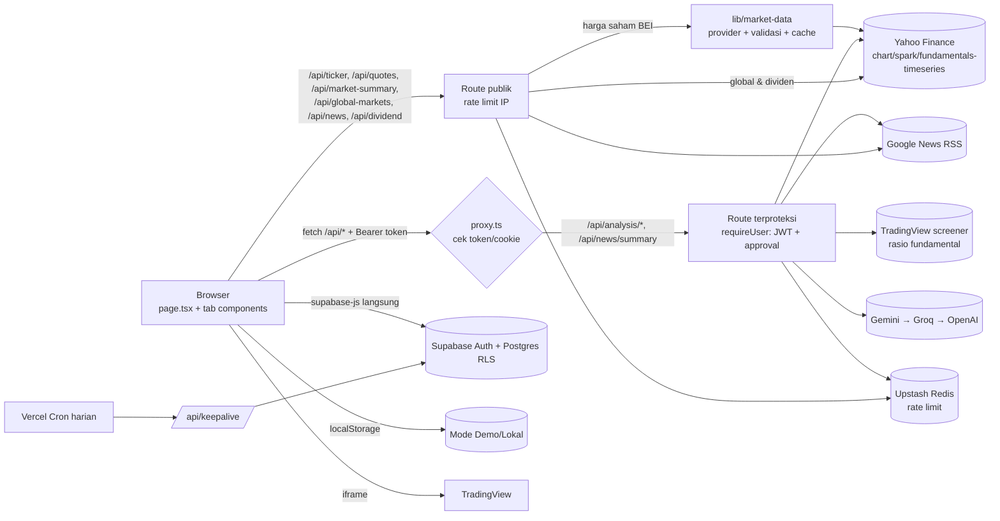

# Dokumentasi Teknis Lengkap: Nunnn Stock Analyzer

> Dokumen rujukan untuk seluruh menu, fitur, arsitektur, logika kalkulasi, API, data, konfigurasi, keamanan, dan hasil audit kode.
> Kondisi kode: commit `c52efc9` (branch `main`, 2026-10-08). Audit awal dibuat pada `3c29703` (2026-10-02); temuan yang sudah diperbaiki sejak itu ditandai ✅ (lihat [§12.1](#121-status-perbaikan)).
> Referensi kode memakai format `path:baris` dan bisa diklik di VSCode atau GitHub.
>
> Status temuan:
> - **Terverifikasi**: dicek langsung di kode.
> - **Perlu verifikasi runtime**: kesimpulan dari membaca kode, belum dibuktikan dengan menjalankan aplikasi.

---

## Daftar Isi

1. [Ringkasan Eksekutif](#1-ringkasan-eksekutif)
2. [Arsitektur](#2-arsitektur)
3. [Tech Stack & Dependensi](#3-tech-stack--dependensi)
4. [Struktur Direktori](#4-struktur-direktori)
5. [Bedah Menu & Fitur](#5-bedah-menu--fitur)
6. [Logika Kalkulasi & Rumus](#6-logika-kalkulasi--rumus)
7. [Referensi API](#7-referensi-api)
8. [Data & Penyimpanan](#8-data--penyimpanan)
9. [Konfigurasi & Environment](#9-konfigurasi--environment)
10. [i18n & Styling](#10-i18n--styling)
11. [Keamanan, CI/CD & Tooling](#11-keamanan-cicd--tooling)
12. [Temuan Audit](#12-temuan-audit)
13. [Utang Teknis & Kualitas Kode](#13-utang-teknis--kualitas-kode)
14. [Roadmap Rekomendasi](#14-roadmap-rekomendasi)
15. [Lampiran](#15-lampiran)

---

## 1. Ringkasan Eksekutif

**Nunnn Stock Analyzer** adalah web app untuk investor saham Indonesia (IDX/BEI). Isinya kalkulator investasi (Average Down, Compounding, Persentase, Dividen, E-IPO), berita pasar dengan rangkuman AI, analisis saham 3-in-1 (fundamental, teknikal, "bandarmology"), portofolio pribadi, dan panel admin untuk menyetujui pengguna.

| Aspek | Nilai |
|---|---|
| Framework | Next.js 16.3.4 (App Router, konvensi `proxy.ts`) + React 19.2.4 |
| Bahasa | TypeScript strict |
| Styling | Tailwind CSS v4, framer-motion, lucide-react, hanya mode gelap |
| Backend | Next.js Route Handlers (12 route), tanpa server actions |
| Data eksternal | Yahoo Finance (endpoint tidak resmi, lewat lapisan provider `lib/market-data` yang bisa diganti vendor berlisensi), Google News RSS, Gemini → Groq → OpenAI |
| Auth & DB | Supabase (Auth + Postgres + RLS); ada mode **Demo/Lokal** berbasis localStorage |
| Rate limit | Upstash Redis (opsional; tidak aktif bila env tidak diisi) |
| Deploy | Vercel (region `sin1`, cron harian) |
| Ukuran | 144 file ter-track git, sekitar 25,3k LOC di `src/`, 11 menu, 13 API route, 7 tabel DB |
| Test | **Tidak ada** |

### 5 temuan paling kritis

1. ✅ ~~**Menu Analisis dan Rangkuman AI selalu 401 di produksi.**~~ Diperbaiki di `abdd7d9`: sesi dikirim sebagai header `Authorization: Bearer`. Lihat [C-01](#c-01).
2. ✅ ~~**Rate limit AI (10/jam) ikut membatasi route fundamental dan teknikal.**~~ Diperbaiki di `abdd7d9`. Lihat [C-02](#c-02).
3. ✅ ~~**Data sintetis ditampilkan seolah data nyata.**~~ Broker summary, foreign flow, harga fallback 5000, fundamental dan berita buatan sudah dihapus. Dividen sejak `86e45a5`, Analisis sejak `802aed7`; sekarang yang tidak tersedia tampil "—" atau error yang jujur. Lihat [H-01](#h-01).
4. **Persetujuan admin belum dicek di RLS.** Server (`requireUser`) sudah memeriksanya sejak `abdd7d9`, tetapi CRUD tabel data lewat anon key belum. Lihat [H-02](#h-02).
5. **Belum ada test maupun CI kualitas** (lint, type-check, build). Workflow SLSA juga tidak valid. Lihat [H-07](#h-07).

---

## 2. Arsitektur

### 2.1 Pola aplikasi: satu halaman dengan tab state

- Hanya ada **satu route halaman**, yaitu [src/app/page.tsx](src/app/page.tsx) (`'use client'`, 1133 baris).
- Menu tidak dipisah per route. Setiap menu adalah tab yang dipilih lewat state `currentTab` ([page.tsx:52](src/app/page.tsx#L52)) dan disimpan di `sessionStorage['nunnn_stock_active_tab']` ([page.tsx:141-158](src/app/page.tsx#L141-L158)).
- **Semua tab selalu ter-mount.** Tab yang tidak aktif hanya disembunyikan dengan CSS (`block`/`hidden`) di dalam wrapper animasi framer-motion ([page.tsx:613-1041](src/app/page.tsx#L613-L1041)). Efek sampingnya: state tiap tab bertahan saat berpindah tab, tetapi efek dan fetch semua tab ikut jalan saat halaman dibuka.
- `page.tsx` memegang state global: `user`, sesi auth, CRUD rencana Avg Down, toast, tombol scroll-to-top, serta modal logout dan hapus. State ini diteruskan ke komponen lewat props. Tidak ada state library.

### 2.2 Pohon provider ([src/app/layout.tsx](src/app/layout.tsx))

```
<html lang="id" class="dark">
  ClientBootstrap        ← polyfill randomUUID/storage, bersihkan token Supabase basi, overlay error (dev)
    LanguageProvider     ← context i18n (id/en), disimpan di localStorage
      ThemeProvider      ← next-themes, forcedTheme="dark"
        {children}       ← page.tsx (Dashboard)
```

### 2.3 Alur data



Poin penting:
- **CRUD data pengguna** (rencana, portofolio, approval) dilakukan langsung dari browser ke Supabase lewat anon key. Keamanannya bergantung penuh pada RLS.
- **Data pasar dan AI** selalu lewat API route di server, sehingga API key AI tidak sampai ke klien.
- **Harga saham BEI** (IHSG, scan pasar, watchlist, portofolio, `/api/ticker`) dibaca lewat satu antarmuka provider dan dicek kewajarannya. Lihat [§7.1](#71-lapisan-data-pasar).

### 2.4 Dua mode operasi

| | Mode Demo/Lokal | Mode Supabase |
|---|---|---|
| Aktif bila | `NEXT_PUBLIC_SUPABASE_URL`/`ANON_KEY` kosong atau berisi placeholder ([supabase-config.ts](src/lib/supabase-config.ts), dipakai klien, server, dan proxy) | Env terisi dengan benar |
| Auth | User simulasi di localStorage (`nunnn_stock_simulated_users`, password di-hash SHA-256 + salt, [crypto.ts](src/lib/crypto.ts)) | Supabase Auth (email/password + Google OAuth) dengan gerbang approval admin |
| Penyimpanan | localStorage | Tabel Supabase (RLS per `user_id`) |
| Proxy & route terproteksi | Dilewati; `requireUser` memberi identitas `demo:<ip>` (tetap kena rate limit per IP) | Wajib header `Authorization: Bearer <token>` (atau cookie `sb-*-auth-token`); JWT & approval dicek di route |

### 2.5 Konvensi Next.js 16

- `middleware.ts` diganti **`src/proxy.ts`** (fungsi `proxy` + `config.matcher`).
- [AGENTS.md](AGENTS.md) mengingatkan bahwa API Next.js di versi ini berbeda dari yang umum dikenal. Baca `node_modules/next/dist/docs/` sebelum mengubah kode framework.

---

## 3. Tech Stack & Dependensi

Sumber: [package.json](package.json)

| Paket | Versi | Fungsi |
|---|---|---|
| `next` | ^16.3.4 | Framework |
| `react` / `react-dom` | 19.2.4 | UI |
| `@supabase/supabase-js` | ^2.106.2 | Klien Auth/DB (dipakai di browser) |
| `@supabase/ssr` | ^0.12.5 | Klien server ([supabase-server.ts](src/lib/supabase-server.ts)); `createBrowserClient` **tidak dipakai** |
| `@upstash/ratelimit`, `@upstash/redis` | ^2.0.8, ^1.38.3 | Rate limiting |
| `framer-motion` | ^12.40.0 | Animasi |
| `lucide-react` | ^1.17.0 | Ikon |
| `next-themes` | ^0.4.6 | Tema (dipaksa gelap) |
| `clsx`, `tailwind-merge` | ^2.1.1, ^3.6.0 | Helper `cn()` |
| Dev: `tailwindcss` / `@tailwindcss/postcss` | ^4 | Styling |
| Dev: `typescript` ^5, `eslint` ^9, `eslint-config-next` 16.2.6, `@types/*` | | Tooling |

**Scripts:** `dev`, `build`, `start`, `lint` (`eslint`), `deploy` (`node deploy.js`). Tidak ada `test` maupun `typecheck`.

**Yang tidak dipakai:**
- library chart (semua grafik berupa SVG tulisan tangan, ditambah iframe TradingView)
- state library, form library, React Query
- UI kit
- test framework

> Catatan: README masih menyebut Next 16.2.6, SheetJS (`xlsx`), dan canvas-confetti. Keduanya sudah dihapus (commit `56beb3d`, `dae1fd4`).

---

## 4. Struktur Direktori

```
.
├── .github/workflows/        security.yml, slsa-provenance.yml
├── .semgrep/custom-rules.yml  7 aturan SAST kustom
├── .zap/rules.tsv             aturan ZAP baseline
├── .gitleaks.toml             aturan secret scan kustom
├── .pre-commit-config.yaml    gitleaks + semgrep (belum ter-install di .git/hooks)
├── security-reports/          FASE-1..6, FINAL-REPORT.md, contoh fix (.ts/.json/.sql)
├── supabase/migrations/       8 migrasi SQL (tabel, RLS, RPC, trigger)
├── public/                    aset default Next (tidak dipakai)
├── deploy.js                  sinkron .env.local → Vercel + deploy --prod
├── next.config.ts             CSP & security headers, images.remotePatterns
├── vercel.json                cron, maxDuration per route, region, headers
└── src/
    ├── proxy.ts               (37)   gerbang token/cookie untuk /api/analysis/* & /api/news/summary
    ├── app/
    │   ├── layout.tsx         (43)   metadata, viewport, providers
    │   ├── page.tsx           (956)  Dashboard: semua tab + auth + CRUD Avg Down
    │   ├── globals.css        (126)  Tailwind v4 @theme tokens, glass-card, dll.
    │   └── api/
    │       ├── analysis/fundamentals/route.ts (425)
    │       ├── analysis/technical/route.ts    (997)  semua indikator teknikal
    │       ├── analysis/news/route.ts         (464)  sentimen per ticker (AI)
    │       ├── news/route.ts                  (156)  feed berita (kategori, pencarian, watchlist; cache 5 mnt)
    │       ├── news/summary/route.ts          (627)  analisis AI berita + SSRF guard (cache 24 jam)
    │       ├── ticker/route.ts                (135)  harga & pencarian ticker (via provider)
    │       ├── quotes/route.ts                (56)   harga + intraday banyak saham (watchlist, portofolio)
    │       ├── market-summary/route.ts        (137)  IHSG, breadth, movers (scan ±845 saham aktif, cache 45 dtk)
    │       ├── global-markets/route.ts        (37)   USD/IDR, LQ45, komoditas, indeks global
    │       ├── dividend/route.ts              (40)   riwayat dividen asli + harga tahunan (cache 6 jam)
    │       ├── dividend/summary/route.ts      (51)   dividen TTM banyak saham (yield chip populer)
    │       └── keepalive/route.ts             (36)   ping Supabase (cron)
    ├── components/            19 komponen + folder home/, dividend/, ipo/, portfolio/, admin/, shared/ (lihat §5)
    │   compounding-tab (1707) · calculator-form (896) · percentage-tab (763)
    │   news-tab (762) · results-display (423) · sidebar (387) · history-table (352)
    │   auth-modal (320) · watchlist-panel (295) · client-bootstrap (294) · portfolio-snapshot (199)
    │   quick-search-ticker (177) · stepper-input (150) · confirm-modal (135)
    │   educational-tip-card (117) · trending-news-strip (106) · company-logo (34) · theme-provider (11)
    │   home/  home-dashboard (232) · market-overview (187) · market-movers (161)
    │          global-markets (91) · sparkline (78) · market-status-bar (69) · types (45)
    │   dividend/  dividend-tab (867) · drip-projection (268) · ex-date-simulator (229)
    │              dividend-history (179)
    │   ipo/       ipo-tab (799) · listing-simulator (202) · ipo-rules (100)
    │   portfolio/ portfolio-tab (569) · holding-modal (252)
    │   admin/     admin-panel-tab (711)
    │   analysis/  analysis-tab (557) · sr-levels (195) · fundamentals-panel (117) · consensus-card (111)
    │              news-panel (110) · technical-panel (105) · flow-panel (71)
    │   watchlist/ watchlist-page (477)
    │   shared/    calc-ui (175)  Card, Field, Segmented, Stat, Badge, format & stepper helper kalkulator
    │              page-header (39)  header standar semua halaman
    └── lib/
        translations.ts (634) · tickers.ts (1003, 979 kode BEI bawaan) · idx-universe.ts (daftar aktif live) · compounding.ts (357)
        dividend.ts (540) · e-ipo.ts (354) · yahoo.ts (314) · calculator.ts (306) · news.ts (220) · format.ts (142)
        watchlist-store.ts (137) · percentage.ts (121) · rate-limit.ts (100) · auth-guard.ts (93) · market-hours.ts (85)
        language-context.tsx (70) · use-polling.ts (66) · idx-themes.ts (54) · crypto.ts (48) · auth-fetch.ts (42)
        supabase.ts (35) · utils.ts (35) · supabase-server.ts (34) · quotes.ts (28) · supabase-config.ts (14)
        portfolio-store.ts (141) · dividend-source.ts (36) · types.ts (26) · global-markets.ts (19) · validators.ts (17)
        market-data/  index (64) · yahoo-provider (57) · validate (54) · types (37)
```

---

## 5. Bedah Menu & Fitur

Ringkasan akses tiap menu:

| # | Menu (ID) | Komponen utama | Akses | Simpan data |
|---|---|---|---|---|
| 0 | Beranda | `home/home-dashboard.tsx` + widget | Publik (sapaan & ringkasan portofolio hanya untuk yang login) | — |
| 0b | Watchlist | `watchlist/watchlist-page.tsx` | Publik | Supabase `user_watchlists` / lokal |
| 1 | Berita & Sentimen | `news-tab.tsx` | Publik; Analisis AI wajib login | — |
| 2 | Kalkulator Avg Down | `calculator-form`, `results-display`, `history-table` | Publik | Supabase / lokal |
| 3 | Compounding | `compounding-tab.tsx` | Publik | Supabase / lokal (simpan, muat, hapus) |
| 4 | Persentase | `percentage-tab.tsx` | Publik | Riwayat lokal (5) |
| 5 | Dividen | `dividend/dividend-tab.tsx` + `dividend/*` | Publik | — (tanpa simpan) |
| 6 | E-IPO | `ipo/ipo-tab.tsx` + `ipo/*` | Publik | Supabase `ipo_plans` / lokal (simpan, muat, hapus) |
| 7 | Analisis Saham Pro | `analysis/analysis-tab.tsx` + `analysis/*` | **Wajib login** | — |
| 8 | Portofolio Saya | `portfolio/portfolio-tab.tsx` + `holding-modal.tsx` | **Wajib login** | Supabase / lokal via [portfolio-store](src/lib/portfolio-store.ts) |
| 9 | Admin Panel | `admin/admin-panel-tab.tsx` | **Hanya email admin** | Supabase RPC / lokal |

### 5.0 Sidebar & Navigasi ([sidebar.tsx](src/components/sidebar.tsx))

- **Daftar menu:** [sidebar.tsx:47-62](src/components/sidebar.tsx#L47-L62). Menu Admin selalu di urutan paling bawah, setelah Watchlist (`fc27b06`).
  - Menu `analysis` dan `portfolio` tampil dengan ikon gembok bila belum login.
  - Menu `watchlist` aktif sejak `db0cca3`. Menu "Riwayat Rencana" (dulu berbadge "Segera", tidak pernah aktif) dihapus; rencana tersimpan tetap ada di tiap kalkulator.
  - Menu `admin` hanya muncul bila email pengguna sama dengan `NEXT_PUBLIC_ADMIN_EMAIL` (default `admin@nunnnstock.com`, [sidebar.tsx:44](src/components/sidebar.tsx#L44)).
- **Ikon (lucide-react), unik per menu:** Beranda `Home`, Berita `Newspaper`, Avg Down `Calculator`, Compounding `Sprout`, Persentase `Percent`, Dividen `HandCoins`, E-IPO `Rocket`, Analisis `ChartCandlestick`, Portofolio `Briefcase`, Admin `ShieldCheck`, Watchlist `Star`. Badge judul di setiap tab memakai ikon yang sama dengan sidebar.
- **Desktop:**
  - Sidebar fixed yang bisa diciutkan (260px ↔ 80px). Chevron untuk menciutkan baru muncul saat hover.
  - Klik logo membuka Beranda.
  - Pengalih bahasa ID/EN; saat sidebar diciutkan berubah jadi satu tombol toggle.
  - Footer profil berisi email dan tombol logout, atau tombol "Masuk ke Akun".
- **Mobile:** header atas 64px dengan tombol hamburger, lalu drawer geser 280px yang berisi menu, pengalih bahasa, dan area profil.

### 5.1 Beranda ([home/home-dashboard.tsx](src/components/home/home-dashboard.tsx))

`page.tsx` hanya merender `<HomeDashboard isActive={currentTab === 'home'} />`. Semua kartu pasar memakai **satu** request `/api/market-summary` yang di-refresh tiap menit **hanya** saat jam bursa, tab Beranda aktif, dan browser terlihat ([home-dashboard.tsx:91](src/components/home/home-dashboard.tsx#L91), hook [use-polling.ts](src/lib/use-polling.ts)). Di luar itu data diambil sekali saat tab dibuka.

Urutan dari atas:

| Bagian | File | Isi & perilaku |
|---|---|---|
| Sapaan / hero | home-dashboard.tsx | Login: "Selamat pagi/siang/sore/malam, {nama}" (jam WIB) + badge Mode Cloud/Lokal. Pengunjung: hero ringkas + tombol Masuk |
| Status pasar | [market-status-bar.tsx](src/components/home/market-status-bar.tsx) | Sesi BEI (Pra-Pembukaan, Sesi 1, Istirahat, Sesi 2, Pra-Penutupan, Bursa Tutup, Libur Bursa), jam WIB, waktu scan terakhir, nama sumber data dari provider ("data bisa tertunda"), tombol Refresh |
| Pencarian | [quick-search-ticker.tsx](src/components/quick-search-ticker.tsx) | Debounce 350ms ke `/api/ticker?q=`; memilih ticker membuka **Analisis** |
| IHSG | [market-overview.tsx](src/components/home/market-overview.tsx) | Harga, perubahan, tutup kemarin, tertinggi/terendah, grafik intraday 5 menit dengan garis acuan, posisi dalam rentang 52 minggu |
| Breadth | market-overview.tsx | Jumlah saham naik/tetap/turun + bar, label "Mayoritas naik/turun/berimbang", jumlah ARA/ARB, total nilai transaksi, jumlah saham dipantau, dan jumlah saham yang dilewati karena datanya meragukan |
| Cakupan emiten | [listing-coverage.tsx](src/components/home/listing-coverage.tsx) | "924 emiten terpantau di web ini dari 963 tercatat di BEI · 96%": bar aktif (TradingView) / suspensi (terdeteksi) / belum terdeteksi, tanggal & sumber angka resmi. Data dari `/api/universe`, ikut sinyal refresh Admin (sejak `f7c2190`) |
| Global & Makro | [global-markets.tsx](src/components/home/global-markets.tsx) | USD/IDR, LQ45, Emas, Brent, Batu Bara (API2), Nikkei 225, Hang Seng, S&P 500 Futures dengan grafik mini; refresh tiap 2 menit saat Beranda aktif ([lib/global-markets.ts](src/lib/global-markets.ts)) |
| Penggerak Pasar | [market-movers.tsx](src/components/home/market-movers.tsx) | Tab Gainers / Losers / Top Nilai / Top Volume (6 baris). Filter nilai transaksi Semua / ≥ Rp1 M / ≥ Rp10 M (default ≥ Rp1 M, hanya untuk Gainers/Losers). Badge ARA/ARB. Klik kode → Analisis; tombol ☆ → watchlist |
| Watchlist | [watchlist-panel.tsx](src/components/watchlist-panel.tsx) | Varian ringkas (6 baris + "Lihat semua"); lihat di bawah |
| Ringkasan Portofolio | [portfolio-snapshot.tsx](src/components/portfolio-snapshot.tsx) | Login saja. Total ekuitas (+ nilai pasar), **P&L hari ini**, P&L total, kas RDN ("Belum diatur" bila kosong, tanpa angka fiktif). Satuan "jt / M / T" ([format.ts](src/lib/format.ts) `formatIDRCompact`). Data dibaca lewat [portfolio-store](src/lib/portfolio-store.ts) yang sama dengan halaman Portofolio. Harga semua saham diambil sekali lewat `/api/quotes`; perubahan yang meragukan tidak dihitung ke P&L hari ini |
| Berita | [trending-news-strip.tsx](src/components/trending-news-strip.tsx) | 4 berita `/api/news?category=saham` (2 kolom); pesan berbeda untuk gagal dimuat vs kosong |
| Tips | [educational-tip-card.tsx](src/components/educational-tip-card.tsx) | 1 tip acak dari 8 tip dwibahasa (isi dikoreksi di `db0cca3`) |
| Akses Cepat | home-dashboard.tsx | 8 menu dengan ikon yang sama seperti sidebar; ikon gembok untuk Analisis/Portofolio bila belum login |
| Disclaimer | home-dashboard.tsx | Teks `common.disclaimer` |

**Watchlist** (widget Beranda [watchlist-panel.tsx](src/components/watchlist-panel.tsx), halaman penuh [watchlist/watchlist-page.tsx](src/components/watchlist/watchlist-page.tsx), store [watchlist-store.ts](src/lib/watchlist-store.ts)):
- Satu store (`useSyncExternalStore`) dipakai bersama oleh widget Beranda, halaman **Watchlist Saham** (menu sidebar), dan tombol ☆ di Penggerak Pasar & Berita. Maksimal 20 saham.
- Widget Beranda: 6 baris, harga + % + grafik mini, tambah lewat pencarian, "Lihat semua" membuka halaman penuh.
- Halaman penuh (dibangun ulang di `30f9770`; sebelumnya hanya widget yang direntangkan di kolom sempit):
  - `PageHeader` + bar status sesi bursa, jam WIB, waktu update, dan sumber data.
  - Ringkasan: jumlah dipantau (naik/turun/tetap), rata-rata perubahan, saham terkuat & terlemah.
  - Pencarian untuk menambah langsung di halaman; saran saham saat kosong.
  - Per saham: harga, perubahan Rp & %, grafik intraday dengan garis penutupan kemarin, rentang hari ini (dari bar 5 menit) dengan penanda posisi harga, nilai transaksi, badge ARA/ARB (batas sesuai tanggal), tombol Analisis & Hapus.
  - **Harga incaran** per saham: "Beli di bawah" atau "Jual di atas", dengan jarak ke target; baris disorot dan muncul banner saat tercapai.
  - Urutan: urutan saya (bisa digeser naik/turun), naik, turun, nilai transaksi, A–Z. Desktop tabel, HP kartu.
- Harga dari `/api/quotes`, di-refresh tiap menit saat jam bursa. Perubahan yang tidak lolos pengecekan kewajaran ditandai "data meragukan".
- Penyimpanan: selalu localStorage `nunnn_stock_watchlist`; bila login ke Supabase, disinkron ke tabel `user_watchlists` ([connectWatchlistToUser](src/lib/watchlist-store.ts)). Versi cloud menang saat login; bila cloud kosong, daftar lokal diunggah. Harga incaran ikut tersimpan di item JSON yang sama.

### 5.2 Berita & Sentimen ([news-tab.tsx](src/components/news-tab.tsx), [lib/news.ts](src/lib/news.ts), [lib/idx-themes.ts](src/lib/idx-themes.ts))

Data hanya diambil saat tab Berita dibuka (`isActive`), dan hasil per kategori di-cache di browser selama 5 menit.

**Navigasi:**
- Pencarian berita atau kode saham (maks 100 karakter), tombol hapus, dan tombol refresh.
- Tab **Untuk Anda** (berita saham di watchlist), **Saham Indonesia**, **Pasar Global**, **Makro & Kebijakan**, **Komoditas**. Kategori lama `foreign`/`domestik`/`politik` di API dialihkan ke kategori baru.
- Tab Untuk Anda tanpa watchlist menampilkan ajakan "Buka Watchlist".

**Feed** (`/api/news`, Google News RSS 7 hari terakhir):
- Judul dibersihkan dari akhiran " - Nama Media", berita duplikat dan konten video dibuang, nama sumber berupa URL diganti domainnya.
- **Kurasi sumber:** bila kategori punya ≥ 10 berita dari daftar ±40 media keuangan/berita arus utama (`TRUSTED_DOMAINS`, [news.ts:30](src/lib/news.ts#L30)), media lain disembunyikan; jumlahnya ditampilkan di bawah feed.
- Berita dikelompokkan per hari (Hari ini / Kemarin / tanggal, WIB) dengan waktu relatif ("3 jam lalu"); tampil 12 berita + "Muat lebih banyak" (maks 40).
- **Chip saham** di setiap berita: kode yang disebut di judul ([extractTickers](src/lib/news.ts#L168)), dengan % perubahan live dari `/api/quotes`, klik → Analisis, ☆ → watchlist.
  - Dikenali dari kode 4 huruf dan dari ±55 nama/brand umum (`NAME_ALIASES`, mis. "BCA" → BBCA, "Bank Mandiri" → BMRI, "Antam" → ANTM, "Vale Indonesia" → INCO). Frasa yang lebih panjang menang ("Indofood CBP" → ICBP, bukan INDF).
  - Kode yang juga kata umum (NATO, NASA, META, BANK, GOLD, ...) hanya dikenali bila didahului "saham"/"emiten" atau ditulis dalam kurung.
- Tab Untuk Anda memakai kueri kode **atau** nama emiten, lalu disaring ketat: hanya berita yang judulnya benar-benar menyebut saham tersebut.

**Analisis AI** (login wajib; `POST /api/news/summary` lewat `authFetch` dengan token Bearer):

| Bagian | Isi |
|---|---|
| Label | Sentimen (Positif/Negatif/Netral) + keyakinan, kategori dampak (Korporasi/Makro/Regulasi/Sektor/Pasar), horizon, **dasar analisis** ("Dari artikel lengkap" atau "Hanya dari judul"), dan provider AI |
| Ringkasan | 1 kalimat inti + 2–3 kalimat konteks, lalu 2–4 poin penting |
| Saham terdampak | **Disebut di berita** (judul + AI) dan **Berpotensi terdampak per sektor**: tema dari peta 25 tema BEI terkurasi ([idx-themes.ts](src/lib/idx-themes.ts)) dengan arah ▲/▼/◆ dan alasan, dikembangkan server menjadi emiten valid |
| Yang perlu dipantau | 1–3 hal ke depan |
| Penutup | Disclaimer "bukan rekomendasi investasi" + tautan artikel asli |

- Tanpa saran beli/jual atau target harga. Keluaran AI divalidasi (enum, panjang teks, kode saham dicocokkan dengan kamus BEI); bila tidak valid, provider berikutnya dicoba (Gemini → Groq → OpenAI, dalam batas waktu 26 detik).
- Analisis "hanya dari judul" dibatasi keyakinan rendah dan maksimal 1 tema; artikel lengkap maksimal 3 tema.
- Tanpa AI (tidak dikonfigurasi/gagal): tampil cuplikan paragraf artikel asli tanpa interpretasi, atau pesan "belum tersedia". Mode "Heuristic Engine" lama yang mengarang temuan sudah dihapus.
- Pesan error spesifik: sesi tidak valid (dengan tombol Masuk), akun menunggu approval, kuota 10/jam habis (dengan sisa waktu), layanan login mati, pemeriksaan akun gagal di server.
- Sentimen hasil analisis juga tampil sebagai badge di kartu berita.

> Catatan: beberapa media (mis. IDNFinancials) memasang proteksi bot Cloudflare yang menolak request dari server. Artikel dari media seperti ini dianalisis hanya dari judul dan diberi label demikian; proteksi tersebut sengaja tidak diakali.

### 5.3 Kalkulator Average Down

File: [calculator-form.tsx](src/components/calculator-form.tsx), [results-display.tsx](src/components/results-display.tsx), [history-table.tsx](src/components/history-table.tsx), [stepper-input.tsx](src/components/stepper-input.tsx), dan logika di [lib/calculator.ts](src/lib/calculator.ts).

**Form.** Hasil dihitung ulang setiap kali input berubah ([calculator-form.tsx:310](src/components/calculator-form.tsx#L310)).

- **Contoh awal:** GTSI (GTS Internasional), 100 lot @ Rp160, beli 100 lot lagi ([calculator-form.tsx:20](src/components/calculator-form.tsx#L20)). Harga sekarang langsung diambil live saat halaman dibuka.
- **Tombol Reset** di header form mengembalikan semua isian ke contoh awal.
- **Tata letak:** satu kolom di layar sempit; mulai `xl` memakai grid 12 kolom (Step 1 & 2 di baris pertama, Step 3 lebar 8/12 dan Step 4 lebar 4/12 di baris kedua).

1. **Saham & Emiten.**
   - Logo, ticker (maks 5 karakter, hanya huruf/angka), dan nama perusahaan.
   - Nama dari kamus lokal tampil instan; nama & harga dari `/api/ticker` diambil 400 ms setelah berhenti mengetik (≥4 karakter).
2. **Posisi Awal.**
   - Lot Awal, Avg Price, dan Harga Sekarang (dengan tombol isi harga pasar).
   - Checkbox "Avg Price awal sudah termasuk fee beli" (hanya muncul bila fee aktif).
3. **Rencana Beli Baru.**
   - Bisa lebih dari satu tahap. Tiap tahap berisi lot, harga beli (dengan tombol isi harga pasar), dan dana dibutuhkan.
   - **Tahap baru terisi otomatis:** lot sama dengan tahap terakhir, harga 5% di bawahnya dan dibulatkan ke fraksi BEI ([calculator-form.tsx:349](src/components/calculator-form.tsx#L349)).
   - **Peringatan fraksi harga** (kuning) bila harga beli bukan kelipatan fraksi BEI.
   - Di HP, setiap tahap tampil sebagai kartu: baris atas berisi nomor tahap, dana, dan tombol hapus; di bawahnya Lot dan Harga Beli berdampingan.
4. **Broker Fee.**
   - Preset: Stockbit 0,15/0,25, Ajaib 0,15/0,25, IPOT 0,19/0,29, Custom, atau Tanpa Fee ([calculator-form.tsx:84](src/components/calculator-form.tsx#L84)).
   - Custom membuka input % beli dan % jual.

**Tombol −/+ ([StepperInput](src/components/stepper-input.tsx)).** Semua kolom angka punya tombol −/+ di kedua sisi; bisa diklik, ditahan (mengulang otomatis), atau memakai panah ↑/↓ keyboard. Angka tetap bisa diketik manual.

| Kolom | Langkah |
|---|---|
| Lot Awal, Lot per tahap | ±1 lot (minimal 1) |
| Harga Sekarang, Harga Beli | ±1 fraksi BEI lewat `stepIdxPrice` (199 → 200 → 202; harga tidak valid di-snap, 2.755 → 2.760/2.750) |
| Avg Price | ±1 fraksi, desimal dipertahankan |
| Fee custom | ±0,01% (0–10%) |

**Baris aksi** ([calculator-form.tsx:848](src/components/calculator-form.tsx#L848)):
- Ringkasan live: Avg Baru (+ % perubahan), Harga BEP (+ % jarak dari harga sekarang), dan Modal Baru.
- Tombol "Simpan" (cloud) atau "Simpan Lokal"; bila nonaktif, alasannya ditampilkan.
- Data disimpan ke tabel `avg_down_plans` atau localStorage `nunnn_stock_saved_plans` ([page.tsx:375](src/app/page.tsx#L375)).

> ⚠️ Saat disimpan, semua tahap masih digabung jadi satu lot dan satu harga rata-rata tertimbang ([page.tsx:389](src/app/page.tsx#L389)). Rincian per tahap hilang, dan flag `avgPriceAwalIncludesFee` hanya ikut tersimpan di mode lokal. Lihat [M-14](#m-14).

**Hasil ([results-display.tsx](src/components/results-display.tsx)):**
- Tampilan kosong "Menunggu Input Data".
- Baris atas 3 kartu: Emiten (logo, ticker, nama), Modal Baru (+lot/lembar), Total Lot Akhir.
- **SEBELUM vs SESUDAH**: avg price, modal, market value, **Harga BEP (impas setelah fee jual)** dengan keterangan "Butuh naik x%", dan floating P&L (Rp/%). Badge "Berbalik Profit!" beranimasi sekali bila posisi berbalik untung.
- **Rangkuman Perbaikan Posisi**:
  - % perubahan avg price. Bila harga beli baru di atas avg, label berubah menjadi "Harga Rata-Rata Naik" (kuning) dengan catatan bahwa ini sebenarnya average up.
  - % pengurangan floating loss ("100% (Sembuh!)" bila impas/untung; "Floating Loss Membesar" bila justru bertambah).
  - Kalimat jarak ke BEP sebelum vs sesudah, misalnya "harga perlu naik 9,61% (sebelumnya 18,82%)".
  - Bila posisi awal sudah untung, yang tampil pesan "Posisi Portofolio Sehat".
- Format angka mengikuti bahasa (id-ID / en-US).

**Rencana tersimpan ([history-table.tsx](src/components/history-table.tsx)):**
- Kartu berjudul "Rencana Tersimpan" dengan jumlah rencana; semua teks dwibahasa.
- Desktop: tabel Saham, Posisi Awal, Rencana Baru, Estimasi Avg Baru (badge Turun/Naik), Tanggal, Aksi. Mobile: kartu.
- Estimasi memakai `calculateAvgDown` yang sama dengan kalkulator, termasuk fee.
- Tombol "Muat" berlabel; setelah diklik halaman otomatis scroll kembali ke form ([page.tsx:498](src/app/page.tsx#L498)). Hapus memakai modal konfirmasi.
- Peringatan localStorage untuk pengguna yang belum login, dengan link "Masuk ke akun" yang membuka modal login lewat prop `onSignInClick`.
- Aksi "Avg Down" dari tab Portofolio mengisi form ini secara otomatis ([page.tsx:509](src/app/page.tsx#L509)).

### 5.4 Kalkulator Compounding ([compounding-tab.tsx](src/components/compounding-tab.tsx), [lib/compounding.ts](src/lib/compounding.ts))

Ada dua mode: **Rencana Trading** (default) dan **Investasi Jangka Panjang**. Header form berisi tombol Reset, Cetak (`window.print`, desktop), dan **Simpan Rencana**.

**Rencana Trading: Harian / Bulanan / Tahunan**
- Pilihan periode muncul di samping pemilih mode. Setiap periode menyimpan nilainya sendiri (target, durasi, setoran), jadi berpindah periode tidak menghapus isian.
- Default ([compounding-tab.tsx:79](src/components/compounding-tab.tsx#L79)):

  | Periode | Target | Durasi | Batas durasi |
  |---|---|---|---|
  | Harian | 1%/hari | 20 hari | 2.520 hari |
  | Bulanan | 5%/bulan | 12 bulan | 600 bulan |
  | Tahunan | 20%/tahun | 10 tahun | 100 tahun |

- Input: modal awal, target profit per periode (%), durasi (dengan tombol pintas, mis. 1 bln/3 bln/6 bln/1 thn), setoran tambahan per periode, dan broker fee (preset atau custom).
- **Konversi target** di bawah kolom target, misalnya "1%/hari ≈ 23,24%/bulan · ≈ 1.127%/tahun (majemuk, sebelum fee)". Muncul peringatan kuning bila setara lebih dari 100% per tahun.
- Asumsi hari bursa: 21 hari per bulan, 252 per tahun.
- Fee broker dipotong 1× beli + 1× jual setiap periode.
- Kartu ringkasan: Modal Akhir, Profit Bersih (+ return %), Total Disetor, **Total Fee Broker**.

**Investasi Jangka Panjang:**
- Input: modal awal, setoran berkala + frekuensinya (harian/mingguan/bulanan/tahunan), return tahunan % + frekuensi bunga (harian/bulanan/kuartalan/tahunan), jangka waktu (0–100 tahun + 0–11 bulan), inflasi % dan pajak bunga %.
- Kartu ringkasan: Total Saldo Akhir (+ return %), Akumulasi Setoran, Akumulasi Bunga (kotor, + total pajak), dan **Saldo Riil** (disesuaikan inflasi).

**Input angka.** Semua kolom angka memakai tombol −/+:
- Nominal Rupiah: langkah mengikuti besarnya angka (10 juta → ±1 juta; di bawah 1 juta → ±100 ribu).
- Persen: target ±0,1 (harian) / ±0,5 (bulanan) / ±1 (tahunan); return & inflasi & pajak ±0,5; fee ±0,01.
- Persen menerima koma maupun titik sebagai desimal ("0,5" = "0.5").

**Grafik** ([compounding-tab.tsx:1314](src/components/compounding-tab.tsx#L1314)):
- Dimulai dari titik modal awal. Isi: area saldo nominal, garis total setoran, dan garis nilai riil (khusus jangka panjang).
- Bisa di-hover dengan mouse maupun disentuh di HP; tooltip mengikuti titik yang disorot.
- Jangka panjang: titik per tahun bila durasi > 36 bulan, selain itu per bulan.
- Angka besar disingkat Juta/Miliar/Triliun … (EN: Million/Billion/Trillion …).

**Tabel** ([compounding-tab.tsx:1463](src/components/compounding-tab.tsx#L1463)):
- Header tetap terlihat saat di-scroll; jumlah baris ditampilkan.
- Kolom: Periode, Saldo Awal, Setoran, Profit/Bunga, Fee Broker atau Pajak (bila > 0), Saldo Akhir, Saldo Riil (bila inflasi > 0), Return Kumulatif.
- Rencana Trading: Harian bisa dilihat **Per Hari / Rekap Bulanan / Rekap Tahunan**; Bulanan bisa **Per Bulan / Rekap Tahunan**; Tahunan per tahun ([compounding-tab.tsx:711](src/components/compounding-tab.tsx#L711)).
- Jangka panjang: toggle Tahunan/Bulanan.

**Rencana tersimpan** ([compounding-tab.tsx:1533](src/components/compounding-tab.tsx#L1533)):
- Simpan lewat dialog dengan judul otomatis (mis. "Trading Harian 1% × 20 Hari"); bisa dimuat dan dihapus (dengan konfirmasi).
- Disimpan di Supabase `compounding_plans` atau localStorage `nunnn_stock_compounding_plans`. Lihat §8.1 untuk pemetaan kolom rencana trading.
- Ada CSS khusus cetak ([compounding-tab.tsx:806](src/components/compounding-tab.tsx#L806)).

### 5.5 Kalkulator Persentase ([percentage-tab.tsx](src/components/percentage-tab.tsx), [lib/percentage.ts](src/lib/percentage.ts))

| Mode | Input | Output |
|---|---|---|
| Perubahan % | Dari, Ke | % perubahan, selisih, multiplier, % yang dibutuhkan untuk kembali ke awal |
| Naik/Turun % | Nilai dasar, % | Nilai setelah naik/turun, selisih, faktor |
| % dari Nilai | %, Total | Nilai bagian, sisa |
| Berapa % | Bagian, Total | Persentase, sisa % |
| Nilai Awal (reverse) | Nilai akhir, % | Nilai awal, selisih |

**Fitur pendukung:**
- Tombol tukar (khusus mode Perubahan) dan toggle Naik/Turun (mode Naik/Turun dan Nilai Awal).
- Preset 5/10/20/25/50%.
- Hasil langsung tampil saat mengetik, dengan `aria-live`.
- Catatan pemulihan saat turun, misalnya "Turun 50% butuh naik 100%".
- Baris rumus, tombol salin ringkasan ke clipboard, dan tombol simpan.
- Riwayat 5 entri terakhir tanpa duplikat (`nunnn_stock_percentage_history`), dengan tombol "Hapus Semua".

**State error:** basis 0, total 0, penurunan ≥100% yang tidak bisa dibalik, dan input tidak valid.

> ⚠️ Input "0.125" terbaca sebagai 125. Lihat [M-01](#m-01).

### 5.6 Kalkulator Dividen ([dividend/dividend-tab.tsx](src/components/dividend/dividend-tab.tsx), [lib/dividend.ts](src/lib/dividend.ts))

Dibangun ulang di `86e45a5`. Semua angka berasal dari data asli; **tidak ada lagi data cadangan buatan**. Emiten yang belum pernah membagikan dividen (mis. GOTO) ditampilkan apa adanya, bukan diberi riwayat palsu.

**1. Pilih saham:**
- Pencarian memakai [QuickSearchTicker](src/components/quick-search-ticker.tsx) (navigasi keyboard, Esc, klik di luar menutup).
- Kartu harga: harga, perubahan Rp/% dari `/api/quotes` (tervalidasi, badge "Data meragukan" bila tidak lolos cek), jam update WIB, label "tertunda". Di-refresh tiap 60 detik saat jam bursa, hanya bila tab aktif dan terlihat.
- 16 chip saham dividen populer, **diurutkan berdasarkan yield 12 bulan di harga sekarang** yang dihitung live (`/api/dividend/summary` + `/api/quotes`), bukan angka tetap.
- Data dimuat hanya saat tab dibuka. Ganti saham membatalkan request lama (`AbortController`), dan data saham sebelumnya tidak pernah tampil di bawah kode saham baru. Gagal → kartu error + "Coba lagi"; 404 → "kode tidak ditemukan".

**2. Profil dividen** ([dividend-history.tsx](src/components/dividend/dividend-history.tsx)):
- Kartu: dividen 12 bulan (TTM) + jumlah pembayaran, yield TTM di harga pasar, konsistensi (tahun berturut-turut), pertumbuhan DPS 5 tahun (CAGR, fallback 3 tahun), stabilitas (berapa kali turun dalam 5 tahun penuh).
- Grafik batang DPS per tahun (12 tahun; 6 tahun di HP), tahun berjalan bergaris putus, baris bawah = yield terhadap rata-rata harga tahun itu.
- Tabel riwayat: tahun, cum date ≈, ex date, cair ≈, DPS; badge "Terjadwal" untuk ex date yang belum lewat. 8 baris pertama, sisanya lewat "Tampilkan semua".

**3. Simulasi** (semua angka punya tombol −/+ [`StepperInput`](src/components/stepper-input.tsx)):
- Mode Nominal atau Lot. Berpindah mode membawa nilai yang setara (lot ↔ modal terpakai).
- Harga beli per lembar: default harga pasar, langkah −/+ mengikuti fraksi BEI, peringatan bila bukan kelipatan fraksi, tombol kembali ke harga pasar.
- Dividen per lembar per tahun dengan pilihan dasar: **TTM**, **tahun penuh terakhir**, **rata-rata 3 tahun** (untuk dividen yang naik-turun seperti batu bara), atau **Manual** (mengetik/menekan −/+ otomatis pindah ke Manual).
- Pajak: 10% (individu, tidak direinvestasi; default), 0% (individu, reinvestasi ≥3 tahun), 20% (investor asing / tarif P3B), atau tarif sendiri 0–100%.
- Fee beli broker (default 0,15%).

**4. Hasil:**
- Dividen bersih per tahun (kotor − pajak), rata-rata per bulan sebagai info sekunder.
- Pembagian berikutnya: nominal bersih, DPS, batas beli (cum) ≈ + hitung mundur hari, tanggal cair ≈, badge Terjadwal/Perkiraan.
- Yield: bersih & kotor terhadap **modal terpakai** (yield on cost), dan yield di harga pasar.
- Kepemilikan (lot/lembar), nilai transaksi + fee, modal terpakai, sisa modal yang tidak cukup untuk 1 lot.
- Kalender 12 bulan (berdasarkan tanggal cair) + daftar pembayaran (tabel di desktop, kartu di HP).

**5. DRIP vs diambil tunai** ([drip-projection.tsx](src/components/dividend/drip-projection.tsx)): jangka 1–30 tahun, asumsi pertumbuhan dividen & harga per tahun (tombol "Pakai CAGR historis"), kartu nilai akhir, keunggulan DRIP, lot tambahan, passive income per bulan di tahun terakhir, grafik dua garis, dan tabel per tahun.

**6. Simulasi cum → ex date (dividend trap)** ([ex-date-simulator.tsx](src/components/dividend/ex-date-simulator.tsx)): beli di cum, terima dividen bersih, jual di ex date. Menampilkan hasil bersih dan **harga jual impas** (dibulatkan ke atas ke fraksi BEI). Nilai mengikuti simulasi utama sampai pengguna mengubahnya.

**7. Catatan pajak & data** di bagian bawah halaman.

Bahasa: semua teks dwibahasa; isi input diformat ulang (titik/koma ribuan) saat bahasa diganti. Tidak ada fitur simpan.

### 5.7 Kalkulator E-IPO ([ipo/ipo-tab.tsx](src/components/ipo/ipo-tab.tsx), [lib/e-ipo.ts](src/lib/e-ipo.ts))

Dibangun ulang di `c2e9dde` mengikuti teks resmi **SEOJK 25/SEOJK.04/2025** (berlaku 17 Nov 2025, mencabut SEOJK 15/2020). Model lama ("jatah proporsional 1/X" dan "peluang %") salah: pesanan ritel 1.000 lot diperkirakan dapat 40 lot, padahal aturan hanya memberi maksimal 1 lot bila lot lebih sedikit dari pemesan. Kartu "aturan lama" juga dihapus karena tabelnya ternyata tabel aturan baru (SEOJK 15/2020 hanya punya 4 golongan).

**1. Data IPO (dari prospektus):** kode (opsional; tidak lagi mengambil harga pasar, hanya memberi peringatan bila kode sudah tercatat), nama, harga penawaran (−/+ mengikuti fraksi BEI), dan lot ditawarkan. Petunjuk: nilai 1 lot, nilai penawaran, dan golongan. Data IPO live tidak tersedia karena e-ipo.co.id memblokir akses mesin (Cloudflare 403).

**2. Kondisi pemesanan penjatahan terpusat:** oversubscribe terpusat (× terhadap alokasi minimal awal), jumlah pemesan ritel dan selain ritel, serta porsi pesanan dari ritel (% lot). Petunjuk menampilkan total lot dipesan dan rata-rata pesanan per orang, dengan peringatan bila rata-rata ritel > Rp100 juta atau rata-rata selain ritel ≤ Rp100 juta (asumsi tidak konsisten).

**3. Pesanan Anda:** jumlah lot (tombol "maks ritel"), badge Ritel/Selain ritel, dana disetor, peringatan batas 10% nilai penawaran, dan posisi antrean waktu pesan (Awal 10% / Tengah 50% / Akhir 90% / Atur).

**Hasil penjatahan:**
- Perkiraan jatah Anda (lot) + penjelasan tahap yang berlaku dalam bahasa sehari-hari, nilai jatah, dan dana yang dikembalikan.
- Alur alokasi: nilai penawaran & golongan → alokasi terpusat awal → setelah penyesuaian I/II/III → lot per porsi (1 : 1).
- Kartu porsi ritel dan selain ritel: lot tersedia, pemesan, total dipesan, oversubscribe porsi, dan ringkasan ("1 lot untuk X% tercepat", "≈ k lot per pemesan", atau "10 lot + proporsional").
- Strategi pesanan: tabel 1 lot, 10 lot, **pesanan efisien terkecil** (dicari dengan pencarian biner), maks ritel, maks ritel + 1 lot (masuk selain ritel), dan pesanan Anda, beserta perkiraan jatah dan dana kembali.
- Tombol **Simpan simulasi** (L-01 ✅).

**4. Simulasi hari pertama listing** ([listing-simulator.tsx](src/components/ipo/listing-simulator.tsx)): lot dijual (default = jatah), harga jual sendiri + harga impas, fee beli IPO (default 0%) dan fee jual. Skenario: ARB hari 1, −10%, flat, +10%, ARA 1/2/3 hari berturut-turut, dihitung dengan `getAutoRejectionBounds` (batas yang berlaku saat ini, dibulatkan ke fraksi).

**Aturan (akordeon)** ([ipo-rules.tsx](src/components/ipo/ipo-rules.tsx)): tabel golongan & penyesuaian dengan golongan aktif disorot, catatan definisi, dan urutan penjatahan di tiap porsi beserta contoh resmi SEOJK.

**Simulasi tersimpan:** daftar kartu dengan Muat dan Hapus (dengan konfirmasi). Tersimpan di `ipo_plans` (login) atau `nunnn_stock_ipo_plans` (lokal).

### 5.8 Analisis Saham Pro ([analysis/analysis-tab.tsx](src/components/analysis/analysis-tab.tsx), wajib login)

Ditulis ulang di `802aed7`. Semua angka berasal dari data pasar nyata; bagian yang datanya tidak tersedia tampil "—" atau pesan error, tidak pernah diisi angka buatan.

- **Terkunci** bila belum login: header halaman, kartu gembok, dan CTA login ([analysis-tab.tsx:244](src/components/analysis/analysis-tab.tsx#L244)).
- **Tidak ada yang dimuat otomatis.** Analisis hanya berjalan setelah tombol **Analisis** ditekan, sehingga kuota AI tidak terbuang saat halaman sekadar dibuka.
- **Kartu pemilihan saham:**
  - `QuickSearchTicker` (seluruh emiten aktif), chip **Terakhir** (maks 6 saham yang pernah dianalisis, `nunnn_stock_analysis_recent`), dan chip **Populer** (12 saham).
  - Saham terpilih tampil dengan logo, nama, harga, dan perubahan dari `/api/ticker` (route publik, tanpa AI).
  - Sakelar **Sentimen AI** (diingat di `nunnn_stock_analysis_ai`) dan tombol **Analisis {kode}**, yang berubah jadi **Analisis ulang** untuk saham yang sama.
  - Kode dari Beranda atau Portofolio (prop `initialTicker`) hanya memilih saham, tidak langsung menganalisis.
  - Sebelum analisis pertama, ditampilkan 5 kartu ringkas fitur yang akan didapat.
- **Analisis** ([analysis-tab.tsx:201](src/components/analysis/analysis-tab.tsx#L201)): teknikal, fundamental, dan berita dimuat paralel. Masing-masing punya skeleton dan pesan error sendiri (404 kode tidak dikenal, 401/403/429, 502 sumber gagal). Bila pembaruan gagal, data terakhir tetap tampil dengan penanda.
- **Penghematan AI:**
  - Berita diminta dengan `ai=1` hanya bila sakelar Sentimen AI menyala. Bila mati, sentimen memakai kata kunci judul (tanpa token).
  - Panel Sentimen Berita menyediakan tombol **Analisis sentimen dengan AI (1 kuota)** untuk meminta AI per saham.
  - Hasil AI disimpan server ±30 menit per kumpulan berita, jadi analisis ulang dengan berita yang sama tidak memakai kuota.
- **LIVE** ([analysis-tab.tsx:174](src/components/analysis/analysis-tab.tsx#L174)): toggle di header. Hanya harga dan teknikal yang diperbarui, tiap 60 detik saat bursa buka dan halaman terlihat; tidak pernah memanggil AI. Tombol "Refresh semua data" di Admin memuat ulang teknikal dan fundamental (tanpa berita/AI).
- **Ringkasan harga:** logo, sektor, harga dan perubahan, rentang hari ini, **batas ARB – ARA hari ini** (papan reguler, dari penutupan sebelumnya lewat `getAutoRejectionBounds`), rentang 52 minggu, volume (lot), nilai transaksi, waktu data (WIB), dan sumber (Yahoo, bisa tertunda ±10 menit). Badge ARA/ARB muncul bila harga menyentuh batas, dan badge "harga perlu dicek" bila validasi harga menandainya.
- **Grafik TradingView** (iframe dengan RSI, MACD, dan Pivot; simbol dikunci ke emiten aktif), berdampingan dengan **Skor Konsensus** ([consensus-card.tsx](src/components/analysis/consensus-card.tsx)):
  - Skor 0–100 dan rating.
  - Bar 4 komponen, dengan bobot yang dinormalkan ulang bila ada komponen yang tidak tersedia.
  - Maksimal 5 poin positif dan 5 poin negatif.
  - Disclaimer bahwa skor bukan rekomendasi beli/jual.
- **Support & Resistance 9 titik** ([sr-levels.tsx](src/components/analysis/sr-levels.tsx)):
  - Metode Klasik, Fibonacci, atau Camarilla.
  - Setiap titik diberi label dan petunjuk: R4 *Resistance ekstrem*, R3 *Resistance kuat*, R2 *Resistance menengah*, R1 *Resistance terdekat*, PP *Pivot (titik keseimbangan)*, S1 *Support terdekat*, S2 *Support menengah*, S3 *Support kuat*, S4 *Support ekstrem*.
  - Setiap titik juga menampilkan kekuatan (●), harga yang dibulatkan ke fraksi BEI, dan jarak % dari harga sekarang.
  - Baris "▶ Harga sekarang" disisipkan di posisinya. Ada kartu resistance/support terdekat dan bias pivot (di atas, di bawah, atau tepat di pivot).
  - Badge konfluensi "≈ SMA50 / VWAP20 / BB bawah / …" muncul bila indikator lain berjarak ≤1% atau ≤2 fraksi dari titik.
  - Badge "sama dengan R3" muncul bila beberapa titik berimpit karena rentang sesi acuan sempit (sering terjadi pada Camarilla).
  - Tanggal sesi acuan (H/L/C) dan rumus metode ditampilkan.
- **Indikator Teknikal** ([technical-panel.tsx](src/components/analysis/technical-panel.tsx)):
  - Tren mingguan, harian, dan per jam (dari data 60 menit sungguhan).
  - RSI, MACD, Stochastic, ADX ±DI, Bollinger %B, ATR, VWAP 20 hari, serta volatilitas dan max drawdown.
  - Tabel EMA/SMA 20/50/200 dengan posisi harga.
  - Chip sinyal penyusun skor teknikal.
- **Arus Volume & Dana** ([flow-panel.tsx](src/components/analysis/flow-panel.tsx)):
  - Status tekanan beli/jual dari CMF(20), MFI(14), tren OBV, dan rasio volume terhadap rata-rata 20 hari. Saat bursa buka, rasio ini ditandai "sesi berjalan, belum final".
  - Broker summary dan net beli asing **tidak ditampilkan**, karena tidak tersedia dari sumber gratis. Versi lama mengarangnya dari hash kode saham.
- **Fundamental** ([fundamentals-panel.tsx](src/components/analysis/fundamentals-panel.tsx)):
  - Sektor dan industri.
  - 10 kartu: P/E TTM + EPS, PBV + P/S, ROE + ROA, DER (x) + current ratio, dividend yield, margin bersih + margin operasi, kapitalisasi + free float, pendapatan TTM, laba bersih, serta FCF + beta. Untuk sektor Finance, DER diberi catatan kurang relevan.
  - Grafik batang pendapatan vs laba/rugi bersih, dengan toggle Tahunan (4–5 tahun) dan Kuartalan (sampai 6 kuartal). Warna legenda sama dengan warna batang.
  - Sumber data ditulis di bawah grafik.
- **Sentimen Berita** ([news-panel.tsx](src/components/analysis/news-panel.tsx)):
  - Badge Bullish, Bearish, atau Netral.
  - Ringkasan dan poin kunci.
  - Metode (AI beserta nama model, atau kata kunci judul) dan tingkat keyakinan.
  - Daftar maksimal 8 berita dari 7 hari terakhir yang menyebut kode atau nama emiten. Media kredibel didahulukan.

### 5.9 Portofolio Saya ([portfolio/portfolio-tab.tsx](src/components/portfolio/portfolio-tab.tsx), wajib login)

Dibangun ulang di `3b89457`. Data dibaca/ditulis lewat [lib/portfolio-store.ts](src/lib/portfolio-store.ts) (Supabase untuk akun cloud, localStorage untuk mode lokal), sama dengan ringkasan di Beranda.

**Ringkasan (5 kartu):** nilai portofolio (saham + kas bila diisi), modal, floating P/L (Rp & %), P/L hari ini (perubahan meragukan tidak dihitung), dan estimasi dividen 12 bulan (dividen kotor TTM × lembar, dari `/api/dividend/summary`) beserta yield on cost.

**Kas RDN (opsional):** belum diatur sampai pengguna mengisinya; disimpan dengan upsert ke `portfolio_cash`. Tidak ada lagi kas fiktif Rp100 juta yang dibuat otomatis.

**Kepemilikan:**
- Harga semua saham dalam satu request `/api/quotes` (tervalidasi), di-refresh tiap 60 detik saat jam bursa dan hanya saat tab dibuka. Keterangan sumber & jam update WIB.
- Bar alokasi + bobot per saham, urutan Nilai / P/L % / Hari ini / Kode.
- Desktop (≥ lg): tabel Saham, Lot (+bobot), Avg, Harga (+% hari ini), Nilai pasar, Floating P/L, Dividen 12 bln, Aksi. Mobile/tablet: kartu.
- Saham tanpa harga dinilai di harga rata-rata dan tidak dihitung ke P/L (ditandai "harga belum ada").
- Aksi: Analisis, Avg Down (mengisi kalkulator), Ubah, Hapus (konfirmasi). Notifikasi memakai toast (bukan `alert()`).

**Modal tambah/ubah** ([holding-modal.tsx](src/components/portfolio/holding-modal.tsx)): kode 4 huruf dengan nama dari daftar BEI (peringatan bila tidak ada di daftar), lot & harga dengan tombol −/+, tombol "harga pasar". Menambah saham yang sudah dimiliki = **beli lagi**: digabung dengan rata-rata tertimbang (sebelumnya gagal karena constraint `unique (user_id, ticker)`). Harga "4.300" kini terbaca 4.300 (sebelumnya 4,3). Esc dan klik latar menutup modal.

**Yang dihapus:** holding contoh BBRI/ANTM yang otomatis ditulis ke penyimpanan pengguna baru.

### 5.10 Admin Panel ([admin/admin-panel-tab.tsx](src/components/admin/admin-panel-tab.tsx))

Dibangun ulang di `3b89457`, dua bagian:

**Pengguna:**
- Statistik total, disetujui, menunggu. Pencarian email, filter dengan jumlah per status.
- Daftar diurutkan **menunggu dulu** (disorot kuning), lalu terbaru. Badge "Admin" (kolom `is_admin`) dan "Anda".
- Setujui / Tangguhkan (konfirmasi) / Hapus (konfirmasi); aksi pada akun sendiri dinonaktifkan. Tombol **Setujui semua (N)**.
- Desktop tabel, mobile kartu. Tanggal daftar dalam WIB; mode demo menampilkan "—" (tidak dicatat).
- Error tetap tampil sampai ditutup; keberhasilan memakai toast.

**Sistem:**
- **Refresh semua data** (tombol di header Admin dan di kartu "Data pasar & daftar emiten", sejak `c52efc9`, diperbaiki `a31f09b`): memanggil `POST /api/admin/refresh`, yang:
  1. Mencatat **generasi refresh bersama** ([refresh-generation.ts](src/lib/refresh-generation.ts)): `revalidateTag(..., { expire: 0 })` pada nilai `unstable_cache`. Di Vercel cache data ini dipakai bersama semua instance, jadi **instance lain ikut kedaluwarsa paling lambat ±10 detik** (sebelum `a31f09b` hanya instance yang menerima request yang dikosongkan; dividen/fundamental di instance lain bisa basi sampai 6 jam).
  2. Menandai semua cache server kedaluwarsa (`clearAllServerCaches`: harga, scan pasar, pasar global, berita, dividen, fundamental, teknikal, daftar emiten). Data lama **tidak dibuang**, hanya dipaksa diambil ulang, dan tetap disajikan sebagai cadangan bila sumber sedang gagal.
  3. Memuat ulang daftar emiten aktif, lalu mengirim sinyal [refresh-signal](src/lib/refresh-signal.ts). Beranda (pasar, berita, snapshot portofolio, watchlist), Berita (cache feed di browser ikut dibuang), Watchlist, Portofolio, Dividen, dan Analisis (teknikal & fundamental) yang terbuka, juga di tab lain browser ini, langsung mengambil data baru. Pengunjung lain mendapat data baru pada pembaruan berikutnya.
  - Hasil AI (rangkuman berita, sentimen Analisis) sengaja tidak dibuang: kuncinya artikel/kumpulan berita yang sama sehingga tetap valid, dan berita baru otomatis dianalisis ulang. Ini menghemat token.
  - Kartu menampilkan jumlah emiten dipantau, kode baru vs daftar bawaan, kode di luar TradingView (suspensi + tanpa data), jam daftar dimuat, dan hasil refresh terakhir (termasuk "semua server" vs "server ini saja").
  - **Cakupan emiten BEI** (sejak `f7c2190`, [listing-coverage.ts](src/lib/listing-coverage.ts)): terpantau di web ini (aktif + suspensi), suspensi terdeteksi, kode lama tanpa data, dan jumlah resmi BEI beserta persentase cakupannya. Refresh menghitung ulang semuanya.
    - **Aktif** = daftar TradingView (845 per 8 Okt 2026; TradingView memang hanya memuat 845 saham biasa IDX, 826 aktif + 19 nonaktif).
    - **Suspensi** = kode di daftar bawaan yang tidak ada di TradingView tetapi masih punya data harga di Yahoo (79), lengkap dengan tanggal transaksi terakhir (daftar bisa dibuka).
    - **Tanpa data** = kode lama yang tidak dikenal Yahoo lagi (55; delisting atau suspensi sangat lama).
    - **Resmi BEI**: situs idx.co.id memblokir akses otomatis (Cloudflare 403) dan halaman Wikipedia masih per Des 2024 (941), jadi angka resmi diisi admin lewat tombol **Ubah jumlah resmi** (jumlah, tanggal, sumber). Nilai bawaan 963 (Okt 2026, ANTARA News). Butuh [migrasi 000011](supabase/migrations/20261008000011_app_settings.sql); di mode demo memakai nilai bawaan.
- Koneksi: mode data (Supabase / demo), **ping Supabase** dengan waktu respons, akun yang login.
- **Skema database** (mode cloud): pemeriksaan baca-saja per migrasi (tabel/kolom/fungsi yang dibuatnya) dengan status OK / Belum ada / Error dan nama file migrasi. Pada 8 Okt 2026 pemeriksaan ini sempat mendeteksi database produksi tertinggal migrasi (kolom `user_approvals.is_admin`, tabel `user_watchlists`, kolom baru `ipo_plans`); sudah diperbaiki dengan [000009](supabase/migrations/20261008000009_repair_production_schema.sql) dan [000010](supabase/migrations/20261008000010_harden_claim_first_admin.sql). Bila ada yang belum, panel menyarankan menjalankan file 000009.
- Jumlah data di browser ini (Avg Down, Compounding, E-IPO, portofolio akun ini, pengguna demo).
- **Reset data demo** hanya muncul di mode demo. Password admin baru ditampilkan di panel yang **tetap terlihat** dengan tombol Salin sampai ditutup (sebelumnya hilang setelah 4 detik).

### 5.11 Modal

- **AuthModal** ([auth-modal.tsx](src/components/auth-modal.tsx)):
  - Field email dan password, toggle Masuk/Daftar, dan tombol Google OAuth.
  - Banner "Mode Simulasi (Lokal)" saat Supabase tidak dikonfigurasi.
  - Akun yang baru mendaftar menunggu approval admin; pemberitahuannya lewat `alert`.
  - Semua teks masih *hardcoded* dalam Bahasa Indonesia.
- **ConfirmModal** ([confirm-modal.tsx](src/components/confirm-modal.tsx)): dirender lewat portal, dengan varian danger, warning, dan info.

---

## 6. Logika Kalkulasi & Rumus

### 6.1 Average Down: `calculateAvgDown` ([calculator.ts:97](src/lib/calculator.ts#L97))

```
lembar         = lot × 100
avgAwalRiil    = includeFees && !avgIncludesFee ? avg × (1 + feeBeli) : avg
modalAwal      = lembarAwal × avgAwalRiil
P/L awal       = (includeFees ? MV × (1 − feeJual) : MV) − modalAwal
modalBaru      = Σ tahap (lot×100 × harga × (1 + feeBeli bila includeFees))
avgBaru        = (modalAwal + modalBaru) / (lembarAwal + lembarBaru)
avgReduction%  = (avgAwalRiil − avgBaru) / avgAwalRiil × 100   ← negatif = average up
lossShrunk%    = (PL%awal − PL%akhir) / PL%awal × 100 ; 100 bila berbalik untung, negatif bila loss membesar
hargaBEP       = modal / (lembar × (1 − feeJual bila includeFees))     ← harga jual impas
butuhNaik%     = (hargaBEP − hargaSekarang) / hargaSekarang × 100
```

Contoh default GTSI (100 lot @160, beli 100 lot @135, harga 135, fee Stockbit): avg 160 → 147,60 (−7,75%), BEP 160,40 → 147,97, butuh naik 18,82% → 9,61%.

**Fraksi harga BEI** ([calculator.ts:60-95](src/lib/calculator.ts#L60-L95)):

| Rentang harga | Fraksi |
|---|---|
| < Rp200 | Rp1 |
| Rp200 – < Rp500 | Rp2 |
| Rp500 – < Rp2.000 | Rp5 |
| Rp2.000 – < Rp5.000 | Rp10 |
| ≥ Rp5.000 | Rp25 |

- `getIdxTickSize`, `isValidIdxPrice`, `roundDownToIdxTick`.
- `stepIdxPrice(harga, ±1)`: naik/turun satu fraksi. Turun memakai fraksi rentang di bawahnya (200 → 199, 500 → 498); harga yang tidak valid di-snap ke arah yang dituju.

### 6.2 Compounding jangka panjang: `calculateCompounding` ([compounding.ts:54](src/lib/compounding.ts#L54))

Simulasi dihitung **per bulan**, selama `totalMonths = max(1, tahun×12 + bulan)`.

**Konversi return tahunan ke rate bulanan, sesuai frekuensi compounding:**

| Frekuensi compounding | Rumus `r_monthly` |
|---|---|
| tahunan | (1+r)^(1/12) − 1 |
| kuartalan | (1+r/4)^(1/3) − 1 |
| bulanan | r/12 |
| harian | (1+r/365)^(365/12) − 1 |

**Konversi setoran ke jumlah per bulan:**

| Frekuensi setoran | Setoran per bulan |
|---|---|
| harian | × 30,417 |
| mingguan | × 4,333 |
| bulanan | × 1 |
| tahunan | penuh, hanya di bulan ke-12, 24, … |

**Langkah per bulan:**
1. Bunga = saldo awal bulan × `r_monthly`.
2. Pajak = bunga × tarif pajak.
3. Saldo baru = saldo + setoran + (bunga − pajak). Setoran masuk di akhir bulan, jadi belum berbunga pada bulan itu.
4. Saldo riil = saldo / (1 + i_monthly)^m, dengan i_monthly = (1+inflasi)^(1/12) − 1.

### 6.3 Rencana Trading: `calculateTradingCompounding` ([compounding.ts:246](src/lib/compounding.ts#L246))

Satu fungsi untuk periode harian, bulanan, dan tahunan. Per periode:

```
profit = saldo × r                                       ← r = target % per periode
fee    = saldo × feeBeli + (saldo + profit) × feeJual    ← asumsi seluruh saldo diputar 1× per periode
saldo  = saldo + setoran + (profit − fee)
```

- **Asumsi hari bursa** ([compounding.ts:195-212](src/lib/compounding.ts#L195-L212)): 21 hari per bulan, 252 per tahun. Batas jumlah periode: 2.520 hari, 600 bulan, 100 tahun.
- **Konversi target antar periode** `convertTradingRate` ([compounding.ts:351](src/lib/compounding.ts#L351)): `(1 + r)^(hari_tujuan / hari_asal) − 1`, majemuk dan sebelum fee. Contoh: 1%/hari ≈ 23,24%/bulan ≈ 1.127%/tahun; 5%/bulan ≈ 79,59%/tahun.
- **Rekap** `groupTradingDetails` ([compounding.ts:323](src/lib/compounding.ts#L323)): menggabungkan N periode menjadi satu baris (21 hari → bulan, 252 hari → tahun, 12 bulan → tahun). Kelompok terakhir boleh tidak penuh (mis. 50 hari → 1–21, 22–42, 43–50). Return kumulatif = (saldo akhir − total setoran) / total setoran.

### 6.4 Dividen ([dividend.ts](src/lib/dividend.ts))

Semua fungsi murni (tanpa I/O). Tanggal berupa string ISO kalender.

**Tanggal** ([dividend.ts:94-137](src/lib/dividend.ts#L94-L137)):
- Ex date dari Yahoo (timestamp 09:00 WIB, dikonversi memakai `gmtoffset` bursa).
- Cum date = 1 hari bursa sebelum ex date (settlement T+2). Hanya akhir pekan yang dilewati; hari libur bursa belum diketahui.
- Tanggal cair ≈ ex date + 18 hari, digeser ke hari kerja (sampel BEI 2022–2024: 9–24 hari).
- Tahun pembagian = tahun ex date, kecuali ex date Januari dihitung ke tahun sebelumnya (interim tertunda, mis. BBRI ex 2 Jan 2024 milik siklus 2023).

**`analyzeDividends(events, today, yearlyAvgClose)`** ([dividend.ts:140](src/lib/dividend.ts#L140)):
- TTM = jumlah DPS dengan ex date dalam 365 hari terakhir.
- Tahun penuh terakhir = tahun pembagian sebelum tahun berjalan. Rata-rata 3 tahun hanya bila riwayat mencakup 3 tahun itu (tahun tanpa pembagian dihitung 0).
- Konsistensi: hitung mundur dari tahun penuh terakhir selama DPS > 0. CAGR 5 tahun (fallback 3 tahun) bila kedua ujung > 0. Penurunan dihitung dalam 5 tahun penuh terakhir.
- Yield historis per tahun = DPS / rata-rata harga penutupan bulanan tahun itu.
- Jadwal 12 bulan ke depan: pembagian dengan ex date di masa depan dipakai apa adanya (**Terjadwal**). Pola 12 bulan terakhir (atau tahun penuh terakhir bila kosong) diproyeksikan ke tanggal yang sama tahun berikutnya (**Perkiraan**); perkiraan dalam ±45 hari dari pembagian terjadwal dibuang.

**`simulateDividend`** ([dividend.ts:309](src/lib/dividend.ts#L309)):
- Mode lot: lembar = lot × 100. Mode nominal: lot = floor(modal / (harga × 100 × (1 + fee))).
- Modal terpakai = lembar × harga × (1 + fee); sisa = modal − modal terpakai.
- Bruto = lembar × DPS; pajak = bruto × tarif; yield on cost = bruto atau neto / modal terpakai. (M-10 ✅)

**`buildPaymentSchedule`** ([dividend.ts:361](src/lib/dividend.ts#L361)): DPS perkiraan = DPS siklus acuan × (DPS tahunan pilihan / total siklus acuan), sehingga proporsi interim/final asli tetap (mis. BBCA 55 : 281), bukan dibagi rata.

**`projectDrip`** ([dividend.ts:413](src/lib/dividend.ts#L413)):
- DPS tahun ke-y = DPS × (1 + g_div)^(y−1); harga pada waktu t (tahun) = harga beli × (1 + g_harga)^t.
- Setiap pembayaran: dividen bersih masuk kas DRIP, dibelikan **lot utuh** di harga saat itu termasuk fee beli; sisa kas dibawa ke pembayaran berikutnya.
- Tanpa DRIP: lembar tetap, dividen bersih dikumpulkan sebagai kas. Nilai = lembar × harga akhir tahun + kas.

**`simulateExDate`** ([dividend.ts:518](src/lib/dividend.ts#L518)):
- Harga ex teoritis = cum − DPS, dibulatkan ke fraksi BEI terdekat.
- Hasil = lembar × harga ex × (1 − fee jual) + dividen bersih − lembar × harga cum × (1 + fee beli).
- Harga impas = (biaya beli − dividen bersih) / (lembar × (1 − fee jual)), dibulatkan ke atas ke fraksi BEI.

### 6.5 E-IPO ([e-ipo.ts](src/lib/e-ipo.ts), SEOJK 25/SEOJK.04/2025)

**Golongan & alokasi minimal penjatahan terpusat** (romawi VI–VII; nilai yang lebih tinggi antara % dan Rp, dibulatkan ke atas ke lot):

| Golongan | Nilai penawaran | Alokasi minimal | Penyesuaian I (2,5×–<10×) | II (10×–<25×) | III (≥ 25×) |
|---|---|---|---|---|---|
| I | ≤ Rp100 M | 20% / Rp10 M | 22,5% | 25% | 30% |
| II | > Rp100 M – ≤ Rp250 M | 15% / Rp20 M | 17,5% | 20% | 25% |
| III | > Rp250 M – ≤ Rp500 M | 10% / Rp37,5 M | 12,5% | 15% | 20% |
| IV | > Rp500 M – ≤ Rp1 T | 7,5% / Rp50 M | 10% | 12,5% | 17,5% |
| V | > Rp1 T | 2,5% / Rp75 M | 5% | 7,5% | 12,5% |

- Golongan I dengan nilai penawaran ≤ Rp10 miliar: seluruh saham masuk penjatahan terpusat, tanpa penyesuaian.
- Tingkat pesanan (×) = total lot dipesan di penjatahan terpusat ÷ alokasi minimal awal. Bila alokasi awal sudah melebihi batas penyesuaian, tidak disesuaikan.
- `calculatePoolAllocation` ([e-ipo.ts:71](src/lib/e-ipo.ts#L71)): porsi ritel = floor(alokasi / 2), selain ritel = sisanya (rasio 1 : 1).

**Penjatahan dalam satu porsi** `allocateInPool` ([e-ipo.ts:147](src/lib/e-ipo.ts#L147)), romawi VIII angka 7. Pemodal lain diasumsikan memesan rata-rata sama, yaitu (total − pesanan Anda) / (pemodal − 1), karena sebaran per orang tidak dipublikasikan. Tahap yang dihasilkan:
- `filled`: total pesanan ≤ lot tersedia → semua terpenuhi.
- `queue-one-lot`: lot < jumlah pemodal → hanya (lot / pemodal) × 100% pemodal tercepat yang mendapat 1 lot. Anda dapat bila posisi antrean di bawah batas itu. Contoh resmi SEOJK (100.000 lot, 125.000 pemodal → 80% pertama) terverifikasi.
- `equal-rounds`: lot cukup untuk 1 lot/orang tetapi tidak 10 lot/orang → dibagi rata per putaran (level k terbesar yang muat), sisa putaran terakhir 1 lot per pemodal sesuai urutan waktu. Kasus ini tidak dijelaskan eksplisit di SEOJK; ini interpretasi dari huruf a–b.
- `proportional`: semua mendapat min(pesanan, 10) lot, sisa lot dibagi proporsional terhadap pesanan yang belum terpenuhi lalu dibulatkan ke bawah; mungkin +1 lot dari sisa pembulatan sesuai urutan waktu (tidak dihitung).

**Pesanan Anda** `calculateEIpo` ([e-ipo.ts:258](src/lib/e-ipo.ts#L258)): ritel bila nilai pesanan ≤ Rp100 juta; batas pesanan = 10% nilai penawaran; dana kembali = (pesan − jatah) × harga × 100. `smallestOrderForBestAllotment` ([e-ipo.ts:323](src/lib/e-ipo.ts#L323)) mencari pesanan terkecil yang jatahnya sama dengan pesanan ritel maksimal.

**Listing:** `listingPnl` = lembar × harga jual × (1 − fee jual) − lembar × harga IPO × (1 + fee beli).

### 6.6 Persentase ([percentage.ts](src/lib/percentage.ts))

Semua fungsi mengembalikan `{ok:true, ...} | {ok:false, error}`, dengan EPSILON = 1e-12.

| Fungsi | Rumus | Kasus error / catatan |
|---|---|---|
| `percentChange` | (to − from) / \|from\| × 100 | Error bila from = 0. Multiplier = null bila from < 0. returnToStart = (from − to) / \|to\| (null bila to = 0) |
| `applyPercent` | base × (1 ± p/100) | — |
| `percentOf` | total × p/100 | — |
| `whatPercent` | part / total × 100 | `zero-base` bila total = 0 |
| `reversePercent` | final / (1 ± p/100) | `non-positive-factor` bila faktor ≤ EPSILON |

### 6.7 Indikator teknikal ([lib/indicators.ts](src/lib/indicators.ts), dipakai [api/analysis/technical/route.ts](src/app/api/analysis/technical/route.ts))

**Sumber data:** Yahoo `v8/finance/chart` lewat `fetchOhlc` ([yahoo.ts:227](src/lib/yahoo.ts#L227)), dengan tiga seri: harian 1 tahun, mingguan 2 tahun, dan 60 menit 1 bulan. Harga terkini diambil dari harga tervalidasi [market-data](src/lib/market-data.ts).

- Bar harian terakhir memakai harga terkini, agar indikator mengikuti harga live.
- Semua fungsi murni dan di-export, sehingga bisa dites.
- Cache 60 detik per ticker.

| Indikator | Fungsi | Definisi |
|---|---|---|
| SMA / EMA | `sma`, `ema`, `emaSeries` | EMA k = 2/(p+1), di-seed dengan SMA p bar pertama |
| RSI | `rsi` | Wilder 14. Seri datar → 50; avgLoss 0 → 100 |
| MACD | `macd` | 12/26/9. Sinyal Bullish/Bearish (Crossover) dan `histogramRising` |
| Bollinger | `bollinger` | SMA20 ± 2σ (populasi), %B, bandwidth |
| Stochastic | `stochastic` | Lambat 14,3,3: %K = SMA3 dari %K mentah, %D = SMA3 dari %K. Buy/Sell Signal = cross di area <20 / >80 |
| ATR | `atr` | Wilder 14 |
| ADX / ±DI | `adx` | Wilder 14 (jumlah yang di-smoothing). >25 Strong, >20 Weak |
| MFI | `mfi` | Jumlah aliran dana positif/negatif selama 14 bar (definisi standar) |
| CMF | `cmf` | Chaikin Money Flow 20 |
| OBV | `obv` | Tren 10 bar relatif terhadap volume rata-rata (aman untuk OBV negatif). Divergensi bila harga ±2% berlawanan arah dengan OBV |
| VWAP 20 hari | di route | Typical price berbobot volume untuk 20 bar **harian** (bukan VWAP intraday) |
| Risk | `riskMetrics` | Volatilitas = σ·√252; max drawdown 1 tahun; proksi Sharpe (rf = 0). >50% High, >25% Moderate |

**Tren multi-timeframe** (`trendFrom`, [technical/route.ts:94](src/app/api/analysis/technical/route.ts#L94)):
- Mingguan memakai EMA10 vs SMA20; harian dan per jam memakai EMA20 vs SMA50.
- BULLISH bila harga > EMA > SMA dan RSI ≥ 50; BEARISH bila kebalikannya dan RSI ≤ 50; selain itu SIDEWAYS.

**Support & resistance 9 titik** (`pivotLevels`, [indicators.ts:273](src/lib/indicators.ts#L273)), dihitung dari H/L/C **sesi terakhir yang sudah selesai**. Bar hari ini dilewati sebelum 16:15 WIB (`lastCompletedIndex`, [technical/route.ts:83](src/app/api/analysis/technical/route.ts#L83)). Semua titik dibulatkan ke fraksi BEI.

| Metode | PP | R1 / S1 | R2 / S2 | R3 / S3 | R4 / S4 |
|---|---|---|---|---|---|
| Klasik | (H+L+C)/3 | 2PP − L / 2PP − H | PP ± (H−L) | H + 2(PP−L) / L − 2(H−PP) | R3 + (H−L) / S3 − (H−L) |
| Fibonacci | (H+L+C)/3 | PP ± 0,382·(H−L) | PP ± 0,618·(H−L) | PP ± 1,000·(H−L) | PP ± 1,618·(H−L) |
| Camarilla | (H+L+C)/3 | C ± 1,1(H−L)/12 | C ± 1,1(H−L)/6 | C ± 1,1(H−L)/4 | C ± 1,1(H−L)/2 |

**Skor konsensus teknikal** ([technical/route.ts:183-223](src/app/api/analysis/technical/route.ts#L183-L223)):

| Sinyal | Bullish | Bearish | Bobot maks |
|---|---|---|---|
| RSI | <30: 1,5 · >55: 0,5 | >70: 1,5 · <45: 0,5 | 1,5 |
| MACD | Bullish 1 (crossover 2) | Bearish 1 (crossover 2) | 2 |
| Harga vs SMA20 / SMA50 / SMA200 | 0,5 / 1 / 1 | 0,5 / 1 / 1 | 2,5 |
| Stochastic | Buy Signal 1,5 · Bullish 0,5 | Sell Signal 1,5 · Bearish 0,5 | 1,5 |
| Bollinger %B | <10: 0,5 | >90: 0,5 | 0,5 |
| ADX Strong | +DI > −DI: 1 | sebaliknya: 1 | 1 |
| OBV divergence | Bullish 1 | Bearish 1 | 1 |

- Skor = 50 + (bull − bear) / bobot maks × 50. Bobot maks hanya menjumlahkan indikator yang datanya tersedia.
- Dengan rumus ini, "STRONG" butuh banyak sinyal kuat yang searah. Rumus lama (bull / (bull + bear)) memberi skor 0 dan STRONG SELL hanya dari 6 sinyal kecil yang searah.
- Rating: ≥75 STRONG BUY, ≥55 BUY, ≤25 STRONG SELL, ≤45 SELL, selain itu NEUTRAL.

### 6.8 Arus volume & dana ([technical/route.ts:164-176](src/app/api/analysis/technical/route.ts#L164-L176))

Estimasi dari harga dan volume harian, **bukan data broker atau asing** (data itu tidak tersedia dari sumber gratis, jadi tidak ditampilkan).

- Skor = 50 + CMF × 200, lalu ±10 untuk tren OBV naik/turun, lalu + (MFI − 50) × 0,2. Hasilnya dibatasi 0–100.
- Status: ≥75 tekanan beli kuat, ≥58 tekanan beli, ≤25 tekanan jual kuat, ≤42 tekanan jual, selain itu seimbang.
- Rasio volume = volume hari ini / rata-rata 20 sesi sebelumnya. `partial: true` selama sesi berjalan, karena volume belum final.

### 6.9 Skor fundamental & skor konsensus ([lib/analysis-score.ts](src/lib/analysis-score.ts))

**Poin fundamental** (`fundamentalScore`):

| Metrik | Poin (bobot) |
|---|---|
| P/E | <0 atau EPS negatif: −2 · <12: +2 · <22: +1 · lainnya: −1 (2) |
| PBV | <1,2: +2 · <3: +1 · lainnya: −1 (2) |
| ROE | >15: +2 · >8: +1 · ≤0: −2 · lainnya 0 (2) |
| DER (x) | <0,8: +1 · >2: −1 (1). Dilewati untuk sektor Finance |
| Margin bersih | >15: +1 · <0: −1 (1) |
| Dividend yield | ≥4: +1 (1) |

- Skor = (total − min) / (max − min) × 100. Min dan max dihitung hanya dari metrik yang tersedia ([M-08](#m-08) ✅).
- Poin bernilai 0 tidak dicatat sebagai kontra.

**Skor sentimen** (`newsScore`): Bullish 75, Bearish 25, Netral 50. Bila tidak ada berita, sentimen tidak ikut dihitung.

**Skor konsensus** (`consensus`, [analysis-score.ts:87-98](src/lib/analysis-score.ts#L87-L98)):
- Rumus: 0,35·Teknikal + 0,30·Fundamental + 0,20·Arus volume + 0,15·Sentimen.
- Komponen yang tidak tersedia dikeluarkan, lalu bobot sisanya dinormalkan ulang (tidak diisi 50 palsu).
- −5 bila volatilitas High, +2 bila Low.

**Sentimen berita** ([analysis/news/route.ts](src/app/api/analysis/news/route.ts)):
- AI lewat [lib/llm.ts](src/lib/llm.ts) dengan skema JSON `{sentiment, confidence, summary, keyPoints}`, **hanya bila klien meminta `ai=1`**. Hasil di-cache 30 menit per kumpulan berita; kuota AI hanya terpakai saat AI benar-benar dipanggil (bukan dari cache).
- Respons menyertakan `aiState`: `fresh` (baru memakai kuota), `cached`, `not_requested`, `quota_exhausted`, `unavailable` (tanpa kunci AI atau semua penyedia gagal), atau `no_news`.
- Tanpa AI, dipakai cadangan kata kunci (`headlineScore`, [:45](src/app/api/analysis/news/route.ts#L45)):
  - Frasa dinilai lebih dulu dengan bobot ±2 (net buy/sell, aliran masuk/keluar, asing borong/jual, laba naik/turun), lalu kata utuh.
  - Setiap judul diberi nilai positif, negatif, atau netral.
  - Label hanya berubah bila selisihnya minimal 2 judul dan 1,5×.

### 6.10 Parsing angka ([format.ts](src/lib/format.ts))

`parseFormattedNumber` menerima format ID dan EN sekaligus:
- Hanya koma: "1,250,000" dibaca ribuan; "12,5" dibaca desimal.
- Hanya titik: `/\.\d{3}$/` atau lebih dari satu titik dianggap ribuan. Akibatnya "0.125" → 125 ([M-01](#m-01)).
- Ada koma dan titik: pemisah yang muncul terakhir dianggap desimal.

Helper lain: `formatNumberForInput`, `formatIDR`, `formatPercent`.

---

## 7. Referensi API

Semua route berada di `src/app/api/**/route.ts`. Rate limit IP: 100/menit. Rate limit "AI": 10/jam per `user.id`. Keduanya hanya aktif bila Upstash dikonfigurasi.

| Route | Method & param | Auth | Rate limit | Validasi | Sumber eksternal | Bila gagal |
|---|---|---|---|---|---|---|
| `/api/ticker` | GET `?q=` (cari) / `?symbol=` (harga) | — | IP | `q` ≤ 20 karakter `[A-Za-z0-9.\s-]`; `symbol` lewat `validateTickerSymbol`, akhiran `.JK` dibuang | Yahoo search ×2; harga lewat provider | 500 untuk pencarian; `changePercent: null` bila data meragukan |
| `/api/market-summary` | GET `?minValue=` (Rp, filter Gainers/Losers) | — | IP | `minValue` 0–10¹³ | Provider: IHSG + scan seluruh saham aktif dari [idx-universe](src/lib/idx-universe.ts) (±845) (spark 5d/1d, batch 20, 5 paralel). Cache bersama 45 dtk | **502**; data lama tetap disajikan bila ada |
| `/api/quotes` | GET `?symbols=A,B` (maks 30) | — | IP | Tiap simbol lewat `validateTickerSymbol` | Provider (harian 5d/1d + intraday 1d/5m). Cache 30 dtk per kombinasi | 400 bila tidak ada simbol valid; 502 |
| `/api/global-markets` | GET | — | IP | — | Yahoo spark (harian + intraday 15m) untuk 8 instrumen. Cache 60 dtk | 502 |
| `/api/news` | GET `?category=` / `?q=` / `?tickers=A,B` (maks 20) | — | IP | `q` ≤ 100 karakter; ticker lewat validator | Google News RSS (timeout 8 dtk). Cache 5 mnt per kueri | **502** |
| `/api/news/summary` | POST `{title, source, link}` | Cek same-origin + proxy + `requireUser` (JWT + approval) | IP; kuota AI hanya bila memanggil AI (bukan dari cache) | `title` ≤ 300, `source` ≤ 120, `link` ≤ 2000 | Resolve link Google News, baca paragraf artikel (redirect diikuti maks 3, dicek SSRF tiap lompatan), Gemini (3 model) → Groq → OpenAI. Cache 24 jam per artikel | Cuplikan artikel asli (`mode: extract`) atau `mode: unavailable` |
| `/api/analysis/fundamentals` | GET `?symbol=` | proxy + `requireUser` | IP | validator | TradingView screener (rasio, sektor) + Yahoo `fundamentals-timeseries` (pendapatan & laba tahunan/kuartalan) lewat [fundamentals-source.ts](src/lib/fundamentals-source.ts). Timeout 10 dtk, cache 6 jam | **404** ticker tidak dikenal, **502** semua sumber gagal. Metrik yang kosong → `null` |
| `/api/analysis/technical` | GET `?symbol=` | proxy + `requireUser` | IP | validator | Yahoo chart 1d/1y + 1wk/2y + 60m/1mo, harga tervalidasi provider. Cache 60 dtk | **404** ticker tidak dikenal, **502** sumber gagal |
| `/api/analysis/news` | GET `?symbol=` `[&ai=1]` | proxy + `requireUser` | IP; kuota AI hanya bila `ai=1` dan belum ada hasil AI tersimpan | validator | Google News RSS per ticker (cache 10 mnt, maks 8 berita), [lib/llm.ts](src/lib/llm.ts) Gemini → Groq → OpenAI (batas 20 dtk). Cache sentimen 30 mnt (AI) / 5 mnt (kata kunci) | **502** feed gagal; tanpa berita → `method: none`; AI gagal/kuota habis → sentimen kata kunci + `aiState` |
| `/api/dividend` | GET `?symbol=` | — | IP | validator, `.JK` dibuang | Yahoo chart `range=max&interval=1mo&events=div` (riwayat ex date + rata-rata harga per tahun) lewat [dividend-source.ts](src/lib/dividend-source.ts). Cache 6 jam per ticker | **404** ticker tidak dikenal, **502** sumber gagal (data lama tetap disajikan bila ada). Belum pernah bagi dividen → `events: []` |
| `/api/dividend/summary` | GET `?symbols=A,B` (maks 20) | — | IP | validator | Cache yang sama dengan `/api/dividend` | Ticker yang gagal dilewati |
| `/api/admin/refresh` | GET (status) / POST (refresh) | proxy + `requireAdmin` (`is_admin`), cek same-origin (POST) | IP | — | POST: catat generasi refresh bersama (semua instance), tandai semua cache server kedaluwarsa, muat ulang daftar emiten aktif (TradingView). Respons: `cleared`, `allInstances`, `generation` | Daftar bawaan bila TradingView gagal; `allInstances: false` bila cache bersama tidak tersedia |
| `/api/universe` | GET | — | IP | — | Cakupan emiten ([listing-coverage.ts](src/lib/listing-coverage.ts)): TradingView (aktif) + cek Yahoo untuk kode di luar TradingView (batch 10, timeout 6 dtk) + `app_settings` (angka resmi). Cache 6 jam (angka resmi 10 mnt), ikut refresh Admin | **502** |
| `/api/admin/listed-official` | POST `{count, asOf, source}` | proxy + `requireAdmin`, cek same-origin | IP | count 100–5000 (bilangan bulat), asOf `YYYY-MM-DD`, source ≤ 120 | RPC `admin_set_app_setting` dengan JWT admin, lalu semua cache disegarkan | **501** tanpa Supabase, **503** `migration_missing` bila migrasi 000011 belum dijalankan |
| `/api/keepalive` | GET | **Tidak ada** (tanpa `CRON_SECRET`) | — | — | Supabase `select id from user_approvals limit 1` | 500 generik |

**Proxy** ([proxy.ts](src/proxy.ts)):
- Matcher: `/api/news/summary`, `/api/analysis/:path*`, dan `/api/admin/:path*`.
- Hanya mengecek **keberadaan** kredensial: header `Authorization: Bearer <token>` atau cookie `sb-<ref>-auth-token`. JWT divalidasi di route lewat `requireUser()`.
- Klien memanggil route ini lewat [authFetch](src/lib/auth-fetch.ts), yang menyertakan `access_token` sesi Supabase (sesi disimpan supabase-js di localStorage, bukan cookie).

**Helper server:**
- [auth-guard.ts](src/lib/auth-guard.ts) `requireUser(request)`: validasi JWT dari header Bearer (fallback cookie) lewat `auth.getUser()`, lalu cek baris `user_approvals` dengan JWT pengguna (`select('*')` agar tahan skema yang tertinggal migrasi). Hasil: 401 sesi tidak valid, 403 `not_approved`, 503 Supabase tidak terjangkau, 500 `auth_check_failed` (mis. error database). Mode Demo memberi identitas `demo:<ip>`.
- [rate-limit.ts](src/lib/rate-limit.ts) `applyAiRateLimit(id)`: kuota AI saja, dipakai setelah cek cache agar hasil tersimpan tidak memakan kuota.
- [rate-limit.ts](src/lib/rate-limit.ts) `applyRateLimit(req, id?)`: IP diambil dari `x-forwarded-for` (fallback `127.0.0.1`).
- [validators.ts](src/lib/validators.ts) `validateTickerSymbol`: uppercase lalu dicocokkan dengan `^[A-Z]{1,5}(\.JK)?$`. Validator ini tidak menghapus `.JK`; route `ticker` dan `quotes` membuangnya sendiri.

**Timeout & durasi:**
- Semua fetch eksternal memakai timeout: `news` (8 detik), `news/summary` (6–12 detik, dengan batas total 26 detik untuk AI), [lib/yahoo.ts](src/lib/yahoo.ts) (8 detik), fundamental (10 detik), dan [lib/llm.ts](src/lib/llm.ts) (12 detik per panggilan, dengan batas total per route).
- `maxDuration` di [vercel.json](vercel.json): AI 30 detik, analisis 20 detik, dividen/news/market-summary 15 detik, ticker/quotes/global-markets 10 detik.

### 7.1 Lapisan data pasar

Semua harga saham BEI dibaca lewat [lib/market-data](src/lib/market-data/index.ts), bukan langsung dari Yahoo.

**Daftar emiten** ([idx-universe.ts](src/lib/idx-universe.ts), sejak `6d74662`): daftar saham aktif diambil dari screener publik TradingView (cache 1 jam; bila gagal dipakai daftar terakhir yang berhasil atau daftar bawaan [tickers.ts](src/lib/tickers.ts)). Pemeriksaan 8 Okt 2026 terhadap waktu transaksi terakhir di Yahoo: 842 saham bertransaksi dalam 7 hari, semuanya ada di daftar TradingView (845). Daftar bawaan lama (Wikipedia, Des 2024) kehilangan 38 di antaranya (mis. CDIA, AADI, EMAS, CBDK, RATU, FORE) dan memuat 137 kode tanpa transaksi > 7 hari; 38 kode itu kini ditambahkan ke daftar bawaan (979 kode). Scan pasar dan pencarian ticker memakai daftar aktif, sehingga IPO baru langsung terpantau tanpa deploy ulang.

**Provider.** Antarmuka `MarketDataProvider` ([types.ts](src/lib/market-data/types.ts)): `getStockQuotes(tickers, { intraday })` dan `getCompositeIndex()`. Implementasi saat ini: [yahoo-provider.ts](src/lib/market-data/yahoo-provider.ts). Untuk memakai vendor berlisensi BEI:
1. buat `src/lib/market-data/<vendor>-provider.ts`;
2. daftarkan di `PROVIDERS` ([index.ts:14](src/lib/market-data/index.ts#L14));
3. set `MARKET_DATA_PROVIDER=<id>` (plus API key vendor) di Vercel.

Route dan UI tidak perlu diubah. Data global (USD/IDR, komoditas, indeks luar negeri) tetap dari Yahoo.

**Harga acuan (penutupan sesi sebelumnya).** Field `chartPreviousClose`/`previousClose` dari Yahoo terbukti basi atau salah (7 Okt 2026: IHSG memakai penutupan 2 hari lalu sehingga tampil +0,46% padahal −0,75%; VKTR memakai Rp835 sehingga tampil −19,76% padahal −0,74%). Karena itu:
- acuan diambil dari **bar harian terakhir sebelum tanggal sesi terakhir** (`splitSessions`, [yahoo.ts:72](src/lib/yahoo.ts#L72)). Tanggal sesi terakhir ditentukan dari `regularMarketTime` (waktu transaksi terakhir), karena setelah tengah malam Yahoo mengosongkan (`null`) bar sesi yang baru selesai; sebelum perbaikan `84ebbe7` acuan bergeser sehari (8 Okt dini hari: BBCA −2,02% padahal −0,82%, GOTO +3,45% padahal −3,23%, BYAN +2,45% padahal −6,69%);
- grafik intraday memakai bar 5 menit sesi terakhir saja; bar intraday hari sebelumnya tidak dipakai sebagai acuan karena bisa berisi harga basi ([fetchQuotesWithIntraday](src/lib/yahoo.ts#L169));
- acuan saham BEI dibulatkan ke fraksi terdekat (`roundToNearestIdxTick`, [calculator.ts:82](src/lib/calculator.ts#L82)), karena Yahoo kadang menskalakan histori (VKTR 675 → 672,87).

Hasil verifikasi: 17/17 angka (IHSG + 16 saham) identik dengan Stockbit pada 7 Okt 2026, dan 19/19 setelah perbaikan `84ebbe7` pada 8 Okt dini hari.

**Pengecekan kewajaran** (`validateIdxQuote`, [validate.ts:22](src/lib/market-data/validate.ts#L22)):

| Aturan | Kode issue |
|---|---|
| Harga atau acuan ≤ 0 | `invalid-price` |
| Harga bukan kelipatan fraksi BEI | `off-tick` |
| Perubahan melewati batas auto rejection (mustahil) | `exceeds-limit` |
| Harga berubah padahal volume 0 (data basi) | `no-volume` |

Data bermasalah dikeluarkan dari breadth dan movers (jumlahnya dikirim di `dataQuality`), ditandai `suspect: true` di `/api/quotes`, dan dicatat lewat `console.warn`. Aturan ini menangkap data yang **mustahil**, tidak semua data yang **salah**: acuan basi yang perubahannya masih di dalam batas (seperti kasus VKTR) hanya dicegah oleh metode acuan harian di atas.

**Batas ARA/ARB** (`getAutoRejectionBounds(ref, waktu)`, [calculator.ts:123](src/lib/calculator.ts#L123); sejak `2204733` bergantung tanggal transaksi):
- ARA: 35% untuk acuan ≤ Rp200, 25% untuk ≤ Rp5.000, 20% di atasnya (juga di hari pertama saham IPO).
- ARB ([`getAutoRejectionDownPct`](src/lib/calculator.ts#L112)): **15% untuk semua rentang** sejak 8 Apr 2025 (Kep-00003/BEI/04-2025) sampai 31 Des 2026; mulai 1 Jan 2027 kembali simetris dengan ARA (Kep-00136/BEI/09-2026).
- Acuan Rp1–Rp10 (sejak harga minimum Rp1, 28 Sep 2026): batas tetap ±Rp1.
- Dibulatkan ke fraksi, minimal satu fraksi. Papan Akselerasi dan saham pemantauan khusus memakai batas lain (belum dimodelkan).
- Sebelum `2204733` ARB dianggap simetris (−25% untuk Rp200–Rp5.000), sehingga jumlah ARB di Beranda bisa kurang dan penurunan > 15% yang mustahil lolos validasi.

**Sesi bursa** ([market-hours.ts:27](src/lib/market-hours.ts#L27), WIB): Senin–Kamis pra-pembukaan 08:45, sesi 1 09:00–12:00, sesi 2 13:30–15:50, pra-penutupan 15:50–16:00; Jumat sesi 1 09:00–11:30, sesi 2 14:00–15:50. Hari libur tidak dijadwalkan; bila sampai 09:30 IHSG belum bertransaksi hari itu, status menjadi "Libur Bursa" (`getEffectiveIdxSession`).

**Cache server** (`createTtlCache`, [yahoo.ts](src/lib/yahoo.ts)): in-memory per instance, dengan deduplikasi request yang sedang berjalan, dan menyajikan data lama bila pengambilan baru gagal. Setiap akses memeriksa generasi refresh bersama (paling sering tiap 10 detik per instance); entri yang lebih tua dari refresh Admin terakhir dianggap kedaluwarsa tetapi tetap disimpan sebagai cadangan.

---

## 8. Data & Penyimpanan

### 8.1 Tabel Supabase ([supabase/migrations/](supabase/migrations/))

Semua tabel memakai RLS dengan aturan "pemilik baris sendiri" (`auth.uid() = user_id`).

| Tabel | Kolom penting | Dipakai oleh |
|---|---|---|
| `avg_down_plans` | ticker, company_name, lot_awal, avg_price_awal, current_price, lot_baru, harga_beli_baru, fee_beli, fee_jual. Semua angka dibatasi CHECK > 0 | page.tsx:335/409/465 |
| `portfolio_holdings` | ticker, company_name, lot ≥ 0, avg_price ≥ 0, `unique (user_id, ticker)` | portfolio-store (portfolio-tab, portfolio-snapshot) |
| `portfolio_cash` | user_id (PK), cash_balance ≥ 0. Hanya ditulis bila pengguna mengisi kas (upsert) | portfolio-store |
| `compounding_plans` | initial_amount, contribution_amount/frequency, annual_return_rate, compounding_frequency, duration_years/months, inflation_rate, tax_rate | compounding-tab (rencana trading memakai ulang kolom-kolom ini, lihat di bawah) |
| `ipo_plans` | price, total_lots, oversubscription (≥ 0 sejak migrasi 000008), total_subscribers, retail_ratio 0–100 (desimal, untuk rasio pemesan ritel), personal_order_lots, retail_demand_pct & queue_pct ([migrasi 000008](supabase/migrations/20261008000008_ipo_plans_allocation_inputs.sql)) | ipo/ipo-tab. Bila migrasi 000008 belum dijalankan, simpan otomatis memakai kolom lama |
| `user_approvals` | email, approved, is_admin, approved_by, updated_at | page.tsx, auth-modal, admin-panel, `requireUser` (server). Produksi sempat memakai tabel versi lama tanpa fungsi admin; diperbaiki 8 Okt 2026 dengan [000009](supabase/migrations/20261008000009_repair_production_schema.sql) (idempotent, setara 000004–000008) dan [000010](supabase/migrations/20261008000010_harden_claim_first_admin.sql) (`claim_first_admin` wajib login, jalur insert tidak lagi dipaksa pending, fungsi admin dicabut dari anon). Diverifikasi: pemanggilan anonim ditolak `permission denied`, baris uji terhapus |
| `user_watchlists` | user_id (PK), items jsonb (array, maks 20), updated_at ([migrasi 000007](supabase/migrations/20261007000007_create_user_watchlists.sql)) | watchlist-store. Ada di produksi sejak 000009 (8 Okt 2026) |
| `app_settings` | key (PK), value jsonb, updated_at, updated_by ([migrasi 000011](supabase/migrations/20261008000011_app_settings.sql)). **Pengecualian aturan pemilik baris:** semua orang boleh membaca; tidak ada policy tulis, perubahan hanya lewat RPC `admin_set_app_setting(p_key, p_value)` (SECURITY DEFINER, wajib login + `is_admin()`, key yang diizinkan: `idx_listed_official`) | listing-coverage (angka emiten resmi BEI), route `/api/admin/listed-official` |

**Pemetaan kolom untuk rencana trading di `compounding_plans`** ([compounding-tab.tsx:475](src/components/compounding-tab.tsx#L475)). Tidak butuh migrasi karena kolomnya `varchar(20)`/`numeric` tanpa batasan nilai:

| Kolom | Rencana Trading | Investasi Jangka Panjang |
|---|---|---|
| `compounding_frequency` | `trading_daily` / `trading_monthly` / `trading_yearly` | `daily` / `monthly` / `quarterly` / `yearly` |
| `contribution_frequency` | periode (`daily` / `monthly` / `yearly`) | frekuensi setoran |
| `annual_return_rate` | target % per periode | return % per tahun |
| `duration_years` / `duration_months` | 0 / jumlah periode | tahun / bulan |
| `tax_rate` / `inflation_rate` | fee beli / fee jual (%) | pajak / inflasi (%) |

Rencana trading harian lama (`trading_daily`) tetap kompatibel.

**Fungsi (RPC) dan trigger:**
- `is_admin()`
- `admin_set_user_approval(p_email, p_approved)`
- `admin_delete_user(p_email)`
- `claim_first_admin(p_email)`: memakai advisory lock untuk mencegah race ([migrasi 000006](supabase/migrations/20260903000006_fix_claim_first_admin_race.sql)).
- `handle_updated_at` (trigger)
- `force_pending_on_nonadmin_insert` (trigger, [migrasi 000005](supabase/migrations/20260903000005_restrict_user_approvals_insert_rls.sql)): memaksa insert dari non-admin bernilai `approved=false, is_admin=false`.

### 8.2 Kunci browser storage

| Kunci | Jenis | Isi |
|---|---|---|
| `nunnn_stock_active_tab` | sessionStorage | Tab aktif |
| `nunnn_stock_language` | localStorage | `id` / `en` |
| `nunnn_stock_saved_plans` | localStorage | Rencana Avg Down (mode lokal) |
| `nunnn_stock_compounding_plans` | localStorage | Rencana Compounding |
| `nunnn_stock_ipo_plans` | localStorage | Simulasi E-IPO tersimpan (mode lokal) |
| `nunnn_stock_percentage_history` | localStorage | 5 riwayat persentase |
| `nunnn_stock_analysis_recent` | localStorage | Maks 6 kode saham terakhir yang dianalisis |
| `nunnn_stock_analysis_ai` | localStorage | Sakelar Sentimen AI (`0` = mati; default menyala) |
| `nunnn_stock_watchlist` | localStorage | Watchlist (maks 20, `{symbol, name, target?: {price, kind: 'buy' \| 'sell'}}`); cadangan lokal dari `user_watchlists` |
| `nunnn_stock_portfolio_holdings_{uid}` / `_cash_{uid}` | localStorage | Portofolio lokal ([portfolio-store](src/lib/portfolio-store.ts)) |
| `nunnn_stock_mock_user` | localStorage | Sesi user demo |
| `nunnn_stock_simulated_users` | localStorage | User demo (hash SHA-256 + salt) |
| `sb-<ref>-auth-token` | localStorage (bawaan supabase-js) | Sesi Supabase. **Bukan cookie**, lihat [C-01](#c-01) |

### 8.3 Alur auth & approval ([page.tsx:161-328](src/app/page.tsx#L161-L328))

1. `supabase.auth.getSession()`. Bila refresh token rusak, kunci `sb-*` dibersihkan.
2. **Bila email = admin:** baca baris `user_approvals`. Bila belum ada, insert pending lalu panggil `rpc('claim_first_admin')`. Bila belum approved atau belum admin, panggil `claim_first_admin` lagi.
3. **Bila bukan admin:** bila tidak ada baris atau `approved=false`, insert pending (bila belum ada), lalu `signOut()` dan tampilkan toast "Akun Anda belum disetujui".
4. Admin menyetujui pengguna dari Admin Panel lewat RPC.

> Pemeriksaan approval ini hanya terjadi di klien. Lihat [H-02](#h-02).

---

## 9. Konfigurasi & Environment

### 9.1 Environment variables

| Variabel | Sisi | Dipakai di | Wajib? |
|---|---|---|---|
| `NEXT_PUBLIC_SUPABASE_URL` / `NEXT_PUBLIC_SUPABASE_ANON_KEY` | Publik | supabase.ts, supabase-server.ts, proxy.ts | Tidak (tanpa ini aplikasi masuk mode demo) |
| `NEXT_PUBLIC_ADMIN_EMAIL` | Publik | page.tsx:189/251, auth-modal:30, admin-panel:98, sidebar:44 | Default `admin@nunnnstock.com` |
| `GEMINI_API_KEY`, `GROQ_API_KEY`, `OPENAI_API_KEY` | Server | analysis/news, news/summary | Tidak (tanpa ini dipakai fallback heuristik) |
| `UPSTASH_REDIS_REST_URL` / `_TOKEN` | Server | rate-limit.ts | Tidak (tanpa ini rate limit **mati**) |
| `MARKET_DATA_PROVIDER` | Server | lib/market-data/index.ts | Tidak (default `yahoo`; ID yang tidak dikenal kembali ke Yahoo dengan peringatan) |
| `GOOGLE_CLIENT_ID` / `_SECRET` | — | **Tidak dipakai kode**, hanya ada di `.env.local` | — |
| `NODE_ENV` | Build | next.config.ts, client-bootstrap, page.tsx | Otomatis |

Belum ada `.env.example`.

### 9.2 File konfigurasi

- **[next.config.ts](next.config.ts):**
  - CSP:
    - `script-src 'self' 'unsafe-inline'` (dev menambah `'unsafe-eval'`)
    - `img-src` mengizinkan `assets.stockbit.com`
    - `frame-src` mengizinkan TradingView
    - `connect-src` berisi Supabase dan 3 host AI
  - Header lain: nosniff, X-Frame-Options DENY, Referrer-Policy, Permissions-Policy, HSTS preload.
  - `images.remotePatterns` mengizinkan logo Stockbit.
  - ⚠️ `style-src`/`font-src` tidak mengizinkan Google Fonts, lihat [H-04](#h-04).
- **[vercel.json](vercel.json):**
  - Cron `/api/keepalive` setiap hari pukul 00:00 UTC.
  - `maxDuration` dan memori per route; region `sin1`.
  - Security headers yang menduplikasi `next.config.ts` (Permissions-Policy-nya sedikit berbeda), plus `Cache-Control: no-store` untuk `/api/*`.
- **[deploy.js](deploy.js):**
  - Membaca **seluruh** `.env.local`, lalu untuk setiap kunci menjalankan `vercel env remove` + `add` ke production, preview, dan development.
  - Setelah itu menjalankan `vercel --prod`. Lihat [H-06](#h-06).
- **Lainnya:**
  - `tsconfig.json`: strict, alias `@/*` → `src/*`, mengecualikan `security-reports`.
  - `eslint.config.mjs`: next core-web-vitals + TypeScript. `no-unused-vars` = error, `no-explicit-any` dan `exhaustive-deps` = warn. Saat ini lint bersih.
  - `postcss.config.mjs`: `@tailwindcss/postcss`. Tidak ada `tailwind.config` karena Tailwind v4 dikonfigurasi lewat CSS.
  - `cspell.json`: kamus EN + ID.

---

## 10. i18n & Styling

### 10.1 i18n

- **Context:** [language-context.tsx](src/lib/language-context.tsx).
  - `t('section.key')` mengembalikan nama kunci itu sendiri bila terjemahan tidak ada.
  - Bahasa disimpan di localStorage.
- **Kamus:** [translations.ts](src/lib/translations.ts), dengan blok `id` (baris 4-426) dan `en` (427+). Section: common, sidebar, cover, news, calculator, results, percentage, compounding, portfolio, ipo, analysis, admin.
- **Inkonsistensi:**
  - Banyak komponen memakai `language === 'id' ? … : …` langsung di JSX, bukan `t()`.
  - Teks yang masih *hardcoded* ID: `auth-modal.tsx`. (`history-table.tsx`, halaman Compounding, dan Beranda sudah dwibahasa sejak `b9db7a6` / `f2c68f1` / `db0cca3`.)
  - Kunci terjemahan `exportExcel` dan `saveSim` sudah ada tetapi fitur yang memakainya tidak ada. `printPdf` kini dipakai tombol Cetak di Compounding.

### 10.2 Styling

- **Tailwind v4** dengan token di blok `@theme` di [globals.css:4-20](src/app/globals.css#L4-L20): bullish-green, bearish-red, dan background sidebar/card/input.
- **Kelas kustom:** `.glass-card`, `.glass-input`, `.mesh-bg`, `.text-profit-glow`, `.text-loss-glow`, plus scrollbar kustom.
- **Font:** Plus Jakarta Sans lewat `@import` Google Fonts ([globals.css:1](src/app/globals.css#L1)).
- **Tema:** hanya gelap (`forcedTheme="dark"`), dengan aksen emerald di atas latar `#121518`.
- **Komponen layout bersama** (sejak `4b0603f`): [`PageHeader`](src/components/shared/page-header.tsx) dipakai semua halaman kecuali Beranda (ukuran judul, jarak, badge kategori, dan slot aksi seragam); [`shared/calc-ui.tsx`](src/components/shared/calc-ui.tsx) (Card, CardTitle, Field, Segmented, Stat, Badge) dipakai Dividen, E-IPO, Portofolio, dan Admin.
- **Viewport:** `maximumScale: 1, userScalable: false` ([layout.tsx:13-18](src/app/layout.tsx#L13-L18)), sehingga pengguna tidak bisa zoom (masalah aksesibilitas).

### 10.3 Animasi & konten dinamis (sejak `ddd4d02`, `2d1a979`)

**Lapisan animasi bersama** ([shared/motion.tsx](src/components/shared/motion.tsx), framer-motion):

| Komponen | Kegunaan |
|---|---|
| `AnimatedNumber` | Angka berjalan (count-up) dari nilai lama ke baru. Teks diperbarui langsung di DOM, tanpa render ulang tiap frame. `fromZero` untuk angka hasil utama |
| `Reveal`, `Stagger` / `StaggerItem` | Muncul halus (fade + naik) saat masuk layar, sekali saja; daftar muncul berurutan |
| `GrowBar` | Batang progres yang tumbuh ke nilainya dan bergeser halus saat nilai berubah |
| `Flash` | Kilatan singkat setiap kali nilai berubah (harga live, hasil kalkulator) |

- `Card` di [calc-ui](src/components/shared/calc-ui.tsx) muncul saat pertama terlihat. Nilai `Stat` yang berupa teks/angka otomatis memakai `Flash`.
- `PageHeader` memunculkan eyebrow, judul, dan deskripsi berurutan; cahaya latarnya melayang pelan (`animate-float`).
- [globals.css](src/app/globals.css) mendefinisikan `animate-fadeIn`, `animate-scaleIn`, `animate-float`, `animate-shimmer`, dan `.skeleton-shimmer`. Kelas `animate-fadeIn`/`animate-scaleIn` sebelumnya dipakai tetapi tidak pernah didefinisikan.
- **Aksesibilitas:** `MotionConfig reducedMotion="user"` di [page.tsx](src/app/page.tsx) dan `@media (prefers-reduced-motion: reduce)` mematikan animasi bila pengguna memilih "kurangi gerakan" di sistem operasinya.

**Konten yang dihitung dari input dan data live, per halaman:**

| Halaman | Isi dinamis |
|---|---|
| Beranda | IHSG count-up; bar breadth tumbuh; sparkline "tergambar" dari kiri (clip, aman untuk `non-scaling-stroke`); **tips dipilih sesuai kondisi pasar** ([educational-tip-card.tsx](src/components/educational-tip-card.tsx)): ≥15 ARA → bahaya mengejar ARA; IHSG ≤ −1% atau turun > 2× naik → average down / manajemen risiko; IHSG ≥ +1% → disiplin ambil untung. Alasannya ditampilkan, dan ada tombol tips sebelumnya/berikutnya |
| Berita | Bar **Paling diberitakan** (emiten yang disebut ≥2 berita, klik untuk memfilter, dengan % harga live), jumlah berita dan media, rekap sentimen berita yang sudah dianalisis AI; artikel muncul saat di-scroll |
| Avg Down | Perubahan hari ini dan batas **ARB–ARA hari ini** di bawah harga sekarang (dari `/api/ticker`); peringatan bila harga tahap di luar batas hari ini; ringkasan count-up; panel **Wawasan**: jarak BEP dalam fraksi dan minimal hari ARA, BEP terpangkas berapa fraksi, porsi modal baru, uji turun 10% |
| Compounding | Kartu ringkasan count-up; garis grafik tergambar; **Wawasan**: waktu berlipat 2 (bersih fee/pajak), porsi profit/bunga, fee vs profit kotor, setara % per tahun, erosi inflasi, hasil per bulan dari saldo akhir |
| Persentase | Hasil berkedip saat berubah; kotak **Bila ini harga saham BEI**: jumlah fraksi, minimal hari ARA/ARB, harga valid terdekat, dan cek batas harian |
| Dividen | Dividen bersih count-up; batang kalender tumbuh; modal yang dibutuhkan untuk Rp1 juta/bulan bersih pada yield saat ini |
| E-IPO | Perkiraan jatah lot count-up |
| Analisis | Skor konsensus count-up; bar komponen tumbuh; chip Terakhir/Populer menampilkan % harga live (polling 60 detik saat bursa buka); kartu fitur muncul berurutan |
| Portofolio | Nilai portofolio count-up; bar alokasi tumbuh; **Wawasan portofolio**: konsentrasi (>40% diberi peringatan), penopang dan penekan hari ini, saham rugi ≥15% (saran simulasi Avg Down), porsi kas |
| Watchlist | Harga dan perubahan berkedip saat diperbarui |
| Admin | Angka `Stat` berkedip saat berubah |

**Splash pemuatan awal** ([app-splash.tsx](src/components/app-splash.tsx), sejak `6978da7`):
- Dirender di server dari [layout.tsx](src/app/layout.tsx), jadi langsung tampil saat web dibuka atau di-reload, sebelum JavaScript termuat. Pindah tab di dalam aplikasi tidak memunculkannya lagi.
- Animasi: tiga candle naik bergantian, garis tren tergambar dengan titik berdenyut, wordmark NUNNN STOCK, dan progress bar tipis; tanpa teks lain (`4f9449d`). Keyframes `splash*` di [globals.css](src/app/globals.css).
- Ditutup saat halaman memanggil `signalAppReady()` setelah sesi login selesai diperiksa, dan urutan logo (±1,3 detik, diukur dari jam animasinya sendiri) sudah tampil utuh. Pengaman: tutup paksa setelah 6 detik, dan CSS menutup sendiri setelah 10 detik bila JavaScript gagal.
- Ikut aturan "kurangi gerakan" sistem operasi.

**Helper BEI baru** di [calculator.ts](src/lib/calculator.ts): `ticksBetween(from, to)` (jumlah fraksi, mengikuti perubahan fraksi antar-rentang harga), `minAraDays(from, to)` dan `minArbDays(from, to)` (minimal hari ARA/ARB beruntun di papan reguler, memakai `getAutoRejectionBounds`).

---

## 11. Keamanan, CI/CD & Tooling

### 11.1 Workflow GitHub Actions

**[security.yml](.github/workflows/security.yml)**
- Pemicu: push ke main/develop, PR ke main, dan jadwal harian pukul 02:00 UTC.
- Job:
  - `secrets-scan`: gitleaks.
  - `sast-scan`: Semgrep `p/owasp-top-ten` + `p/nextjs`, hasil SARIF.
  - `sca-scan`: Trivy fs dan config, plus SBOM CycloneDX.
  - `dast-scan`: ZAP baseline, hanya saat jadwal atau bila `vars.STAGING_URL` diisi.
  - `security-gate`.
- Semua action di-pin ke SHA, dengan `harden-runner` dalam mode `egress-policy: audit`.
- **Masalah:**
  - Image `semgrep/semgrep:latest` tidak di-pin (baris 42).
  - Hasil Semgrep diakhiri `|| true` (baris 65), sehingga gate tidak pernah gagal karena temuan SAST.
  - Pada run terjadwal tanpa `STAGING_URL`, target ZAP kosong.

**[slsa-provenance.yml](.github/workflows/slsa-provenance.yml)**: **workflow ini tidak valid.**
- Reusable workflow `generator_container_slsa3.yml` dipanggil sebagai *step* `uses:` (baris 53). GitHub Actions tidak mengizinkan ini; reusable workflow harus dipanggil di level *job*.
- Workflow merujuk `steps.build.outputs.digest`, padahal tidak ada step dengan id `build`.
- Generator yang dipakai adalah generator *container*, padahal workflow tidak membangun container image.

**Tidak ada CI kualitas:** lint, `tsc --noEmit`, `next build`, dan test tidak dijalankan pada PR. Error TypeScript baru ketahuan saat build Vercel gagal (commit `d45a9c7`).

### 11.2 Tooling lokal

- `.pre-commit-config.yaml` (gitleaks v8.22.1, semgrep v1.102.0) belum ter-install. `.git/hooks` hanya berisi file sample.
- Tidak ada husky, lint-staged, Prettier, atau `.editorconfig`.
- Tidak ada Dependabot atau Renovate. CodeQL yang disarankan di laporan FASE-5 belum dibuat.

### 11.3 Status temuan [security-reports/FINAL-REPORT.md](security-reports/FINAL-REPORT.md) vs kode sekarang

| Temuan | Status |
|---|---|
| F1-01 upgrade Next | ✅ `^16.3.4` |
| F1-02 hapus xlsx | ✅ |
| F1-03 / F2-05 verifikasi JWT | ⚠️ `requireUser()` sudah dipasang, tetapi sesi tidak dikirim lewat cookie ([C-01](#c-01)) |
| F2-14 SSRF | ⚠️ Baru sebagian, lihat [H-03](#h-03) |
| F2-02 CSRF | ✅ Hanya di `news/summary` |
| F3-01 mass assignment `user_approvals` | ✅ Dengan trigger dan policy (perhatikan [M-16](#m-16)) |
| F2-07 race `claim_first_admin` | ✅ Advisory lock |
| F3-06 rate limit | ⚠️ Kode sudah ada, tetapi Upstash tidak ada di `.env.local` ([H-05](#h-05)) |
| F4-01 kebocoran error keepalive | ✅ Error generik, tetapi endpoint masih tanpa auth ([M-17](#m-17)) |
| F5-01 pin SHA actions | ✅ Workflow SLSA tetap rusak |
| F3-07, F4-06, F4-07 | ⏳ Masih manual atau terbuka |

---

## 12. Temuan Audit

Ringkasan jumlah temuan: **2 Critical · 7 High · 18 Medium · 10 Low**.

Status yang dipakai: **T** = terverifikasi di kode · **R** = perlu verifikasi runtime · **✅** = sudah diperbaiki (lihat [§12.1](#121-status-perbaikan)).

### Critical

<a id="c-01"></a>
**C-01 ✅: Sesi Supabase tidak terkirim sebagai cookie, sehingga route terproteksi selalu 401** · Auth · Diperbaiki di `abdd7d9` (token dikirim lewat header `Authorization: Bearer`, divalidasi `requireUser`)

- **Lokasi:** [supabase.ts:26](src/lib/supabase.ts#L26), [proxy.ts:25-43](src/proxy.ts#L25-L43), [auth-guard.ts](src/lib/auth-guard.ts).
- **Masalah:** klien browser memakai `createClient` dari `supabase-js`, yang menyimpan sesi di **localStorage**. Sementara itu proxy dan `requireUser()` (lewat `@supabase/ssr`) mencari sesi di **cookie**.
- **Dampak:**
  - Saat Supabase aktif, `/api/analysis/*` dan `/api/news/summary` kemungkinan besar selalu 401. Menu Analisis Saham Pro dan Rangkuman AI jadi tidak berfungsi.
  - Di mode demo, proxy meloloskan request, tetapi `requireUser()` tetap tidak punya sesi yang valid, jadi kemungkinan juga gagal.
- **Rekomendasi:**
  - Ganti klien browser dengan `createBrowserClient` dari `@supabase/ssr`, yang menulis sesi ke cookie.
  - Atau kirim header `Authorization: Bearer <access_token>` dan validasi dengan `supabase.auth.getUser(token)`.
  - Tentukan juga perilaku mode demo secara eksplisit di `requireUser`.

<a id="c-02"></a>
**C-02 ✅: Limiter "AI" (10/jam) ikut membatasi fundamental dan teknikal, diperparah auto-refresh 60 detik** · Availability/Cost · Diperbaiki di `abdd7d9` (fundamental & teknikal hanya limit IP). Sejak `802aed7` sentimen di-cache 30 menit per kumpulan berita dan berita hanya di-refresh tiap 10 menit

- **Lokasi:** [rate-limit.ts:70](src/lib/rate-limit.ts#L70); fundamentals dan technical meneruskan `user.id`; auto-refresh di `analysis-tab.tsx` versi lama.
- **Dampak:**
  - Satu analisis memakai 3 kuota. Dengan LIVE aktif, kuota 10/jam habis sekitar menit ke-3 sampai ke-4, lalu muncul error 429 dan pesan "Gagal memuat data fundamental".
  - Setiap refresh juga memanggil LLM lagi (sampai 5 model Gemini), sehingga biaya API membengkak.
- **Rekomendasi:**
  - Pakai limiter AI hanya untuk route yang memanggil LLM.
  - Cache hasil sentimen per ticker (misalnya 15–30 menit).
  - LIVE cukup me-refresh harga dan teknikal, tanpa memanggil AI.

### High

<a id="h-01"></a>
**H-01 ✅: Data sintetis/fallback disajikan sebagai data nyata** · Integritas data · T · Dividen sejak `86e45a5`, Analisis sejak `802aed7`

- **Lokasi lama:**
  - Broker summary dari hash ticker, foreign flow rekaan, dan harga fallback 5000 di `technical/route.ts`.
  - `getDeterministicStockData` di route fundamental.
  - Berita fallback buatan di `analysis/news`.
  - Dividen deterministik.
- **Dampak:** pengguna bisa mengambil keputusan beli/jual berdasarkan angka palsu tanpa tahu angka itu palsu.
- **Perbaikan:**
  - Semua fallback palsu dihapus. Route membalas 404 untuk kode yang tidak dikenal dan 502 bila sumber gagal; UI menampilkan pesan per bagian.
  - Fundamental kini dari TradingView screener dan Yahoo `fundamentals-timeseries`.
  - Bagian "Bandarmology" diganti **Arus Volume & Dana** (CMF/MFI/OBV), dengan keterangan bahwa data broker dan asing tidak tersedia.

<a id="h-02"></a>
**H-02 (sebagian ✅): Approval admin hanya dicek di klien** · Authorization · Route AI/analisis sudah mengecek approval di server sejak `abdd7d9`; RLS tabel data belum

- **Lokasi:** [page.tsx:271-290](src/app/page.tsx#L271-L290), [auth-guard.ts](src/lib/auth-guard.ts), dan RLS tabel data.
- **Dampak:** pengguna yang sudah terdaftar tetapi belum disetujui tetap memegang JWT yang valid. Dengan JWT itu ia bisa memanggil API berbiaya (AI) dan CRUD tabelnya sendiri langsung lewat anon key, karena `signOut()` dilakukan di klien.
- **Rekomendasi:**
  - Cek `user_approvals.approved` di `requireUser()`.
  - Tambahkan syarat approval di policy RLS tabel data, misalnya lewat fungsi `is_approved()`.

<a id="h-03"></a>
**H-03 (sebagian ✅): Celah pada SSRF guard** · SSRF · Diperbaiki di `abdd7d9`: IPv6 berkurung siku, IPv4-mapped, `fdic.gov`, host `news.google.com` persis, batas panjang body, redirect dicek tiap lompatan. **Masih terbuka:** DNS tidak di-resolve (DNS rebinding)

- **Lokasi:** [news/summary/route.ts:204-235](src/app/api/news/summary/route.ts#L204-L235), [:300](src/app/api/news/summary/route.ts#L300).
- **Rincian celah:**
  - `URL.hostname` untuk IPv6 bertanda kurung (`[::1]`), sehingga pengecekan `::1`/`fc`/`fd`/`fe80` tidak pernah cocok.
  - IPv4-mapped IPv6 (`[::ffff:127.0.0.1]`) tidak diblok.
  - DNS tidak di-resolve, sehingga domain yang mengarah ke IP privat tetap lolos.
  - `startsWith('fc'|'fd')` justru memblok domain sah, misalnya `fdic.gov`.
  - `link.includes('news.google.com')` cocok untuk URL apa pun yang sekadar memuat string itu.
- **Rekomendasi:**
  - Buang tanda kurung dari hostname, lalu parse IP dengan benar (IPv4, IPv6, mapped).
  - Resolve DNS dan cek semua alamat hasilnya.
  - Cocokkan host persis `news.google.com`.
  - Batasi panjang `title`, `source`, dan `link`.

<a id="h-04"></a>
**H-04: CSP memblok Google Fonts** · UI/Config · R

- **Lokasi:** [globals.css:1](src/app/globals.css#L1) memuat `fonts.googleapis.com`, sedangkan [next.config.ts:10-12](next.config.ts#L10-L12) hanya punya `style-src 'self' 'unsafe-inline'` dan `font-src 'self'`.
- **Dampak:** di produksi, font Plus Jakarta Sans kemungkinan gagal dimuat dan tampilan jatuh ke `sans-serif`. Ini juga menambah noise pelanggaran CSP.
- **Rekomendasi:** pakai `next/font/google`, yang menyajikan font dari host sendiri tanpa mengubah CSP.

<a id="h-05"></a>
**H-05: Rate limit kemungkinan tidak aktif di produksi** · Abuse/Cost · R

- **Lokasi:** [rate-limit.ts:53](src/lib/rate-limit.ts#L53). `.env.local` tidak berisi `UPSTASH_*`, dan `deploy.js` hanya menyinkronkan isi `.env.local`.
- **Dampak:** route publik (market-summary dengan sekitar 47 panggilan Yahoo per request) dan route AI tidak terlindungi.
- **Rekomendasi:**
  - Pasang Upstash lewat Vercel Marketplace.
  - Saat produksi, tulis log peringatan atau buat aplikasi gagal start bila limiter belum dikonfigurasi.

<a id="h-06"></a>
**H-06: `deploy.js` menyebar semua secret ke semua environment** · Secret management · T

- **Lokasi:** [deploy.js:39-70](deploy.js#L39-L70).
- **Masalah:**
  - Seluruh isi `.env.local`, termasuk `GOOGLE_CLIENT_SECRET` yang tidak dipakai, didorong ke production, preview, dan development.
  - Nama kunci diinterpolasi ke perintah shell (`execSync`, `shell:true`).
  - Variabel di-remove lalu di-add satu per satu, sehingga ada jeda saat variabel kosong.
- **Rekomendasi:**
  - Kelola env lewat dashboard atau `vercel env` secara selektif, dengan daftar kunci yang diizinkan (allowlist).
  - Hapus `GOOGLE_CLIENT_*` dari `.env.local` bila memang tidak dipakai.

<a id="h-07"></a>
**H-07: Tidak ada test dan CI kualitas, workflow SLSA rusak** · Quality · T

- **Rincian:** lihat §11.1. Fungsi kalkulasi finansial berjalan tanpa satu pun test.
- **Rekomendasi:** lihat §14 (Vitest untuk `lib/` dan workflow `ci.yml`). Perbaiki `slsa-provenance.yml`: pakai generator generik di level job, atau hapus workflow ini.

### Medium

| ID | Kategori | Lokasi | Masalah | Rekomendasi |
|---|---|---|---|---|
| <a id="m-01"></a>M-01 | Kalkulasi | [format.ts:40-44](src/lib/format.ts#L40-L44) | Input dengan tepat 3 desimal dibaca sebagai ribuan: "0.125" → 125, "1.125" → 1125, termasuk di mode EN | Tentukan pemisah desimal dari bahasa aktif (ID = koma, EN = titik), jangan ditebak dari pola |
| M-02 ✅ | Data | ticker/route.ts | ~~`symbol=BBCA.JK` dibentuk jadi `BBCA.JK.JK`~~ | Diperbaiki di `db0cca3` (`.JK` dibuang sebelum dipakai) |
| <a id="m-03"></a>M-03 ✅ | Indikator | [indicators.ts:47](src/lib/indicators.ts#L47) | ~~RSI = 100 untuk seri datar (avgGain = avgLoss = 0)~~ | Diperbaiki di `802aed7`: hasilnya 50 |
| M-04 ✅ | Indikator | indicators.ts `obv` | ~~Tren OBV memakai pengali `×1,02`, sehingga salah arah bila OBV ≤ 0~~ | Diperbaiki di `802aed7`: selisih dibandingkan dengan volume rata-rata |
| M-05 ✅ | Indikator | indicators.ts | ~~Smoothing MFI/ADX non-standar; seed EMA memakai nilai pertama, bukan SMA~~ | Diperbaiki di `802aed7`: MFI jumlah 14 bar, ADX Wilder, EMA di-seed SMA |
| M-06 ✅ | Indikator | technical/route.ts `lastCompletedIndex` | ~~Pivot dihitung dari bar hari ini yang belum selesai saat jam bursa~~ | Diperbaiki di `802aed7`: sesi terakhir yang selesai (bar hari ini dilewati sebelum 16:15 WIB) |
| M-07 ✅ | Label | technical/route.ts | ~~Tren "Hourly" dihitung dari data harian~~ | Diperbaiki di `802aed7`: memakai data 60 menit sungguhan |
| <a id="m-08"></a>M-08 ✅ | Skor | [analysis-score.ts](src/lib/analysis-score.ts) | ~~`minPossible = −5` di-*hardcode*; ROE 0–8 diberi 0 poin tetapi dicatat sebagai "kontra"~~ | Diperbaiki di `802aed7`: min/max dari metrik yang tersedia, poin 0 tidak dicatat |
| M-09 ✅ | Kalkulasi | calculator.ts | ~~`avgPriceReductionPct` memakai avg mentah, bukan `realAvgPriceAwal`~~ | Diperbaiki di `b9db7a6` |
| <a id="m-10"></a>M-10 ✅ | Kalkulasi | dividend.ts | ~~Di mode nominal, `totalInvestmentRp` tidak dihitung ulang setelah dibulatkan ke lot~~ | Diperbaiki di `86e45a5`: yield dihitung dari modal terpakai (termasuk fee), sisa modal ditampilkan |
| M-11 ✅ | Kalkulasi | e-ipo.ts | ~~Harga 0 atau lot 0 menghasilkan Infinity/NaN~~ | Diperbaiki di `c2e9dde`: input dijaga dan hasil hanya tampil bila harga & lot > 0 |
| M-12 ✅ | Data | dividend | ~~Tanggal ex-date diberi label `cumDate`; `paymentDate` salinan tanggal yang sama; tahun lokal vs tanggal UTC~~ | Diperbaiki di `86e45a5`: ex date memakai zona WIB, cum date & tanggal cair dihitung dan diberi label perkiraan |
| M-13 ✅ | Sentimen | analysis/news/route.ts | ~~Kata kunci dicocokkan sebagai substring ("up" cocok di "Rupiah"); parsing jawaban LLM cenderung menghasilkan Bullish~~ | Diperbaiki di `802aed7`: frasa + kata utuh per judul, output AI berupa JSON terstruktur |
| <a id="m-14"></a>M-14 | Data | [page.tsx:382-406](src/app/page.tsx#L382-L406) | Rincian tahap pembelian digabung saat disimpan; `avgPriceAwalIncludesFee` tidak tersimpan di Supabase | Tambah kolom `tranches jsonb` dan `avg_includes_fee` |
| M-15 ✅ | Performa | market-summary/route.ts | ~~Scan sekitar 940 ticker tiap request, tiap pengunjung, tiap 30 detik~~ | Diperbaiki di `db0cca3`: cache bersama 45 dtk, IHSG & scan paralel, polling hanya saat jam bursa dan tab aktif |
| <a id="m-16"></a>M-16 ✅ | DB | migrasi 000005/000006 | Trigger `force_pending` bisa menimpa `is_admin` pada jalur insert `claim_first_admin`; saat ini hanya aman karena klien sudah insert baris lebih dulu | Kecualikan fungsi SECURITY DEFINER dari trigger |
| <a id="m-17"></a>M-17 | Security | [keepalive/route.ts](src/app/api/keepalive/route.ts) | Tanpa `CRON_SECRET`, siapa pun bisa memicu query; komentar masih menulis "6 jam" padahal cron berjalan harian | Cek `Authorization: Bearer ${CRON_SECRET}` |
| M-18 ✅ | Config | supabase-config.ts | ~~Deteksi "Supabase terkonfigurasi" berbeda antara klien dan proxy~~ | Diperbaiki di `abdd7d9` (satu helper untuk klien, server, proxy) |

Temuan Medium lain yang terkait performa dan robustness:
- ✅ ~~Loop Gemini sampai 5 model tanpa timeout bisa melewati `maxDuration` 30 detik.~~ `news/summary` (`abdd7d9`) dan `analysis/news` (`802aed7`) memakai [lib/llm.ts](src/lib/llm.ts): 3 model, timeout per panggilan, dan batas total.
- ✅ ~~3 fetch di Analisis dijalankan berurutan.~~ Sejak `802aed7` ketiganya paralel dan saling lepas.
- ✅ ~~`?q=` di Analisis tidak di-*encode*.~~ Pencarian kini memakai `QuickSearchTicker`.
- ✅ ~~Body `news/summary` tanpa batas panjang~~ (dibatasi sejak `abdd7d9`).

### Low / UX

| ID | Lokasi | Masalah |
|---|---|---|
| <a id="l-01"></a>L-01 ✅ | compounding-tab, ipo-tab | ~~Modal simpan Compounding tidak pernah dibuka~~ (`f2c68f1`); ~~E-IPO tidak punya tombol simpan~~ (`c2e9dde`) |
| <a id="l-02"></a>L-02 ✅ | dividend-tab.tsx | ~~Mojibake "≈" dan "â†"~~ (halaman ditulis ulang di `86e45a5`) |
| L-03 ✅ | fundamentals-panel.tsx | ~~Warna legenda grafik fundamental tidak sama dengan warna batang~~ (`802aed7`) |
| <a id="l-04"></a>L-04 ✅ | history-table.tsx | ~~Selector `[title="Masuk ke Akun"]` gagal di mode EN~~. Diganti prop `onSignInClick` di `b9db7a6` |
| L-05 | layout.tsx:13-18 | `userScalable:false` memblok zoom (aksesibilitas, WCAG 1.4.4) |
| L-06 | next.config.ts:8-13 | CSP masih `'unsafe-inline'` di script-src; host AI di `connect-src` tidak dibutuhkan karena AI dipanggil dari server |
| L-07 (sebagian ✅) | Berbagai file | Teks *hardcoded* ID masih ada di auth-modal. History-table, Compounding, dan Beranda (akses cepat) sudah dwibahasa |
| L-08 | README.md | Usang: versi Next, xlsx, confetti, link LICENSE yang tidak ada, tree salah, env var kurang, endpoint kurang |
| L-09 ✅ | dividend-tab.tsx | ~~Props tidak dipakai; state toast tidak pernah di-set~~ (`86e45a5`: props hanya `isActive`) |
| L-10 ✅ | portfolio-tab.tsx | ~~Error ditampilkan dengan `alert()`~~ (toast sejak `3b89457`) |

### 12.1 Status perbaikan

| Commit | Tanggal | Temuan audit yang ditutup | Perbaikan lain di luar daftar audit |
|---|---|---|---|
| `b9db7a6` | 2026-10-07 | M-09, L-04, sebagian L-07 (history-table) | Avg Down: baris tahap terpotong di HP dan kolom sempit; tampilan "--x%" saat average up atau loss membesar; estimasi riwayat yang mengabaikan fee; teks riwayat yang hanya berbahasa Indonesia |
| `64d6a96` | 2026-10-07 | — | Ikon sidebar Dividen dan E-IPO sama (`Coins`); ikon `Percent` dipakai Compounding, bukan Persentase |
| `6360bca` | 2026-10-07 | — | Admin Panel memanggil Supabase di setiap pembukaan halaman oleh siapa pun dan mencetak error `{}` |
| `db0cca3` | 2026-10-07 | M-02, M-15 | Beranda: badge "LIVE" selalu menyala walau bursa tutup; **acuan harga dari Yahoo basi** (IHSG +0,46% padahal −0,75%, VKTR −19,76% padahal −0,74%), juga memengaruhi `/api/ticker`; volume IHSG selalu 0; tombol hapus watchlist tak terlihat di HP; satuan "M" untuk juta; kas RDN fiktif Rp100 juta; isi Tips (salah ketik, kutipan Einstein, angka break-even) |
| `84ebbe7` | 2026-10-08 | — | Setelah tengah malam acuan harga bergeser sehari karena bar sesi terakhir di Yahoo menjadi `null` (BBCA −2,02% padahal −0,82%) |
| `abdd7d9` | 2026-10-08 | C-01, C-02, M-18, sebagian H-02 & H-03 | Berita: mode "Heuristic Engine" yang mengarang temuan & saran beli/jual; pemeriksaan approval meminta kolom `is_admin` yang tidak ada di database produksi; artikel dibaca dari seluruh HTML (menu/iklan ikut) dan redirect tidak diikuti; feed tanpa cache, duplikat, judul berakhiran nama media, kategori Politik tidak relevan |
| `86e45a5` | 2026-10-08 | M-10, M-12, L-02, L-09, sebagian H-01 (dividen) | Dividen: riwayat palsu untuk emiten tanpa dividen (GOTO tampil yield ≈1.354%); DPS hanya dari tahun kalender berjalan (BBRI Rp209, seharusnya Rp346 TTM); bulan bayar digabung dari 10 tahun lalu dibagi rata (BBCA 6×, TLKM 3×); DRIP membeli per lembar, bukan per lot; data saham lama tetap tampil saat request saham baru gagal; yield chip populer hardcoded dan basi; belum ada tombol −/+ |
| `2204733` | 2026-10-08 | — | Batas ARB dianggap simetris padahal 15% sejak Apr 2025 (Beranda kurang menghitung ARB, validasi meloloskan penurunan mustahil); aturan ±Rp1 untuk saham Rp1–Rp10 |
| `c2e9dde` | 2026-10-08 | M-11, L-01 (E-IPO) | E-IPO: model jatah salah (pesanan ritel 1.000 lot "dapat 40 lot", seharusnya maks 1 lot sesuai urutan waktu); "peluang %" seperti undian; kartu SEOJK 15/2020 memakai tabel aturan baru; oversubscribe IPO dipakai untuk penyesuaian (seharusnya oversubscribe terpusat); kode saham menimpa harga penawaran dengan harga pasar; tanpa batas 10% per pemodal; `Math.ceil` menampilkan 1 lot untuk rata-rata 0,05 lot |
| `3b89457` | 2026-10-08 | L-10 | Portofolio: holding contoh BBRI/ANTM ditulis otomatis; kas RDN Rp100 juta fiktif dimasukkan ke `portfolio_cash`; beli lagi saham yang sama gagal (constraint unik); harga "4.300" terbaca 4,3; satu request harga per saham; P/L dihitung 0 diam-diam saat harga gagal; update gagal tetap mengubah tampilan. Admin: password admin demo hilang setelah 4 detik; error hilang sendiri; reset data muncul juga di mode cloud; tanggal daftar palsu di mode demo |
| `4b0603f` | 2026-10-08 | — | Header halaman tidak seragam (judul 3xl vs 4xl, ikon dekoratif, badge berkedip) |
| `46c2ecd` | 2026-10-08 | — | Database produksi tertinggal migrasi: `user_approvals` versi lama dan fungsi admin tidak ada; migrasi 000004 tidak bisa dijalankan ulang. Ditambah file perbaikan idempotent 000009 |
| `16442fc` | 2026-10-08 | M-16 | `claim_first_admin` bisa dipanggil tanpa login untuk email apa pun selama belum ada admin (2 baris uji tersisip saat pemeriksaan skema, dibersihkan oleh 000010); fungsi admin kini hanya untuk pengguna login |
| `6d74662` | 2026-10-08 | — | 38 saham aktif tidak terpantau sama sekali (daftar Wikipedia Des 2024): tidak ada di scan pasar, hitungan ARA/ARB, maupun pencarian; 137 kode tidak aktif tetap dipindai |
| `c52efc9` | 2026-10-08 | — | Tidak ada cara memaksa data segar; tombol Refresh semua data untuk admin (registry cache bersama via `globalThis` karena tiap route dibundel terpisah) |
| `30f9770` | 2026-10-08 | — | Halaman Watchlist hanya widget yang direntangkan di kolom sempit (separuh layar kosong), tanpa perubahan Rp, rentang harian, nilai transaksi, ARA/ARB, harga incaran, pencarian langsung, maupun urutan manual |
| `fc27b06` | 2026-10-08 | — | Menu Admin Panel tidak berada di urutan paling bawah sidebar |
| `c1b5571` | 2026-10-08 | — | Rantai LLM dan parser RSS terduplikasi; `news/summary` diawali BOM; judul berita berawalan "Foto :" dan berakhiran "Halaman 1" |
| `802aed7` | 2026-10-08 | H-01 (analisis), M-03–M-08, M-13, L-03 | Analisis: fundamental palsu dari hash kode saham, broker & asing rekaan, harga cadangan Rp5.000, berita buatan; Yahoo v7/v10 menolak tanpa crumb (401) sehingga fundamental selalu jatuh ke data palsu; S/R hanya 7 titik tanpa label, dari candle yang belum selesai; skor teknikal 0/STRONG SELL hanya dari 6 sinyal kecil; sentimen kata kunci menganggap "aliran keluar dana asing naik" positif |
| `7487a56` | 2026-10-08 | — | Menu "Riwayat Rencana" berbadge "Segera" yang tidak pernah aktif masih tampil di sidebar |
| `cb7faed` | 2026-10-08 | — | Analisis langsung dimuat (termasuk AI) setiap halaman dibuka dengan BBCA sebagai default, dan berita/AI di-refresh otomatis tiap 10 menit; tidak ada batas ARA/ARB di ringkasan harga |
| `ddd4d02` | 2026-10-08 | — | Tampilan statis: tidak ada animasi bersama; kelas `animate-fadeIn`/`animate-scaleIn` dipakai tapi tidak pernah didefinisikan; preferensi "kurangi gerakan" tidak dihormati |
| `2d1a979` | 2026-10-08 | — | Isi halaman statis: tips acak tanpa melihat kondisi pasar; kalkulator tidak memberi konteks fraksi/ARA/ARB; tidak ada wawasan portofolio maupun rangkuman feed berita |
| `a31f09b` | 2026-10-08 | — | Refresh Admin hanya mengosongkan cache di satu instance server (instance lain basi sampai TTL, hingga 6 jam); cache dihapus total sehingga tidak ada cadangan bila sumber gagal tepat setelah refresh; feed Berita (cache browser), strip berita & snapshot portofolio Beranda tidak ikut dimuat ulang |
| `6978da7` | 2026-10-08 | — | Tidak ada animasi pemuatan awal; halaman tampil bertahap tanpa penanda saat web dibuka/di-reload |
| `f7c2190` | 2026-10-08 | — | Tidak ada tampilan cakupan emiten; hanya 845 saham aktif terlihat tanpa penjelasan selisih terhadap 963 emiten tercatat resmi; tidak ada cara memperbarui angka resmi |
| `f2c68f1` | 2026-10-07 | Compounding pada L-01, sebagian L-07 (toast Compounding) | Compounding: fee broker dipotong tapi tidak tampil di tabel harian (baris tidak cocok dengan saldo); kolom pajak di tabel harian bergantung pada input mode lain; input persen `type=number` menolak koma ("0,5"); grafik tidak bisa disentuh di HP; label sumbu hampir tak terlihat; `maxY = 0` (modal 0) menghasilkan NaN; hapus rencana tanpa konfirmasi; default target 5%/hari yang tidak realistis |

**Masih terbuka:** H-02 (RLS), H-03 (DNS rebinding), H-04–H-07, M-01, M-14, M-17, L-05, L-06, L-07 (auth-modal), L-08.

---

## 13. Utang Teknis & Kualitas Kode

**File raksasa** (lebih dari 900 LOC):
- `compounding-tab.tsx` (1720): sudah dipecah ke komponen kecil (`Field`, `Segmented`, `StatCard`) dan logika dipindah ke `lib/compounding.ts`, tetapi masih satu file besar.
- `page.tsx` (924): auth, demo user, CRUD, dan routing tab.
- (Dividen, E-IPO, Portofolio, Admin, dan Analisis sudah dipecah ke folder `components/dividend/`, `ipo/`, `portfolio/`, `admin/`, `analysis/`. Indikator berada di `lib/indicators.ts`, sehingga `technical/route.ts` kini 308 baris.)

**Duplikasi:**

| Pola | Jumlah | Konsolidasi ke |
|---|---|---|
| Komponen logo emiten dengan fallback (FormEmitenLogo, ResultsEmitenLogo, HistoryEmitenLogo) | 3× | [`components/company-logo.tsx`](src/components/company-logo.tsx) (sudah dipakai Dividen, E-IPO, Portofolio) |
| `formatIDR` lokal, padahal sudah ada di [format.ts:86](src/lib/format.ts#L86) | 1× (compounding versi singkat Juta/Miliar); halaman lain sudah pakai `@/lib/format` | `@/lib/format` (tambahkan opsi format singkat) |
| Tombol −/+ angka | Sudah satu komponen [`StepperInput`](src/components/stepper-input.tsx), dipakai Avg Down, Compounding, Dividen, E-IPO & Portofolio | Pakai juga di Persentase |
| Komponen UI kalkulator (Card, Field, Segmented, Stat) | [`shared/calc-ui.tsx`](src/components/shared/calc-ui.tsx) dipakai Dividen, E-IPO, Portofolio & Admin; Compounding masih punya versi lokal | `shared/calc-ui.tsx` |
| Rantai fallback Gemini → Groq → OpenAI | ✅ satu: [lib/llm.ts](src/lib/llm.ts) (`c1b5571`) | — |
| Parser RSS | ✅ satu: [lib/news-feed.ts](src/lib/news-feed.ts) (`c1b5571`) | — |
| String User-Agent Mozilla | 3× (news/summary 2×, ticker search); sisanya sudah memakai `YAHOO_UA` dari `lib/yahoo.ts` | `lib/yahoo.ts` |
| `NEXT_PUBLIC_ADMIN_EMAIL \|\| 'admin@…'` | 5× | `lib/config.ts` |
| Literal kunci `nunnn_stock_*` | Puluhan | `lib/storage-keys.ts` |

**Kode mati:**
- `resolveTickerName` ([tickers.ts:958](src/lib/tickers.ts#L958)).
- Kunci terjemahan `exportExcel`/`saveSim`.
- Kunci terjemahan `compounding.targetReturn`, `durasiHari`, `setoranTambahan`, dan sejenisnya tidak lagi dipakai sejak label Compounding dibuat dinamis per periode.
- Aset bawaan di `public/*.svg`.

**Kebersihan lain:**
- `.gitignore` memuat `.vercel` dua kali.
- Ada 6 `eslint-disable` (exhaustive-deps dan unused).

**Sisi positifnya:**
- Tidak ada `any` atau `@ts-ignore`.
- Lint bersih.
- Tipe di `lib/` cukup rapi, dan fungsi kalkulasinya murni sehingga mudah dites.

---

## 14. Roadmap Rekomendasi

### P0: dampak besar, kerja kecil (1–2 hari)
1. ✅ **C-01** (`abdd7d9`): token Bearer + `requireUser(request)`.
2. ✅ **C-02** (`abdd7d9`): limiter AI hanya untuk route LLM. Cache sentimen per kumpulan berita dan refresh berita 10 menit ✅ `802aed7`.
3. **H-04:** pindah ke `next/font/google`.
4. ✅ **H-01:** fallback palsu dihapus (Dividen `86e45a5`, Analisis `802aed7`).
5. **M-01:** perbaikan satu baris di logika parsing angka. (M-09 ✅ `b9db7a6`, M-02 ✅ `db0cca3`, M-10 ✅ `86e45a5`, M-03 ✅ `802aed7`.)
6. ✅ **L-01, L-02, L-04:** simpan Compounding `f2c68f1`, selector login `b9db7a6`, mojibake `86e45a5`, simpan E-IPO `c2e9dde`.

### P1: keamanan & keandalan (1 minggu)
1. **H-02:** approval sudah dicek di server (`abdd7d9`); tambahkan juga di RLS tabel data.
2. **H-03:** sisa DNS rebinding (resolve DNS dan cek alamat hasilnya). Bagian lain ✅ `abdd7d9`.
3. **H-05:** pasang Upstash; **M-17:** `CRON_SECRET`.
4. **H-06:** ganti `deploy.js` dengan manajemen env yang selektif.
5. ✅ Timeout di semua fetch eksternal dan request Analisis paralel (`802aed7`). (Cache market-summary M-15 ✅ `db0cca3`.)
6. **M-14:** simpan rincian tahap Avg Down.

### P2: kualitas jangka panjang
1. **Test (H-07):** pasang Vitest, lalu mulai dari fungsi murni:
   - `calculator.ts`, `compounding.ts`, `dividend.ts`, `e-ipo.ts`, `percentage.ts`
   - `format.ts` (termasuk kasus "0.125"), `validators.ts`
   - [lib/indicators.ts](src/lib/indicators.ts) dan [lib/analysis-score.ts](src/lib/analysis-score.ts) (sudah fungsi murni): RSI, MACD, Bollinger, pivot 9 titik, dan lain-lain, dicek terhadap nilai referensi.
2. **CI:** buat `ci.yml` yang menjalankan `npm ci` → `npm run lint` → `npx tsc --noEmit` → `npm test` → `npm run build` pada setiap PR. Perbaiki atau hapus `slsa-provenance.yml`, pin image semgrep, dan hapus `|| true`.
3. **Refactor:** pecah `page.tsx` (misalnya hook `useAuth`, `usePlans`) dan konsolidasikan duplikasi di §13. (`analysis-tab.tsx` ✅ dipecah di `802aed7`.)
4. **i18n:** pindahkan semua teks *hardcoded* ke `translations.ts`.
5. **Dokumentasi:** perbarui README (§3 dan §4 di dokumen ini) dan buat `.env.example`.
6. ✅ **Indikator:** definisi standar (M-04 sampai M-07) dan cache 60 detik per ticker (`802aed7`).

---

## 15. Lampiran

### 15.1 Riwayat pengembangan (129 commit)

| Periode | Fokus utama |
|---|---|
| 2026-05-31 | Inisiasi: kalkulator Avg Down, portofolio, Supabase, styling |
| Jun 2026 | Compounding, E-IPO, sistem approval user, Admin Panel |
| Pertengahan 2026 | Analisis Saham Pro: UX overhaul `902390f`, indikator dan konsensus berbobot `6a01dd8`, perbaikan ADX `fad0114`, live refresh 60 detik `d1fd001` |
| Pertengahan 2026 | Dashboard Beranda: IHSG `1d59119`, quick search `1a7de23`, news strip `271bb77`, snapshot `ad09369`, tip `74db9ad`, watchlist `bcf57d5`, 941 ticker BEI `f753ce3` |
| Pertengahan 2026 | Pembersihan: hapus `any` (`2c89fd5`, `a807adf`, `23dafa8`), next/image `c7a7e1b`, hash password demo `21726bf`, keepalive `840275e`, hapus confetti |
| 2026-09-02/03 | Sprint keamanan: authz, SSRF, RLS, rate limit, upgrade Next `f24e8ce`; headers, validator, hapus xlsx, CSRF `56beb3d`; pin SHA `01950d7`; laporan final `a7f4dfa` |
| 2026-10-01 | Tab Persentase `cc0a8d2`, perbaikan TS `d45a9c7`, vercel.json untuk Hobby plan `3c29703` |
| 2026-10-02 | Dokumentasi & audit kode ini `5d64816` |
| 2026-10-07 | Avg Down: UX overhaul, contoh GTSI, tombol −/+, harga BEP `b9db7a6`; ikon sidebar unik `64d6a96`; Compounding: trading harian/bulanan/tahunan & UX overhaul `f2c68f1`; error Admin Panel `6360bca`; pembaruan dokumentasi `8e3ad70`; Beranda baru, watchlist 20 saham, lapisan data pasar tervalidasi `db0cca3`; dokumentasi `24ddbca` |
| 2026-10-08 | Acuan harga setelah tengah malam `84ebbe7`; Berita & Sentimen versi trader, autentikasi Bearer, approval di server, peta tema saham terdampak `abdd7d9`; Kalkulator Dividen dibangun ulang dengan data asli, jadwal cum/cair, DRIP vs tunai, simulasi dividend trap `86e45a5`; batas ARB 15% & aturan Rp1–Rp10 `2204733`; Kalkulator E-IPO sesuai SEOJK 25/2025 (urutan waktu, strategi pesanan, simulasi listing, simpan) `c2e9dde`; Portofolio (beli lagi digabung, P/L hari ini, alokasi, dividen) & Admin Panel (cek skema database, setujui semua) `3b89457`; header seragam semua halaman `4b0603f`; migrasi perbaikan skema produksi `46c2ecd`; halaman Watchlist penuh dengan harga incaran `30f9770`; pengerasan `claim_first_admin` `16442fc`; seluruh saham aktif BEI terpantau otomatis `6d74662`; tombol Refresh semua data di Admin `c52efc9` |

### 15.2 Glosarium

| Istilah | Arti |
|---|---|
| **Average Down** | Membeli lagi saham yang turun untuk menurunkan harga rata-rata |
| **Lot** | Satuan transaksi di BEI = 100 lembar |
| **Floating P/L** | Untung/rugi yang belum direalisasikan (posisi masih dipegang) |
| **Bandarmology** | Analisis jejak "bandar" (pemain besar) lewat volume, broker summary, dan arus dana asing. Aplikasi ini hanya menampilkan estimasi arus volume (CMF/MFI/OBV), karena data broker dan asing per saham tidak tersedia dari sumber gratis |
| **Pivot / S&R** | Titik support (S1–S4), resistance (R1–R4), dan pivot (PP) yang dihitung dari high, low, dan close sesi sebelumnya; acuan statistik, bukan jaminan harga berbalik |
| **Foreign flow** | Selisih beli/jual investor asing |
| **DRIP** | *Dividend Reinvestment Plan*: dividen dipakai lagi untuk membeli saham |
| **DPS / Yield** | Dividen per saham / dividen dibagi harga |
| **Cum-date / Ex-date** | Batas terakhir memiliki saham agar berhak dividen / tanggal saham diperdagangkan tanpa hak dividen |
| **TTM** | *Trailing twelve months*: total 12 bulan terakhir |
| **Yield on cost** | Dividen setahun dibagi modal yang benar-benar dikeluarkan (harga beli + fee), bukan harga pasar |
| **Dividend trap** | Membeli saham menjelang cum date demi dividen, lalu rugi karena harga turun saat ex date ditambah fee & pajak |
| **E-IPO** | Sistem penawaran umum perdana elektronik BEI |
| **Golongan IPO** | Kelas I–V berdasarkan nilai emisi; menentukan porsi alokasi terpusat |
| **Clawback** | Penambahan porsi alokasi terpusat saat oversubscription tinggi |
| **Oversubscription** | Total pesanan dibagi saham yang ditawarkan |
| **SEOJK 25/2025** | Aturan OJK penjatahan E-IPO yang berlaku sejak 17 Nov 2025 (mencabut SEOJK 15/2020): 5 golongan, porsi ritel : selain ritel 1 : 1, batas pesanan 10%, penjatahan 10 lot → urutan waktu → proporsional |
| **Penjatahan terpusat / pasti** | *Pooling* (dibagi sistem e-IPO ke semua pemesan) / *fixed allotment* (ditentukan penjamin emisi, umumnya institusi) |
| **ARA / ARB** | Auto Rejection Atas/Bawah: batas kenaikan/penurunan harga harian. ARB 15% sampai akhir 2026, simetris dengan ARA mulai 2027 |
| **RDN** | Rekening Dana Nasabah (kas di sekuritas) |
| **IHSG (`^JKSE`)** | Indeks Harga Saham Gabungan |
| **RLS** | Row Level Security Postgres/Supabase |

---

*Dokumen ini disusun dari pembacaan seluruh kode di `src/`, `supabase/`, konfigurasi, dan workflow pada commit `3c29703`. Temuan berlabel R perlu dikonfirmasi dengan menjalankan aplikasi (login Supabase, cek Network tab dan Console CSP).*
